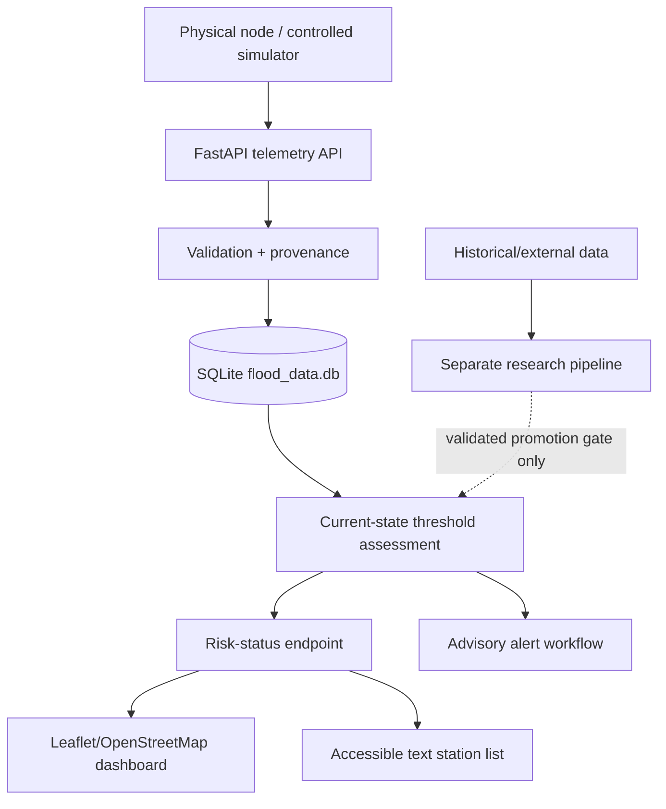

# Chapter Three Draft - System Methodology and Implementation

This draft describes the current verified implementation of the Intelligent Flood Early Warning and Decision Support System. It should be adapted into the final Chapter Three format required by the department.

Implementation addendum (2026-09-08): the user has authorized an operational extension with role-based writes, CSV ingestion, durable alert review, evaluation charts and PDF exports, configurable news feeds and deployment definitions. The [operational guide](operational_platform_guide.md) records its tested scope and limitations. Report snapshots remain synthetic holdout evidence; they are not per-scenario ground-truth validation. Align any revised objectives with the supervisor before incorporating these additions as academically approved core requirements.

## 3.1 Introduction

This chapter presents the methodology, system design, implementation tools, data flow, model design, dashboard design, and testing approach used in the flood early warning and decision support prototype. The system is designed as a portable architecture that can be adapted to different locations by changing station metadata, danger thresholds, and deployment configuration. Nigeria is used as the case-study environment because of its recurring flood-risk context, but the design is not limited to Nigeria.

The implementation focuses on the approved core pipeline:

1. Telemetry ingestion from simulator or hardware-ready sensor nodes.
2. Persistent database storage.
3. Transparent flood-risk classification.
4. Future-horizon machine-learning prediction.
5. Accessible GIS dashboard display.
6. Simulated web, email, and SMS alert logging.

The system does not issue autonomous emergency orders. It provides decision support and instructs users to follow official guidance.

## 3.2 Development Methodology and SDLC

FloodWatch is developed using an **iterative and incremental Agile Software Development Life Cycle (SDLC), supported by prototype-driven development and explicit research/evidence gates**. A pure Waterfall description would not accurately represent the project because requirements and design have been refined after literature review, supervisor feedback, observational-data audit, automated testing, and physical hardware integration.

Each iteration follows planning/evidence review -> requirements -> analysis -> design -> implementation -> verification/testing -> evaluation/review -> documentation/baseline. The methodology does not claim formal Scrum ceremonies that were not performed. Agile is used in its iterative engineering sense: a living backlog, controlled increments, continuous regression testing, stakeholder feedback, and traceability between requirements, design, code and tests.

Research experiments have an additional promotion gate. Experimental predictive logic is not inserted into the operational warning path simply because it can be implemented. Its target, horizon, data provenance, validation design, baseline comparison and limitations must first be defined and evaluated.

Detailed requirements, use cases, DFDs, UML-style diagrams, ERD, deployment design and traceability are maintained in `software_engineering_methodology_and_design.md`.

## 3.3 System Architecture

The system follows a layered architecture.



The simulator or physical node sends telemetry through `POST /api/telemetry`. Pydantic validates the payload, source and threshold metadata are preserved, SQLAlchemy persists the reading, and the current-state engine evaluates configured threshold bands. Experimental forecast probability is separate and does not override current threshold state. Historical hydrological research remains outside the live application path until its promotion gate is passed.

## 3.4 Technology Stack

The implementation uses the approved project stack:

| Layer | Technology | Reason for use |
|---|---|---|
| Backend API | Python and FastAPI | Fast development, clear routing, automatic validation support |
| Data validation | Pydantic | Ensures incoming telemetry has valid types and ranges |
| Database ORM | SQLAlchemy | Provides structured database models and future database portability |
| Database | SQLite file database | Simple local persistence through `sqlite:///flood_data.db` |
| Machine learning | scikit-learn | Supports Logistic Regression, Random Forest, and baseline comparison |
| Simulator messaging | REST with optional paho-mqtt | Allows simulator fallback and hardware-ready communication |
| Dashboard | Jinja2, HTML, CSS, JavaScript | Fits the Python backend and avoids unnecessary frontend build complexity |
| GIS display | Leaflet.js and OpenStreetMap | Lightweight browser-based mapping with open map tiles |

SQLite is deliberately file-based. The normal database URL is:

```text
sqlite:///flood_data.db
```

The in-memory form, `sqlite://`, is not used for the active application or the current regression tests because it does not preserve records after process restart. Tests use a temporary file-based SQLite database so the persistence guardrail is exercised consistently.

## 3.5 Telemetry Input Design

Each station reading contains station identity, location, timestamp, water level, danger threshold, rainfall, flow rate, battery percentage, signal state, and source type.

Example telemetry shape:

```json
{
  "station_id": "STN-01",
  "station_name": "Lokoja (Niger-Benue confluence)",
  "data_source": "simulated",
  "lat": 7.7999,
  "lon": 6.7333,
  "timestamp": "2026-08-31T12:00:00+00:00",
  "water_level_m": 2.174,
  "danger_level_m": 5.5,
  "rainfall_mm_hr": 5.03,
  "flow_rate_m3s": 25.07,
  "battery_pct": 100.0,
  "signal": "online"
}
```

The `data_source` field supports:

- `simulated`, for generated demonstration telemetry;
- `hardware`, for real sensor-node readings sent to the same API.

This makes the system switchable between simulator, hardware, and hybrid demonstrations without changing the database design or dashboard code. In Hybrid mode, the backend compares the newest simulated and hardware-source readings available for a station/source pair and returns the more serious current risk for dashboard attention.

## 3.6 Database Design

FloodWatch uses a relational database architecture through SQLAlchemy. The target development/operational DBMS is **MySQL Server**, while **MySQL Workbench** is used as the administration, inspection and EER-design client. The application connects to MySQL through SQLAlchemy/PyMySQL using the `FLOOD_EWS_DATABASE_URL` configuration; Workbench is not part of the runtime request path.

SQLite is retained as an isolated compatibility and automated-test database where MySQL-specific behaviour is not being tested. This keeps CI/unit tests fast while allowing the real application database to use a client/server DBMS.

The first prototype used a wide `telemetry` table containing station identity, location, water level, threshold, rainfall, flow, battery and signal fields in each row. That representation remains temporarily for backward compatibility with the demonstrated Pico and simulator pipelines, but it is not the target normalized schema.

**Figure 3.x — Target normalized FloodWatch ERD**


The target data model separates:

- **Station**: monitoring/gauge location and identity;
- **Variable**: what is measured, including its unit/category;
- **DataSource**: evidence/provenance classification and provider;
- **Dataset**: historical/external dataset metadata and redistribution status;
- **Observation**: one variable value at one station, source and time;
- **Threshold**: a separately sourced and time-valid decision threshold;
- existing operational entities including users, sessions, alerts, alert audits, scenarios and community reports.

This structure applies normalization through 1NF, 2NF and 3NF. In particular, station/source/unit descriptions are not unnecessarily repeated in every observation, and heterogeneous evidence does not require fabricated values for variables a source did not measure.

**Figure 3.x — Controlled database migration activity**


Migration is deliberately non-destructive. The project first establishes MySQL connectivity and the normalized schema, then introduces compatibility/dual-write adapters, moves reads only after equivalence tests pass, and retires the legacy telemetry persistence only after CI and physical Pico regression remain successful. The detailed logical ERD, constraints, indexes and migration phases are specified in `database_design_mysql_spec_v1.md`.

### 3.6.1 Target database deployment


The deployment separates MySQL Server from MySQL Workbench: FastAPI connects directly to the server through SQLAlchemy/PyMySQL, while Workbench is an administration and EER-design client. SQLite remains outside the target runtime path and is retained for isolated compatibility/CI testing.

## 3.7 Risk Classification Method

**Figure 3.x — Current-state assessment service boundary**


The current implementation separates HTTP transport from interpretation. `current_state_service.py` calculates the measured change from the previous compatible station/source reading, coordinates current-state classification, and constructs the public risk-status contract. `risk_engine.py` remains the explainable threshold classifier. The saved synthetic ML model is called only for sufficiently complete simulated records and its probability remains separate from the threshold ratio; hardware observations do not receive synthetic-model predictions.


The risk engine is implemented in `files/api/risk_engine.py`.

The main physical measure is:

```text
risk ratio = current water level / station danger level
```

The system uses four risk levels:

| Risk level | Meaning |
|---|---|
| Low | No immediate flood-risk signal from the current reading |
| Moderate | Water or rainfall conditions require preparation and monitoring |
| High | Flood-risk conditions are high and users should avoid risky areas while following official guidance |
| Severe | Critical flood-risk conditions are detected and responders should verify conditions |

Machine-learning probability is not numerically merged with the physical threshold ratio. Current-state classification is determined by configured threshold bands. Experimental forecast probability remains informational until a validated research experiment defines and passes an explicit promotion policy.

All risk wording is advisory. The system does not say "evacuate now" or issue autonomous instructions. The English guidance ends with "follow official guidance."

## 3.8 Machine-Learning Design

The machine-learning pipeline is implemented in `files/api/train_model.py`.

The existing saved model was trained on simulator-generated telemetry only and is now **frozen as development evidence**. It is not the thesis research model, is not applied to physical hardware observations, and is not proof of Lokoja predictive performance.

An important correction was made during development. The model was not trained to predict whether the current reading is already above the danger level, because that would create a circular label. Instead, the corrected target is:

```text
While the station is below danger level now, will it reach danger level within the next 6 simulator ticks?
```

The current-tick features are:

- water-level ratio;
- rainfall intensity;
- flow rate;
- rate of rise.

The compared methods are:

- threshold baseline;
- Logistic Regression;
- Random Forest.

The saved model is the Random Forest classifier, stored as `files/api/model.pkl`. The metrics are stored in `files/api/model_metrics.json`.

Current corrected simulator-generated results:

| Method | Accuracy | Precision | Recall | F1 |
|---|---:|---:|---:|---:|
| Threshold baseline | 0.9731 | 1.0000 | 0.5000 | 0.6667 |
| Logistic Regression | 0.9557 | 0.5487 | 1.0000 | 0.7086 |
| Random Forest | 0.9974 | 0.9836 | 0.9677 | 0.9756 |

The previous perfect baseline result is not used because it came from current-threshold label leakage.

## 3.9 Notification Design

The notification layer is implemented in `files/api/notifications.py`.

For the prototype, notifications are simulated and written to a local JSONL log. The active demonstration channels are:

- web dashboard;
- simulated email;
- simulated SMS.

This supports the project requirement that warning access should not assume smartphone ownership. No real SMS or email is sent unless a real provider gateway is configured and tested.

## 3.10 GIS Dashboard and Accessibility Design

The active dashboard is implemented with Jinja2 templates and browser JavaScript:

- `files/api/templates/pages/dashboard.html`
- `files/api/static/css/site.css`
- `files/api/static/js/dashboard.js`

The dashboard includes:

- Leaflet.js map;
- OpenStreetMap and satellite base layers;
- simulated, hardware, and hybrid source switching;
- map markers for stations;
- risk-ring planning overlays;
- station labels;
- station search;
- risk-level filtering;
- selected-station details;
- telemetry freshness and staleness indicators;
- tile-health warning if map tiles are slow;
- schematic river-context overlay;
- accessible station list beside the map.

The station list is important because map markers alone are not accessible to all users. A screen-reader user or keyboard-only user can still read station names, risk levels, water levels, alert channels, and safe guidance. Colour is used as a supporting cue, but the risk level is always written in text.

The river-context overlay is schematic. It helps interpretation in the Nigeria case-study dashboard, but it is not presented as an official flood-boundary dataset and does not change risk classification.

## 3.11 API Endpoints

The main implemented endpoints are:

| Endpoint | Method | Purpose |
|---|---|---|
| `/api/telemetry` | POST | Accepts and stores simulator or hardware telemetry |
| `/api/telemetry` | GET | Returns stored telemetry records |
| `/api/risk-status` | GET | Returns newest risk status per station |
| `/dashboard` | GET | Serves the GIS decision-support dashboard |
| `/data` | GET | Serves the flood-data page |
| `/favicon.ico` | GET | Serves the project browser-tab icon |

Optional account routes exist as a prototype shell, but advanced account-dependent product features are not part of the approved core scope.

## 3.12 Testing and Verification

Testing is performed through executable scripts rather than only manual observation.

The main tests are:

- `files/api/test_model_training.py`, which verifies that the ML target uses a future horizon and avoids current-threshold leakage;
- `files/api/test_api.py`, which verifies telemetry ingestion, bad-input rejection, risk status, source switching, dashboard rendering, parked extras, XSS guards, and SQLite configuration.

Bad-input tests include:

- invalid telemetry source;
- invalid latitude;
- zero danger level;
- battery percentage above 100;
- missing station ID;
- invalid risk-status source query;
- invalid language query.

The latest verified outputs include:

```text
[PASS] Future-horizon ML target verified; circular current-threshold label leakage removed.
[PASS] Core dashboard/data access, break tests, optional auth shell, parked extras, source switching, XSS guards, and SQLite configuration verified.
```

## 3.13 Hardware Integration and Physical Prototype Validation

The physical integration path has been demonstrated using Raspberry Pi Pico -> COM4 -> Python serial bridge -> FastAPI -> SQLite/current-state processing -> dashboard. The potentiometer is a controlled analogue input used to emulate changing stage-like conditions; it is not a Lokoja river-stage observation. The hardware node sends telemetry to:

```text
POST http://127.0.0.1:8010/api/telemetry
```

The reading should include:

```json
"data_source": "hardware"
```

The bridge sends `data_source: hardware`, identifies its threshold as `prototype_demo`, and leaves unmeasured rainfall, flow/discharge and battery values unavailable rather than fabricating zeroes. Physical testing demonstrated changing analogue values reaching the API with successful HTTP responses and appearing in Hardware telemetry mode. This validates sensing-to-software integration, not hydrological measurement accuracy or flood-prediction skill.

## 3.14 Chapter Summary

This chapter describes the iterative Agile SDLC, requirements-driven design and verified implementation of FloodWatch. The engineering system integrates source-aware telemetry ingestion, persistence, provenance/threshold semantics, explainable current-state assessment, accessible GIS visualization, alert workflow, automated regression testing and a demonstrated Pico-to-dashboard physical integration path. Historical predictive research remains a separate evidence-controlled pipeline until its experiment protocol is frozen and evaluated.


### Alert workflow service

**Figure 3.x — Persistent alert workflow and state transitions**


`alert_service.py` owns duplicate suppression, safe bulletin wording, transition rules and audit persistence. Authentication and HTTP error mapping remain at the route boundary.
