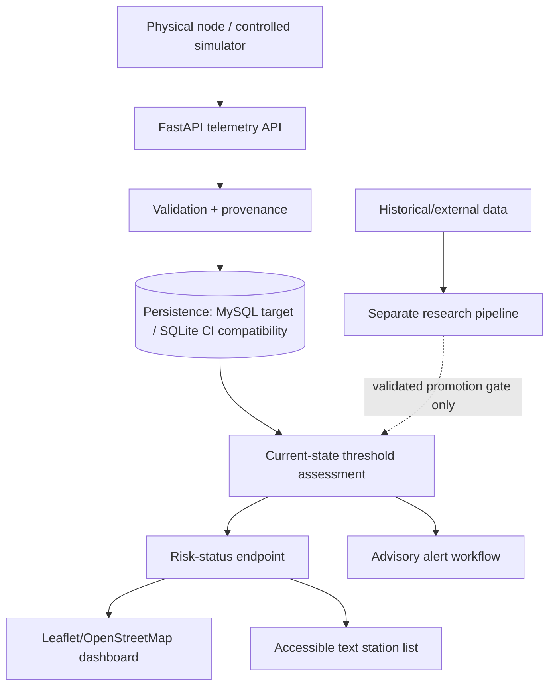

# Chapter Three Draft - System Methodology and Implementation

This draft describes the current verified implementation of the Intelligent Flood Early Warning and Decision Support System. It should be adapted into the final Chapter Three format required by the department.

Implementation addendum (2026-09-08): the user has authorized an operational extension with role-based writes, CSV ingestion, durable alert review, evaluation charts and PDF exports, configurable news feeds and deployment definitions. The [operational guide](operational_platform_guide.md) records its tested scope and limitations. Report snapshots remain synthetic holdout evidence; they are not per-scenario ground-truth validation. Align any revised objectives with the supervisor before incorporating these additions as academically approved core requirements.

## 3.1 Introduction

This chapter presents the methodology, system design, implementation tools, data flow, model design, dashboard design, and testing approach used in the flood early warning and decision support prototype. The system is designed as a portable architecture that can be adapted to different locations by changing station metadata, danger thresholds, and deployment configuration. Nigeria is used as the case-study environment because of its recurring flood-risk context, but the design is not limited to Nigeria.

The implementation focuses on the approved core pipeline:

1. Telemetry ingestion from simulator or hardware-ready sensor nodes.
2. Persistent database storage.
3. Transparent flood-risk classification.
4. Future-horizon machine-learning prediction.
5. Accessible GIS dashboard display.
6. Simulated web, email, and SMS alert logging.

The system does not issue autonomous emergency orders. It provides decision support and instructs users to follow official guidance.

## 3.2 Development Methodology and SDLC

FloodWatch is developed using an **iterative and incremental Agile Software Development Life Cycle (SDLC), supported by prototype-driven development and explicit research/evidence gates**. A pure Waterfall description would not accurately represent the project because requirements and design have been refined after literature review, supervisor feedback, observational-data audit, automated testing, and physical hardware integration.

Each iteration follows planning/evidence review -> requirements -> analysis -> design -> implementation -> verification/testing -> evaluation/review -> documentation/baseline. The methodology does not claim formal Scrum ceremonies that were not performed. Agile is used in its iterative engineering sense: a living backlog, controlled increments, continuous regression testing, stakeholder feedback, and traceability between requirements, design, code and tests.

Research experiments have an additional promotion gate. Experimental predictive logic is not inserted into the operational warning path simply because it can be implemented. Its target, horizon, data provenance, validation design, baseline comparison and limitations must first be defined and evaluated.

Detailed requirements, use cases, DFDs, UML-style diagrams, ERD, deployment design and traceability are maintained in `software_engineering_methodology_and_design.md`.

## 3.3 System Architecture


The architecture distinguishes physical/simulated/external evidence at ingestion, preserves provenance, separates current-state monitoring from predictive research, and converts accepted evidence into decision-support communication. Predictive research reaches the operational path only after an explicit evidence gate.

The system follows a layered architecture.



The simulator or physical node sends telemetry through `POST /api/telemetry`. Pydantic validates the payload, source and threshold metadata are preserved, SQLAlchemy persists the reading, and the current-state engine evaluates configured threshold bands. Experimental forecast probability is separate and does not override current threshold state. Historical hydrological research remains outside the live application path until its promotion gate is passed.

## 3.4 Technology Stack

The implementation uses the approved project stack:

| Layer | Technology | Reason for use |
|---|---|---|
| Backend API | Python and FastAPI | Fast development, clear routing, automatic validation support |
| Data validation | Pydantic | Ensures incoming telemetry has valid types and ranges |
| Database ORM | SQLAlchemy | Provides structured database models and future database portability |
| Database | MySQL Server target; SQLite compatibility/CI | Client/server operational target with fast isolated regression-test compatibility |
| Machine learning | scikit-learn | Supports Logistic Regression, Random Forest, and baseline comparison |
| Simulator messaging | REST with optional paho-mqtt | Allows simulator fallback and hardware-ready communication |
| Dashboard | Jinja2, HTML, CSS, JavaScript | Fits the Python backend and avoids unnecessary frontend build complexity |
| GIS display | Leaflet.js and OpenStreetMap | Lightweight browser-based mapping with open map tiles |

For compatibility and CI, SQLite is deliberately file-based. The compatibility database URL is:

```text
sqlite:///flood_data.db
```

The target application DBMS is MySQL Server as specified in Section 3.6. SQLite remains the file-based compatibility/CI path; the in-memory form, `sqlite://`, is not used for persistence-oriented regression tests.

## 3.5 Telemetry Input Design

Each station reading contains station identity, location, timestamp, water level, danger threshold, rainfall, flow rate, battery percentage, signal state, and source type.

Example telemetry shape:

```json
{
  "station_id": "STN-01",
  "station_name": "Lokoja (Niger-Benue confluence)",
  "data_source": "simulated",
  "lat": 7.7999,
  "lon": 6.7333,
  "timestamp": "2026-08-31T12:00:00+00:00",
  "water_level_m": 2.174,
  "danger_level_m": 5.5,
  "rainfall_mm_hr": 5.03,
  "flow_rate_m3s": 25.07,
  "battery_pct": 100.0,
  "signal": "online"
}
```

The `data_source` field supports:

- `simulated`, for generated demonstration telemetry;
- `hardware`, for real sensor-node readings sent to the same API.

This makes the system switchable between simulator, hardware, and hybrid demonstrations without changing the database design or dashboard code. In Hybrid mode, the backend compares the newest simulated and hardware-source readings available for a station/source pair and returns the more serious current risk for dashboard attention.

## 3.6 Database Design

FloodWatch uses a relational database architecture through SQLAlchemy. The target development/operational DBMS is **MySQL Server**, while **MySQL Workbench** is used as the administration, inspection and EER-design client. The application connects to MySQL through SQLAlchemy/PyMySQL using the `FLOOD_EWS_DATABASE_URL` configuration; Workbench is not part of the runtime request path.

SQLite is retained as an isolated compatibility and automated-test database where MySQL-specific behaviour is not being tested. This keeps CI/unit tests fast while allowing the real application database to use a client/server DBMS.

The first prototype used a wide `telemetry` table containing station identity, location, water level, threshold, rainfall, flow, battery and signal fields in each row. That representation remains temporarily for backward compatibility with the demonstrated Pico and simulator pipelines, but it is not the target normalized schema.

**Figure 3.x — Target normalized FloodWatch ERD**


The normalized persistence layer now has a dedicated `observation_repository.py` and deterministic `observation_catalogue.py`. Catalogue seeding makes provenance vocabulary reproducible, while one atomic Observation stores only the variable actually represented; absent rainfall, flow or other variables are not fabricated.

The target data model separates:

- **Station**: monitoring/gauge location and identity;
- **Variable**: what is measured, including its unit/category;
- **DataSource**: evidence/provenance classification and provider;
- **Dataset**: historical/external dataset metadata and redistribution status;
- **Observation**: one variable value at one station, source and time;
- **Threshold**: a separately sourced and time-valid decision threshold whose measurement unit is inherited from its associated Variable;
- existing operational entities including users, sessions, alerts, alert audits, scenarios and community reports.

This structure applies normalization through 1NF, 2NF and 3NF. In particular, station/source/unit descriptions are not unnecessarily repeated in every observation, and heterogeneous evidence does not require fabricated values for variables a source did not measure.

**Figure 3.x — Controlled database migration activity**


Migration is deliberately non-destructive. The project first establishes MySQL connectivity and the normalized schema, then introduces compatibility/dual-write adapters, moves reads only after equivalence tests pass, and retires the legacy telemetry persistence only after CI and physical Pico regression remain successful. The detailed logical ERD, constraints, indexes and migration phases are specified in `database_design_mysql_spec_v1.md`.

### 3.6.1 Target database deployment


The deployment separates MySQL Server from MySQL Workbench: FastAPI connects directly to the server through SQLAlchemy/PyMySQL, while Workbench is an administration and EER-design client. SQLite remains outside the target runtime path and is retained for isolated compatibility/CI testing.

## 3.7 Risk Classification Method

**Figure 3.x — Current-state assessment service boundary**


The current implementation separates HTTP transport from interpretation. `current_state_service.py` calculates the measured change from the previous compatible station/source reading, coordinates current-state classification, and constructs the public risk-status contract. `risk_engine.py` remains the explainable threshold classifier. The saved synthetic ML model is called only for sufficiently complete simulated records and its probability remains separate from the threshold ratio; hardware observations do not receive synthetic-model predictions.


The risk engine is implemented in `files/api/risk_engine.py`.

The main physical measure is:

```text
risk ratio = current water level / station danger level
```

The system uses four risk levels:

| Risk level | Meaning |
|---|---|
| Low | No immediate flood-risk signal from the current reading |
| Moderate | Water or rainfall conditions require preparation and monitoring |
| High | Flood-risk conditions are high and users should avoid risky areas while following official guidance |
| Severe | Critical flood-risk conditions are detected and responders should verify conditions |

Machine-learning probability is not numerically merged with the physical threshold ratio. Current-state classification is determined by configured threshold bands. Experimental forecast probability remains informational until a validated research experiment defines and passes an explicit promotion policy.

All risk wording is advisory. The system does not say "evacuate now" or issue autonomous instructions. The English guidance ends with "follow official guidance."

## 3.8 Machine-Learning Design

The machine-learning pipeline is implemented in `files/api/train_model.py`.

The existing saved model was trained on simulator-generated telemetry only and is now **frozen as development evidence**. It is not the thesis research model, is not applied to physical hardware observations, and is not proof of Lokoja predictive performance.

An important correction was made during development. The model was not trained to predict whether the current reading is already above the danger level, because that would create a circular label. Instead, the corrected target is:

```text
While the station is below danger level now, will it reach danger level within the next 6 simulator ticks?
```

The current-tick features are:

- water-level ratio;
- rainfall intensity;
- flow rate;
- rate of rise.

The compared methods are:

- threshold baseline;
- Logistic Regression;
- Random Forest.

The saved model is the Random Forest classifier, stored as `files/api/model.pkl`. The metrics are stored in `files/api/model_metrics.json`.

Current corrected simulator-generated results:

| Method | Accuracy | Precision | Recall | F1 |
|---|---:|---:|---:|---:|
| Threshold baseline | 0.9731 | 1.0000 | 0.5000 | 0.6667 |
| Logistic Regression | 0.9557 | 0.5487 | 1.0000 | 0.7086 |
| Random Forest | 0.9974 | 0.9836 | 0.9677 | 0.9756 |

The previous perfect baseline result is not used because it came from current-threshold label leakage.

## 3.9 Notification Design

The notification layer is implemented in `files/api/notifications.py`.

For the prototype, notifications are simulated and written to a local JSONL log. The active demonstration channels are:

- web dashboard;
- simulated email;
- simulated SMS.

This supports the project requirement that warning access should not assume smartphone ownership. No real SMS or email is sent unless a real provider gateway is configured and tested.

## 3.10 GIS Dashboard and Accessibility Design

The active dashboard is implemented with Jinja2 templates and browser JavaScript:

- `files/api/templates/pages/dashboard.html`
- `files/api/static/css/site.css`
- `files/api/static/js/dashboard.js`

The dashboard includes:

- Leaflet.js map;
- OpenStreetMap and satellite base layers;
- simulated, hardware, and hybrid source switching;
- map markers for stations;
- risk-ring planning overlays;
- station labels;
- station search;
- risk-level filtering;
- selected-station details;
- telemetry freshness and staleness indicators;
- tile-health warning if map tiles are slow;
- schematic river-context overlay;
- accessible station list beside the map.

The station list is important because map markers alone are not accessible to all users. A screen-reader user or keyboard-only user can still read station names, risk levels, water levels, alert channels, and safe guidance. Colour is used as a supporting cue, but the risk level is always written in text.

The river-context overlay is schematic. It helps interpretation in the Nigeria case-study dashboard, but it is not presented as an official flood-boundary dataset and does not change risk classification.

## 3.11 API Endpoints

The main implemented endpoints are:

| Endpoint | Method | Purpose |
|---|---|---|
| `/api/telemetry` | POST | Accepts and stores simulator or hardware telemetry |
| `/api/telemetry` | GET | Returns stored telemetry records |
| `/api/risk-status` | GET | Returns newest risk status per station |
| `/dashboard` | GET | Serves the GIS decision-support dashboard |
| `/data` | GET | Serves the flood-data page |
| `/favicon.ico` | GET | Serves the project browser-tab icon |

Optional account routes exist as a prototype shell, but advanced account-dependent product features are not part of the approved core scope.

## 3.12 Testing and Verification

Testing is performed through executable scripts rather than only manual observation.

The main tests are:

- `files/api/test_model_training.py`, which verifies that the ML target uses a future horizon and avoids current-threshold leakage;
- `files/api/test_api.py`, which verifies telemetry ingestion, bad-input rejection, risk status, source switching, dashboard rendering, parked extras, XSS guards, and SQLite configuration.

Bad-input tests include:

- invalid telemetry source;
- invalid latitude;
- zero danger level;
- battery percentage above 100;
- missing station ID;
- invalid risk-status source query;
- invalid language query.

The latest verified outputs include:

```text
[PASS] Future-horizon ML target verified; circular current-threshold label leakage removed.
[PASS] Core dashboard/data access, break tests, optional auth shell, parked extras, source switching, XSS guards, and SQLite configuration verified.
```

## 3.13 Hardware Integration and Physical Prototype Validation

The physical integration path has been demonstrated using Raspberry Pi Pico -> COM4 -> Python serial bridge -> FastAPI -> SQLite/current-state processing -> dashboard. The potentiometer is a controlled analogue input used to emulate changing stage-like conditions; it is not a Lokoja river-stage observation. The hardware node sends telemetry to:

```text
POST http://127.0.0.1:8010/api/telemetry
```

The reading should include:

```json
"data_source": "hardware"
```

The bridge sends `data_source: hardware`, identifies its threshold as `prototype_demo`, and leaves unmeasured rainfall, flow/discharge and battery values unavailable rather than fabricating zeroes. Physical testing demonstrated changing analogue values reaching the API with successful HTTP responses and appearing in Hardware telemetry mode. This validates sensing-to-software integration, not hydrological measurement accuracy or flood-prediction skill.

## 3.14 Chapter Summary

This chapter describes the iterative Agile SDLC, requirements-driven design and verified implementation of FloodWatch. The engineering system integrates source-aware telemetry ingestion, persistence, provenance/threshold semantics, explainable current-state assessment, accessible GIS visualization, alert workflow, automated regression testing and a demonstrated Pico-to-dashboard physical integration path. Historical predictive research remains a separate evidence-controlled pipeline until its experiment protocol is frozen and evaluated.


### Alert workflow service

**Figure 3.x — Persistent alert workflow and state transitions**


`alert_service.py` owns duplicate suppression, safe bulletin wording, transition rules and audit persistence. Authentication and HTTP error mapping remain at the route boundary.


### 3.6.x DB-3 Controlled Dual-Write Compatibility

**Figure 3.x — Controlled legacy-to-normalized telemetry dual-write**


The working REST, CSV and Pico telemetry contract is retained while `telemetry_repository.py` now stages a compatibility `TelemetryRecord` and normalized observations in one database transaction. `telemetry_normalization_adapter.py` maps hardware to `LOCAL_SENSOR` provenance and simulator input to `SIMULATED`. It mirrors only variables actually present in the validated payload: a hardware reading with no rainfall, flow or battery measurement creates no fabricated rows for those variables. The legacy danger threshold is deliberately not copied into `Observation`, because a threshold is a decision/configuration entity rather than a measured observation.

The transaction is atomic: normalization failure rolls back the compatibility write as well, preventing silent divergence between the two persistence representations. Legacy reads remain authoritative during DB-3; normalized reads will not replace them until DB-4 parity tests and the physical Pico regression gate pass.


### 3.6.x DB-4 Normalized Read-Parity Gate

**Figure 3.x — DB-4 normalized read-parity gate**


A separate `normalized_read_repository.py` now reconstructs the telemetry-shaped evidence needed for parity testing from Station, Observation, Variable and DataSource rows. It does not yet replace public/dashboard reads. Parity tests compare station/source identity, location, timestamp, water level, optional rainfall/discharge/battery measurements, signal state and null preservation against the legacy repository. Threshold configuration is excluded because DB-3 deliberately did not misrepresent `danger_level_m` as an observation; threshold normalization must be completed before the current-state engine can move completely to normalized reads.

GitHub Actions run `35932249880` passed. Therefore the evidence-field read-parity sub-gate is PASS, while operational read promotion remains gated by threshold/configuration migration, current-state integration, physical Pico regression and MySQL execution.


### 3.6.x Typed Threshold Configuration and Applicability

**Figure 3.x — Typed threshold configuration and applicability**


The normalized architecture now represents a decision threshold in the `Threshold` entity rather than as an Observation. `threshold_repository.py` resolves thresholds by station, variable, active state and validity interval. No default threshold is invented when none is applicable. During compatibility dual-write, the validated legacy `danger_level_m` is staged as typed threshold configuration with explicit provenance stating that it was derived from the legacy telemetry contract and is not independently verified as an official hydrological threshold. Identical active compatibility thresholds are reused rather than duplicated for every reading.

Normalized DB-4 reads now reconstruct both observational evidence and the applicable threshold. This extends parity to `danger_level_m` and `threshold_type` while preserving the semantic separation between measurement and decision configuration.


### 3.6.x Full Current-State Parity Gate

**Figure 3.x — Legacy versus normalized current-state parity**


A normalized candidate service, `normalized_current_state_service.py`, now computes rate-of-rise from previous normalized river-stage observations, resolves the typed threshold already reconstructed by DB-4, and passes the resulting values through the same explainable `risk_engine.classify` logic used by the legacy path. Simulator-only ML information remains separate and is invoked under the same conditions as the legacy service; hardware current state remains threshold-based with no ML probability.

The parity gate compares the complete public `RiskStatus` contract, including rate of rise, risk level, risk ratio, optional ML probability, model-availability flag, message, colour, language and alert-channel metadata. GitHub Actions run `35951919460` passed. This proves software-behaviour parity for the tested dual-written prototype evidence, not hydrological validity or research-model performance.

The public API/dashboard has deliberately not been switched in this increment. Route promotion is retained as a separate controlled change so any regression can be attributed clearly.


### 3.6.x DB-4 Operational Current-State Read Promotion

**Figure 3.x — Normalized operational risk-status promotion**


After full current-state parity passed, the public `GET /api/risk-status` endpoint was promoted from legacy `TelemetryRecord` reads to the normalized observation/threshold path. Hardware, simulated and hybrid modes now consume normalized evidence through `normalized_read_repository.py` and `normalized_current_state_service.py`. Hybrid mode retains the existing policy of selecting the highest current risk per station, with timestamp as the tie-breaker. Source filtering is applied at the normalized provenance boundary.

The raw `/api/telemetry` compatibility contract remains unchanged and DB-3 continues writing the legacy store. This provides a rollback/reference path until physical Pico regression and MySQL-specific execution are completed. GitHub Actions run `35955191785` passed after promotion.


### 3.6.x MySQL DB-1 Execution Gate

**Figure 3.x — MySQL DB-1 execution and integration gate**


The target DBMS was exercised against a real MySQL 8.4 service rather than inferred from SQLite compatibility. A dedicated CI job supplies `FLOOD_EWS_DATABASE_URL` using the `mysql+pymysql` dialect, creates the SQLAlchemy schema in a disposable MySQL database, writes one validated hardware telemetry reading through the atomic dual-write path, reconstructs normalized evidence and threshold configuration, and executes the normalized current-state service. The gate verifies one legacy record, one stage Observation and one Threshold, with the hardware assessment remaining free of simulator ML probability.

GitHub Actions run `35955625737` passed. This establishes application-level MySQL execution evidence. It does not claim that the student's local MySQL Workbench/server installation or the physical Pico path has been tested by CI.


### 3.6.x Telemetry Application-Service Refactor

**Figure 3.x — Telemetry application-service boundary**


After normalized persistence and current-state promotion were stabilized, telemetry use-case orchestration was extracted from `main.py` into `telemetry_service.py`. FastAPI routes now retain transport responsibilities such as request validation, authorization and HTTP responses, while the application service coordinates repository persistence, immediate threshold assessment, notification/alert persistence and normalized risk-status construction. REST and CSV ingestion therefore share one application workflow in addition to the same repository boundary.

This is a structural refactor rather than a change in scientific behaviour. The public API contracts, normalized decision semantics and legacy rollback store remain unchanged. GitHub Actions run `35956139992` passed after the refactor.


### 3.6.x Scenario Ingestion Consistency Regression

**Figure 3.x — Scenario ingestion through the normalized dual-write path**


A post-promotion audit found that the operator scenario endpoint still created `TelemetryRecord` directly. This was valid before normalized current-state promotion but became an architectural regression afterward: a newly generated scenario could exist in the compatibility table while `/api/risk-status` read only normalized observations. The route was corrected to construct a validated `TelemetryCreate` with `data_source="simulated"` and pass it through `telemetry_service.ingest`, preserving the same dual-write, threshold and alert workflow as REST/CSV telemetry.

A dedicated regression test verifies that scenario execution creates the compatibility row and normalized simulated river-stage observation and that the scenario is subsequently visible through the normalized risk-status endpoint. The first CI run (`35956409588`) failed because the newly written test accidentally bound the imported role-assignment helper as an instance method; production code and the MySQL job were not the cause. The test fixture was corrected and run `35956524052` passed.


### 3.6.x Operational Read Independence from the Compatibility Table

**Figure 3.x — Normalized operational read independence**


The producer audit was followed by a consumer audit. Two remaining operational routes—manual alert dispatch and operator scenario initiation—still selected their current station state directly from the legacy `TelemetryRecord` table. They were migrated to the normalized current-state path exposed through `telemetry_service.risk_statuses`. Alert dispatch now constructs its simulated bulletin from normalized current state, and scenario initiation obtains its baseline water level, threshold, threshold type, coordinates and pre-scenario risk from the same normalized path before dual-writing the new synthetic reading.

A stronger regression test deletes every legacy `TelemetryRecord` after normalized ingestion and then verifies that both alert dispatch and scenario initiation still succeed. This demonstrates that these audited operational consumers no longer require the compatibility table for reads. GitHub Actions run `35956778318` passed, including the MySQL integration job. The legacy table is nevertheless retained as a rollback/reference store until the remaining compatibility audit and physical Pico regression are complete.


### 3.6.x Normalized Historical Telemetry Read Promotion

**Figure 3.x — Normalized telemetry history projection**


The public `GET /api/telemetry` history endpoint was migrated from the compatibility table to a normalized projection. River-stage observations act as the anchor rows; optional rainfall, discharge and battery measurements are reconstructed only when recorded for the same station, source and timestamp, and the threshold applicable at the observation time is resolved from temporal configuration. Newest-first ordering, source filtering and skip/limit pagination are preserved.

The first CI run (`35957056596`) correctly rejected the promotion because the existing `TelemetryResponse` contract requires an `id`, while the normalized projection initially omitted it. The projection was repaired to expose the anchoring Observation identifier as the response identifier. The complete rerun `35957220042` passed, including MySQL integration. A regression test deletes every legacy telemetry row before reading history, demonstrating that the endpoint no longer depends on the compatibility table.


### 3.6.x Legacy Read-Dependency Guard

**Figure 3.x — Legacy telemetry read-dependency guard**


After current-state, alert/scenario and historical telemetry consumers had been promoted, the production route module was audited again. Obsolete compatibility aliases that delegated latest-record reads to `telemetry_repository` were removed together with the now-unused repository import. A CI architecture guard now scans the operational modules and fails if direct `TelemetryRecord` queries, the legacy repository import in `main.py`, or the obsolete latest-record aliases are reintroduced.

GitHub Actions run `35957537472` passed, including MySQL integration. This establishes a mechanically protected no-legacy-read boundary for the audited operational modules. It does not delete `TelemetryRecord`: the model, dual-write path and legacy parity tests remain as migration/rollback evidence until the physical Pico regression and an explicit DB-5 retirement decision.


### 3.6.x Physical Hardware Regression Gate Preparation

**Figure 3.x — Physical Pico-to-normalized-system regression gate**


Following removal and CI-guarding of operational legacy reads, the remaining external migration gate was formalized. A read-only verifier, `files/hardware/verify_physical_hardware_regression.py`, checks that a freshly posted hardware reading exists as a normalized `LOCAL_SENSOR` river-stage Observation, has active typed threshold configuration, remains equal to the temporary dual-write rollback row, and does not fabricate rainfall, discharge or battery values. The verifier deliberately does not access the serial port: it is valid only after the live Pico/serial bridge has visibly posted fresh readings.

The physical gate remains **PENDING**. Passing CI cannot substitute for evidence from the actual Pico, assigned Windows COM port, bridge HTTP responses and dashboard display. The required evidence package is now documented in the hardware integration guide. This test establishes post-migration sensing-to-software integration only; it is not hydrological calibration, Lokoja field validation or predictive-model validation.


### 3.6.x Deterministic Equal-Timestamp Selection

**Figure 3.x — Deterministic latest-reading tie semantics**


A pre-retirement edge-case audit identified that normalized `latest_per_station` selected by station and timestamp but did not explicitly include the normalized Observation identifier as a tie-breaker. If two source readings for the same station shared an identical timestamp, selection could therefore depend on incidental row ordering. The normalized rule was hardened to order by timestamp and then persistence identifier, matching the legacy compatibility rule in which the later persisted row wins an equal-timestamp tie.

A dedicated parity test writes hardware and simulated readings for the same station at exactly the same timestamp and verifies that legacy and normalized latest-per-station selection choose the same later-persisted state. GitHub Actions run `35958025759` passed, including MySQL integration. This is a migration determinism rule, not a hydrological interpretation rule.


### 3.6.x Threshold Authority and Provenance Boundary

**Figure 3.x — Threshold authority boundary**


A provenance audit identified that the generic `TelemetryCreate` compatibility contract permits the label `official_operational`. Before hardening, a sensor/simulator client could therefore cause the normalized mirror to create an official-typed Threshold even though the generic ingestion channel carries no independent authority credential or verified hydrological source. The normalization adapter now prevents that promotion: an `official_operational` label supplied through generic telemetry is stored as `prototype_demo` with explicit provenance explaining that the channel is not authorized to assert an official threshold.

A regression test verifies that no `official_operational` Threshold is created through this path. GitHub Actions run `35958515275` passed, including MySQL integration. A genuine official threshold will require a separate authenticated/import workflow with independently verified authority evidence; that capability is not fabricated by the current prototype.
