# FloodWatch Database Design and MySQL Migration Specification v1.0

Status: design baseline. This document defines the target relational model before destructive migration.

## 1. DBMS decision

**Target development/operational DBMS:** MySQL Server.  
**Administration/design client:** MySQL Workbench.  
**ORM/data-access layer:** SQLAlchemy with PyMySQL.  
**Automated unit/CI database:** isolated SQLite where database-specific behaviour is not under test.

MySQL Workbench is not the database server. Workbench connects to MySQL Server and is used to inspect schemas, execute SQL, administer the instance and produce EER diagrams.

### Why MySQL

MySQL is selected because FloodWatch now has multiple related entities, authenticated users, operational workflows, historical/observational metadata and potentially concurrent API access. It provides a proper client/server relational DBMS, transactions, foreign-key constraints, indexing and mature tooling. It also allows the physical schema to be inspected and defended using MySQL Workbench.

### Why SQLAlchemy remains

SQLAlchemy separates application/domain code from most DBMS-specific SQL. This allows the same repository/service architecture to use MySQL for the real application and lightweight SQLite databases for fast isolated tests. Database-specific integration tests are still required because ORM portability does not mean MySQL and SQLite behave identically.

### Why not keep SQLite as the final DBMS

SQLite remains technically adequate for small local prototypes and tests, but a file-based embedded database is less representative of the intended multi-component operational architecture and provides less opportunity to demonstrate server administration, schema relationships and concurrent application access.

### Why not migrate immediately

The existing `telemetry` table reflects the first prototype: one wide row assumes a fixed set of variables. The research has since established that different evidence sources may contain different variables. Migrating that old shape directly into MySQL would preserve avoidable design debt. The logical model is therefore frozen before the physical migration.

## 2. Database requirements

The database must:

1. distinguish a monitoring station/location from individual observations;
2. distinguish the measured variable from its numeric value;
3. preserve evidence/provenance source;
4. preserve quality and observed/modelled/simulated status;
5. represent unavailable variables by absence/null, not fabricated zero;
6. store thresholds separately from observations so threshold provenance and validity can change without rewriting measurements;
7. preserve existing users, sessions, reports, alert workflow and audit history;
8. support time-series queries by station, variable and timestamp;
9. prevent duplicate observations for the same station/variable/source/time where appropriate;
10. preserve the demonstrated legacy telemetry API during migration;
11. support MySQL foreign keys, indexes and transactions;
12. keep restricted raw research datasets outside public repository storage unless redistribution permits them.

## 3. Conceptual entities

### Station
A geographic or logical monitoring point, e.g. the controlled prototype node or a referenced hydrological gauge.

### Variable
Defines what is measured or represented: river stage, river discharge, rainfall, battery percentage, rate-of-rise, etc. Unit belongs to the variable definition rather than being inferred from a column name.

### DataSource
Defines provenance/evidence class and provider context: local sensor, authoritative observation, gridded observation, remote sensing, reanalysis, modelled external data, derived or simulated.

### Observation
One value of one variable, at one station/location, from one source, at one timestamp.

### Threshold
A decision threshold for a variable/station with explicit type and validity. It is not an observation.

### Dataset
Metadata/provenance for historical or external research datasets. Restricted raw GRDC data is not copied into the public repository simply because a dataset record exists.

Existing operational entities remain: User, UserSession, CommunityReport, AlertEvent, AlertAuditLog and ScenarioRun.

## 4. Normalization reasoning

### First Normal Form (1NF)
Each field is atomic and each observation row represents one value. A single observation does not contain a list of rainfall/stage/discharge values.

### Second Normal Form (2NF)
Descriptive attributes that belong to stations, variables or sources are separated from observation facts. For example, station name/coordinates are not repeated as the authoritative definition in every observation.

### Third Normal Form (3NF)
Non-key attributes depend on their entity key rather than on other non-key attributes. Provider/evidence metadata belongs to DataSource/Dataset; units belong to Variable; threshold provenance belongs to Threshold.

The aim is not maximum table count. The aim is to remove update anomalies while retaining a practical time-series model.

## 4.1 Implemented observation repository boundary

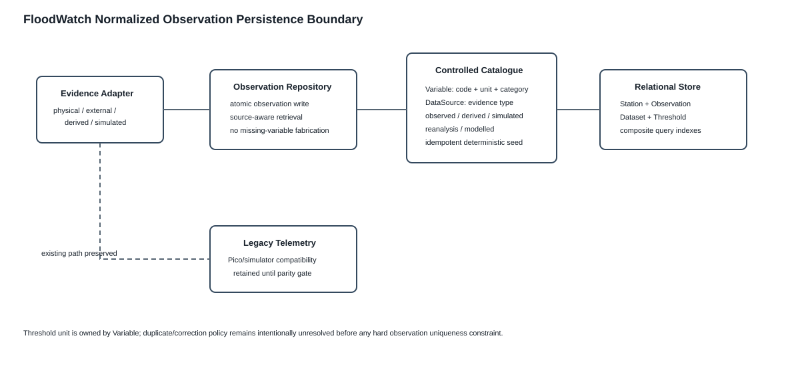

The normalized model now has deterministic Variable/DataSource catalogues and an observation repository. The catalogue defines representation vocabulary, not experiment inclusion. `Threshold` no longer duplicates the unit held by `Variable`, avoiding disagreement between the threshold and the measured quantity. Composite observation indexes cover station-variable-time and source-time access. A hard duplicate-observation uniqueness constraint remains deferred until correction/revision semantics are explicitly defined.

## 5. Target logical ERD

Rendered diagram asset: 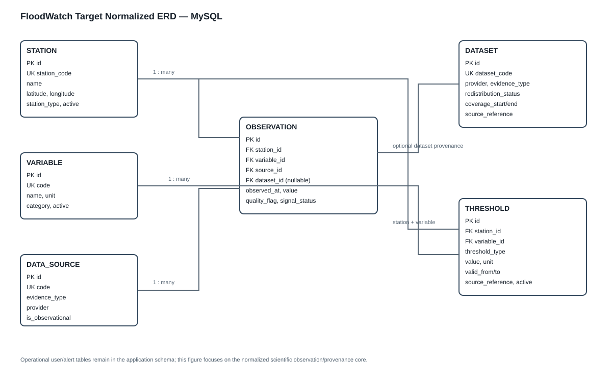

~~~mermaid
erDiagram
    STATION ||--o{ OBSERVATION : has
    VARIABLE ||--o{ OBSERVATION : describes
    DATA_SOURCE ||--o{ OBSERVATION : provides
    DATASET ||--o{ OBSERVATION : may_supply
    STATION ||--o{ THRESHOLD : configures
    VARIABLE ||--o{ THRESHOLD : applies_to

    USER ||--o{ USER_SESSION : owns
    USER ||--o{ COMMUNITY_REPORT : submits
    USER ||--o{ SCENARIO_RUN : executes
    ALERT_EVENT ||--o{ ALERT_AUDIT_LOG : has
    USER ||--o{ ALERT_AUDIT_LOG : performs

    STATION {
      bigint id PK
      varchar station_code UK
      varchar name
      decimal latitude
      decimal longitude
      varchar station_type
      boolean active
      datetime created_at
    }

    VARIABLE {
      bigint id PK
      varchar code UK
      varchar name
      varchar unit
      varchar category
      boolean active
    }

    DATA_SOURCE {
      bigint id PK
      varchar code UK
      varchar name
      varchar evidence_type
      varchar provider
      boolean is_observational
      text notes
    }

    DATASET {
      bigint id PK
      varchar dataset_code UK
      varchar title
      varchar provider
      varchar evidence_type
      varchar redistribution_status
      date coverage_start
      date coverage_end
      text source_reference
      text notes
    }

    OBSERVATION {
      bigint id PK
      bigint station_id FK
      bigint variable_id FK
      bigint source_id FK
      bigint dataset_id FK
      datetime observed_at
      double value
      varchar quality_flag
      varchar signal_status
      datetime ingested_at
    }

    THRESHOLD {
      bigint id PK
      bigint station_id FK
      bigint variable_id FK
      varchar threshold_type
      double value
      varchar unit
      varchar source_reference
      datetime valid_from
      datetime valid_to
      boolean active
    }
~~~

## 6. Key relationships

- One Station can have many Observations.
- One Variable can appear in many Observations.
- One DataSource can provide many Observations.
- An Observation may reference a Dataset when it originates from an imported historical/external dataset.
- One Station/Variable pair can have multiple Threshold records over time; validity dates prevent pretending a threshold is timeless.
- Operational alerts remain decision records. They should reference the station and, after migration, may reference the threshold/assessment context used to create the alert.

## 7. Initial variable catalogue

These are schema capabilities, not a claim that every variable is required in every experiment.

| Code | Meaning | Unit | Current status |
|---|---|---|---|
| river_stage | River/local stage | m | physical-stage candidate; prototype uses controlled stage-like input |
| river_discharge | River discharge | m3/s | GRDC RQ1 observational variable |
| rainfall_rate | Local rainfall intensity | mm/h | simulator currently; physical sensor optional |
| rainfall_total | Accumulated rainfall | mm | external/RQ2 candidate |
| rate_of_rise | Change in stage/discharge over defined interval | context-dependent | derived |
| battery_pct | Node battery state | % | operational variable; current Pico setup does not measure it |
| signal_state | Device communication state | categorical | operational/device metadata rather than hydrological driver |

## 8. Initial evidence/source catalogue

The schema must support at least:

- LOCAL_SENSOR
- AUTHORITATIVE_OBSERVATION
- GRIDDED_OBSERVATION
- REMOTE_SENSING
- REANALYSIS
- MODELLED_EXTERNAL_DATA
- DERIVED
- SIMULATED

This classification prevents a simulator value, GRDC observation and reanalysis value from becoming scientifically indistinguishable after persistence.

## 9. Important constraints and indexes

Target MySQL constraints include:

- unique Station.station_code;
- unique Variable.code;
- unique DataSource.code;
- unique Dataset.dataset_code;
- Observation foreign keys to Station, Variable and DataSource;
- nullable Dataset FK for live/local observations;
- composite index on Observation(station_id, variable_id, observed_at);
- index on Observation(source_id, observed_at);
- duplicate-control key/policy for station + variable + source + observed_at;
- Threshold index on station_id + variable_id + active + validity dates;
- CHECK/application validation for latitude/longitude and accepted evidence/threshold types;
- InnoDB tables so foreign keys and transactions are enforced.

## 10. Legacy telemetry compatibility

Migration activity diagram: 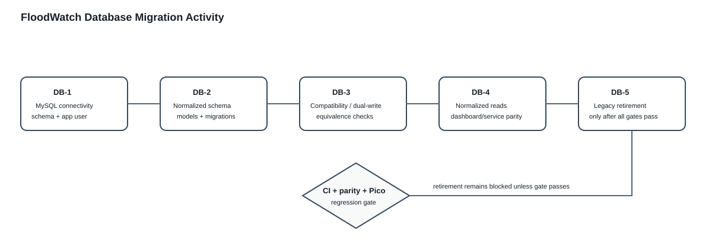

The existing `telemetry` table is not deleted during the first MySQL migration.

Migration strategy:

**Phase DB-1 - MySQL connectivity**
- install/configure MySQL Server and Workbench;
- create a dedicated `floodwatch` schema;
- create a least-privilege application user;
- connect SQLAlchemy using `FLOOD_EWS_DATABASE_URL`;
- run MySQL-specific connectivity/integration tests.

**Phase DB-2 - target schema**
- implement Station, Variable, DataSource, Dataset, Observation and Threshold SQLAlchemy models;
- create migration scripts;
- seed controlled catalogues (variables/source classes) deterministically.

**Phase DB-3 - dual-write compatibility**
- existing telemetry API remains unchanged externally;
- adapter converts each accepted legacy telemetry payload into normalized observations;
- during the controlled migration period, compatibility records and normalized records are checked for equivalence.

**Phase DB-4 - read migration**
- dashboard/current-state services read through normalized repositories;
- legacy telemetry reads remain regression-tested until parity is proven.

**Phase DB-5 - retirement**
- only after parity, CI and physical Pico regression pass may legacy telemetry persistence be retired or archived.

No destructive migration occurs before DB-4 passes.

## 11. MySQL connection convention

The application already reads the environment variable:

~~~text
FLOOD_EWS_DATABASE_URL
~~~

Target form:

~~~text
mysql+pymysql://floodwatch_app:<password>@127.0.0.1:3306/floodwatch
~~~

Credentials must be stored in local environment/configuration, not committed to GitHub.

## 12. MySQL Workbench workflow

Target deployment diagram: 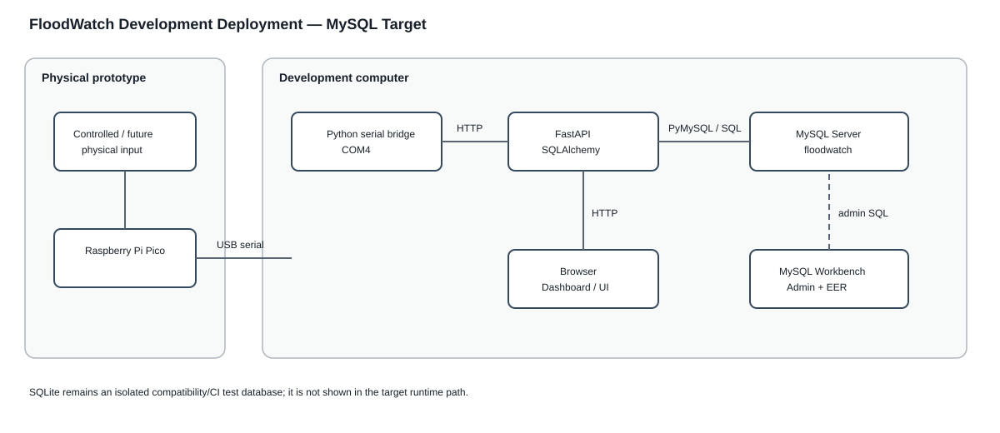

Workbench will be used to:

1. connect to the local MySQL Server;
2. inspect the `floodwatch` schema;
3. execute/administer approved migration SQL when needed;
4. inspect PK/FK/index definitions;
5. generate/review the physical EER diagram;
6. run controlled SQL queries during defense/testing.

Workbench is not called from FastAPI. FastAPI connects directly to MySQL Server through SQLAlchemy/PyMySQL.

## 13. Defense rationale

**Why normalize observations instead of keeping one telemetry table?**  
Because FloodWatch now handles heterogeneous evidence. A fixed wide row assumes every source supplies the same variables. The normalized Observation model stores one variable/value with explicit station, source and time, allowing stage-only hardware, discharge-only GRDC and later rainfall/upstream evidence without inventing missing values.

**Why MySQL?**  
Because the developed application has relational entities, user/alert workflows, time-series observations and a need for explicit constraints, transactions and inspectable client/server database administration. MySQL integrates with the existing SQLAlchemy architecture and MySQL Workbench provides an appropriate design/administration interface.

**Why keep SQLite tests?**  
Fast isolated tests should not require every GitHub runner to maintain a persistent MySQL instance. MySQL-specific behaviour is tested separately; SQLite remains a test double for DBMS-neutral repository/service logic.

## 14. Gate

This specification authorizes implementation of the normalized MySQL-capable schema and migration tooling. It does **not** authorize deleting the legacy telemetry table, importing restricted GRDC raw data into GitHub, selecting research thresholds, or running Experiment 001.

## DB-3 implementation status — controlled dual-write

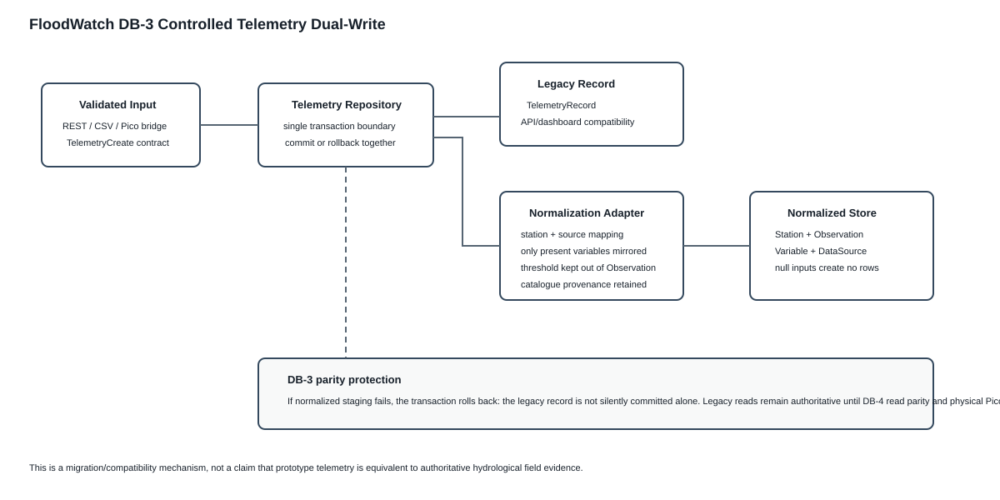

DB-3 is now implemented for validated telemetry ingestion. `telemetry_normalization_adapter.py` maps the legacy payload into atomic normalized observations while retaining the legacy telemetry record. Hardware and simulated provenance remain distinct; null optional measurements create no normalized observations; danger thresholds are not misrepresented as sensor measurements. Catalogue seeding participates in the caller transaction so compatibility and normalized persistence commit or roll back together.

**Gate:** DB-3 is PASS under SQLite compatibility CI. DB-4 normalized-read parity, physical Pico regression after read migration, and MySQL-specific DB-1 execution remain pending.

## DB-4 status — evidence read parity

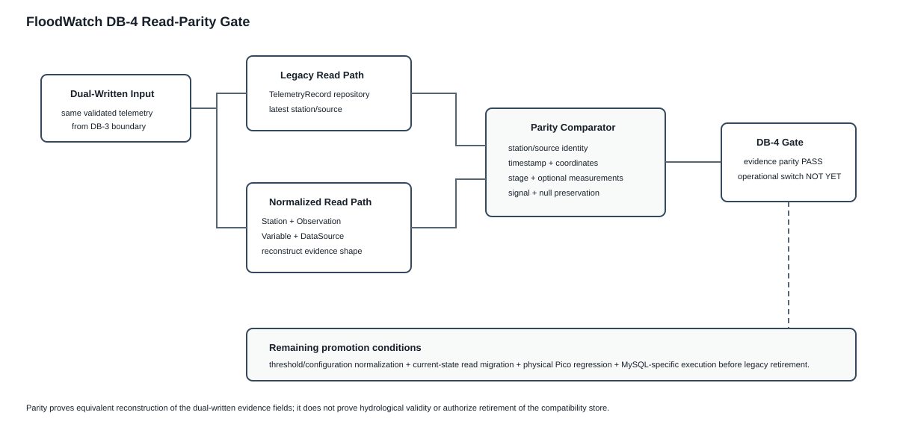

Normalized evidence reconstruction now matches the legacy latest-per-station/source representation for the fields actually dual-written. Null optional measurements remain null. This is a parity result, not authorization to retire the legacy table. Threshold/configuration normalization is the next dependency because `danger_level_m` is not an Observation and the current-state service still requires a threshold.

**DB-4 evidence parity: PASS under SQLite compatibility CI. DB-4 operational read promotion: PENDING.**

## Threshold applicability hardening

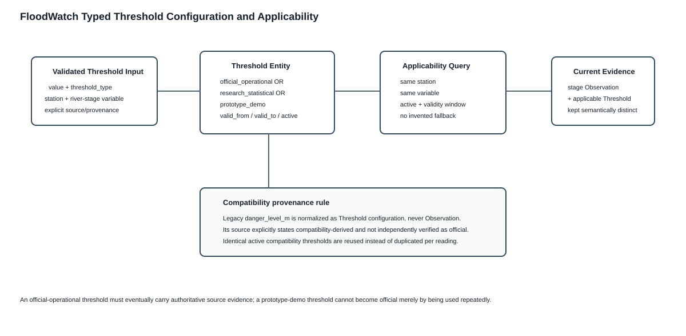

Threshold persistence now has an explicit repository and an index covering station, variable, type and validity. The lookup requires active configuration whose validity interval contains the observation time. The unit remains owned by Variable. Compatibility-derived threshold provenance explicitly states that it is not independently verified as official. This prevents repeated prototype use from laundering a demonstration threshold into an authoritative threshold.

DB-4 normalized evidence reconstruction now includes threshold value/type. Full current-state parity remains the next gate.

## DB-4B status — current-state parity

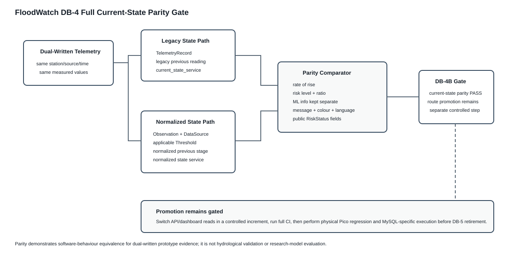

Normalized persistence now supports reconstruction through current-state decision support rather than only raw evidence. Previous normalized stage observations provide the rate-of-rise input; the applicable Threshold provides decision configuration; the shared risk engine produces the display assessment. CI verifies parity against the legacy service for both hardware and simulator paths.

**DB-4B current-state parity: PASS under SQLite compatibility CI. Operational route promotion remains a separate pending step.**

## DB-4 operational promotion status

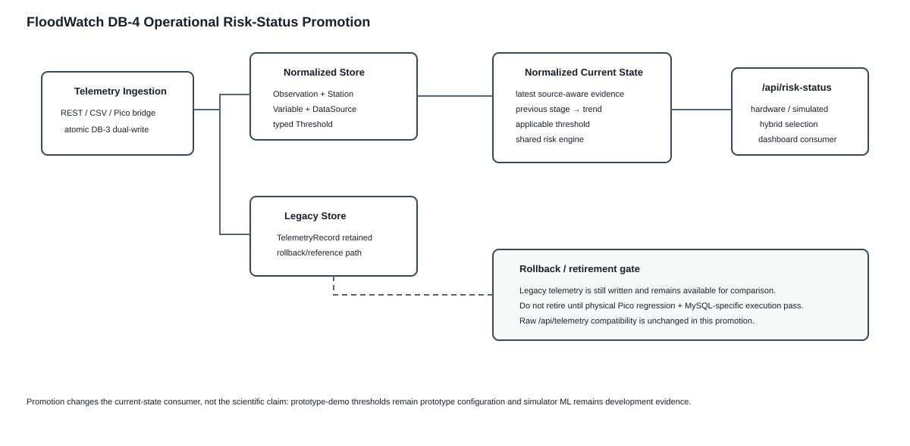

The current-state API now reads from the normalized model. The compatibility telemetry table remains written and queryable but is no longer the source for `/api/risk-status`. This is not DB-5 retirement: physical Pico regression and MySQL-specific execution remain mandatory before removal of legacy persistence.

**DB-4 operational risk-status promotion: PASS under SQLite compatibility CI.**

## DB-1 execution result

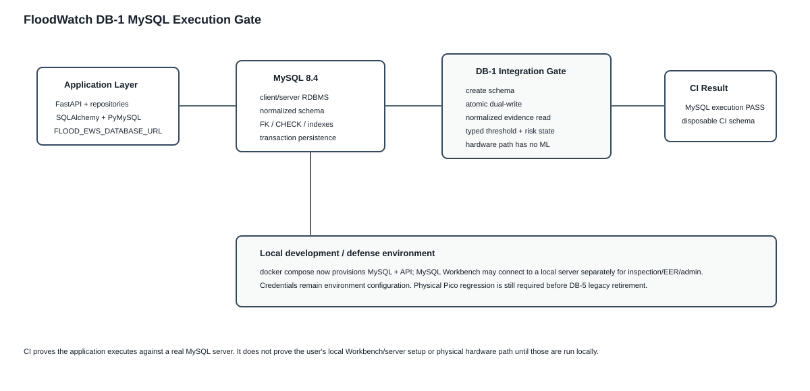

DB-1 now has direct MySQL execution evidence. The CI integration job creates the schema on MySQL 8.4 and verifies dual-write, normalized evidence reconstruction, typed threshold persistence and normalized current-state assessment. Docker Compose now represents the declared deployment architecture by provisioning a MySQL service and connecting the API through `mysql+pymysql`.

**DB-1 MySQL application execution: PASS in disposable CI MySQL. Local Workbench/server verification remains a defense/development environment check, not a missing application-code gate.**

## Normalized historical read promotion

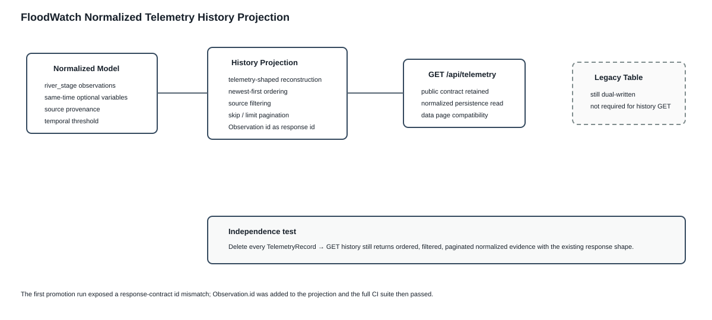

`GET /api/telemetry` no longer requires `TelemetryRecord` for reads. Historical telemetry-shaped rows are projected from normalized stage observations, same-time optional variables, source provenance and temporally applicable thresholds. The anchoring Observation primary key is used as the compatibility response identifier. The legacy table remains dual-written pending final retirement gates.
