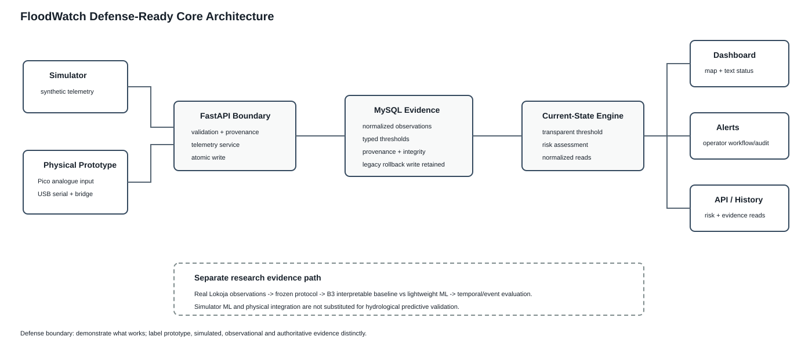
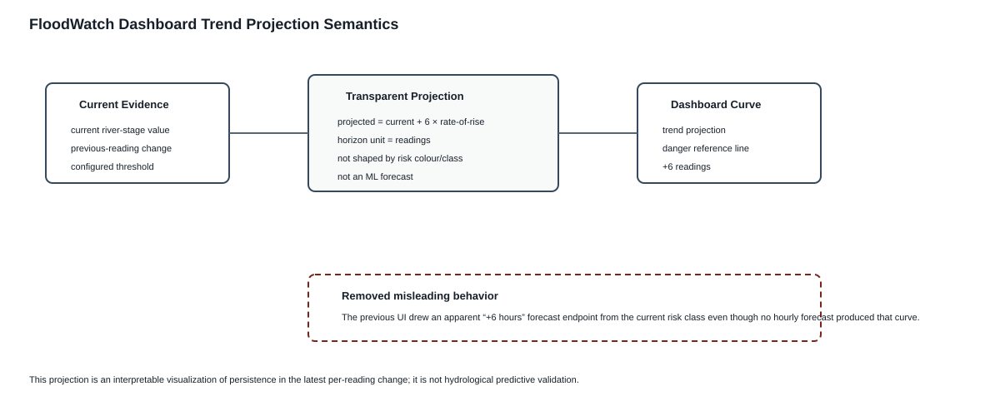
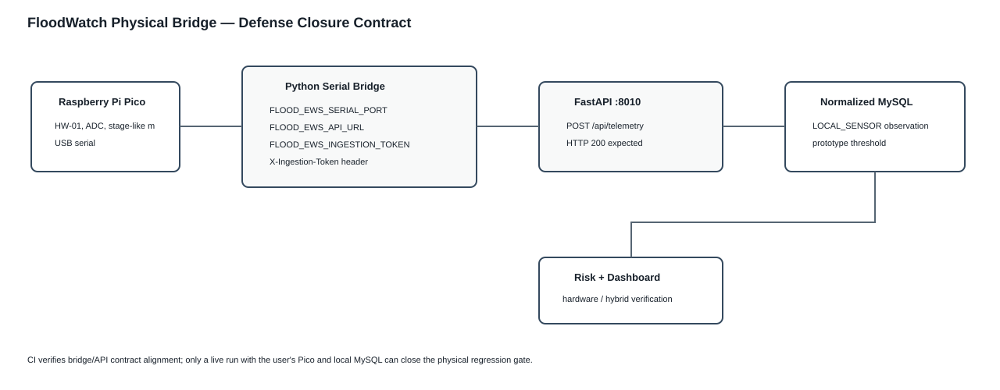

# FloodWatch Defense Demo Script

Use this as a calm, repeatable guide for demonstrating the project. The goal is to show the complete approved core pipeline without getting pulled into parked future-work features. The current three-day closure boundary is documented in [defense_closure_baseline.md](defense_closure_baseline.md).

Optional operational demonstration added 2026-09-08: after showing the original core, sign into an account authorized through `manage_operator.py`, upload CSV evidence, acknowledge/escalate an alert and view its history, then open `/evaluation` and download a scenario PDF. Explain that the report contains a saved holdout-evaluation snapshot, not freshly measured accuracy from one scenario reading. The extension is user-authorized product work; do not describe it as supervisor-approved without agreement. Use [operational_platform_guide.md](operational_platform_guide.md) for commands and [provider_setup.md](provider_setup.md) for news/messaging setup. Docker/hosted CI and real messages were not verified locally.

## 1. Demo message in one sentence

FloodWatch is a portable flood early warning and decision support prototype that receives simulator or hardware-ready telemetry, stores normalized source-aware evidence, applies transparent threshold-based current-state risk logic, and displays the result on an accessible GIS dashboard with persistent alert workflow support. A saved simulator-only future-horizon ML model is displayed as separate development evidence and is not applied to physical observations.

## 2. What to say before opening the system

Short opening:

> This implementation uses Nigeria as the case-study deployment, but the architecture is portable because each station supplies its own coordinates and danger threshold. The system is decision support only, so it does not replace NEMA, SEMA, or local responders. It provides risk interpretation and always directs users to follow official guidance.

Key guardrails to mention:

- It does not issue autonomous evacuation commands.
- It supports simulator and hardware-style readings through the same API shape.
- MySQL is the target operational DBMS; the current MySQL 8.4 integration gate passes in CI. SQLite remains an isolated compatibility/test fallback.
- It includes a map and a text station list for accessibility.
- It simulates email and SMS alerts so access is not smartphone-only.
- Its ML metrics are from simulator-generated data and are labelled that way.

## 3. Terminal setup

Use two PowerShell terminals.

Do not paste the `PS C:\...>` prompt. Paste only the command text.

### Terminal 1 - backend

```powershell
cd C:\Users\User\Documents\Word_Document\Project\files\api
py -m pip install -r .\requirements.txt
py -u .\test_model_training.py
py -u .\test_api.py
py -u .\test_operational.py
py -m uvicorn main:app --reload --host 127.0.0.1 --port 8000
```

Expected evidence:

```text
[PASS] Future-horizon ML target verified; circular current-threshold label leakage removed.
[PASS] Core dashboard/data access, break tests, optional auth shell, parked extras, source switching, XSS guards, and SQLite configuration verified.
```

Then open:

```text
http://127.0.0.1:8000/dashboard
```

If Windows blocks port `8000` with `WinError 10013`, use a higher local port:

```powershell
py -m uvicorn main:app --reload --host 127.0.0.1 --port 8030
```

Then open:

```text
http://127.0.0.1:8030/dashboard
```

### Terminal 2 - simulator

```powershell
cd C:\Users\User\Documents\Word_Document\Project
py .\files\flood_sensor_simulator.py --mode flood --ticks 30
```

Expected behavior:

- The simulator sends readings to the API.
- The backend terminal shows `POST /api/telemetry` requests with `200 OK`.
- The dashboard updates with station markers and text station cards.

## 4. Suggested demo order

### Step 1 - Show the homepage

Open:

```text
http://127.0.0.1:8000/
```

Say:

> The public homepage introduces the system calmly and makes clear that this is a decision-support tool, not an autonomous emergency authority.

### Step 2 - Show the dashboard

Open:

```text
http://127.0.0.1:8000/dashboard
```

Point out:

- monitored station count;
- highest risk;
- model status;
- map markers;
- accessible station list;
- safe risk messages.

Say:

> The map and text list are generated from the same risk-status endpoint, so visual and non-visual users receive equivalent station information.

### Step 3 - Show source switching

Use the dashboard source selector:

- Hybrid
- Simulated
- Hardware

Say:

> This is how the same system can be demonstrated with simulated readings now and physical sensors later. Simulated mode shows only generated readings. Hardware mode shows only readings posted with `data_source` set to `hardware`. Hybrid mode compares available simulated and hardware readings and displays the currently more serious station risk.

Point out the source-mode explanation panel near the map. It exists so users do not have to guess why Hybrid differs from Simulated or Hardware.

### Step 4 - Show map controls

Point out:

- OpenStreetMap / satellite layer selector;
- station search;
- risk filter;
- risk rings;
- station labels;
- river-context toggle;
- selected-station detail panel.

Say:

> The river-context layer is schematic. It helps dashboard interpretation, but it is not an official flood-boundary dataset and it does not change the risk calculation.

### Step 5 - Show accessibility

Scroll to or point at the station list beside the map.

Say:

> A user does not have to interpret map markers alone. Each station is also available as text, with written risk level, readings, alert channels, and safe guidance.

### Step 6 - Show the flood data page

Open:

```text
http://127.0.0.1:8000/data
```

Say:

> This page helps verify that telemetry has been stored and can be reviewed after ingestion. It supports the evidence trail behind the dashboard.

Point out:

- newest records appear first;
- the source filter can show all, simulated, or hardware telemetry;
- the table refreshes automatically every 15 seconds while the page remains open;
- the manual refresh button lets the user pull the latest rows immediately.

### Step 7 - Show test evidence

Show the terminal output or screenshots of:

```powershell
py -u .\test_model_training.py
py -u .\test_api.py
```

Say:

> The saved model is simulator-only development evidence; I do not claim it is field-validated or use it for physical current-state risk. The operational risk state is produced by transparent threshold logic. The real Lokoja predictive comparison is a separate research experiment.

### Step 8 - Optional read-only API check

From the project root:

```powershell
py .\files\api\query_api.py --view risk --source hybrid
```

Say:

> This helper reads the same public risk-status endpoint used by the dashboard. It is read-only and does not create demo accounts or change system state.

### Step 9 - Optional account-shell note

Only mention this if asked.

Say:

> The account pages are an optional prototype shell, not part of the approved core objectives. They currently demonstrate careful registration confirmation, phone/contact preference capture, and guarded account deletion with a simulated verification code, but real account-dependent services remain future work until supervisor approval.

## 5. If something goes wrong during the demo

### Dashboard says no telemetry

Check:

1. Is Terminal 1 still running `uvicorn`?
2. Did Terminal 2 run the simulator from the project root?
3. Did Terminal 1 show `POST /api/telemetry` with `200 OK`?

Run again:

```powershell
cd C:\Users\User\Documents\Word_Document\Project
py .\files\flood_sensor_simulator.py --mode flood --ticks 30
```

### Simulator says REST post timed out

This usually means the API server is not reachable.

Check:

```text
http://127.0.0.1:8000/dashboard
```

If the page does not load, restart Terminal 1:

```powershell
cd C:\Users\User\Documents\Word_Document\Project\files\api
py -m uvicorn main:app --reload
```

### Browser asks for `/favicon.ico`

This is now handled by the application. A `404` for `/favicon.ico` should not appear after the latest fix.

### PowerShell shows `PSReadLine` or paste errors

That is a terminal paste/display issue, not a project logic failure. Paste one command at a time and avoid copying prompts or Markdown quote markers.

If PowerShell rejects an ampersand pasted from a formatted block, use the simpler `py` commands above. Do not paste leading `>` quote characters from chat output.

## 6. Questions the panel may ask

### Why not LSTM or deep learning?

Answer:

> The project does not have enough real sequential field data to justify deep learning. I used Logistic Regression and Random Forest with a threshold baseline so the comparison remains explainable and suitable for the available simulator-generated dataset.

### Why is the model not 100 percent?

Answer:

> A perfect result would be suspicious here. The earlier perfect baseline came from a circular label, so it was corrected. The current model predicts a future threshold crossing using current features only.

### Why use SQLite?

Answer:

> SQLite is suitable for a local undergraduate prototype because it is persistent, file-based, and simple to run. The SQLAlchemy layer also keeps the architecture portable for a future database such as MySQL or PostgreSQL if deployed at larger scale.

### Why include a text station list if there is already a map?

Answer:

> Map-only interfaces exclude users who use screen readers or who cannot easily interpret visual markers. The text list provides equivalent station status and supports accessibility.

### Is this Nigeria-only?

Answer:

> No. Nigeria is the case study. The architecture is portable because station coordinates, danger levels, and source metadata are data inputs rather than hardcoded system assumptions.

### Does the system send real SMS or email?

Answer:

> Not in this prototype. It logs simulated web, email, and SMS alerts. Real delivery should only be enabled after a provider gateway is configured and tested.

## 7. Screenshot checklist

Capture these screenshots for the final report/presentation:

- homepage;
- dashboard before simulator data;
- dashboard after flood-mode simulator data;
- source selector showing simulated/hardware/hybrid;
- accessible station list;
- selected-station detail panel;
- flood data page;
- terminal showing model-training metrics;
- terminal showing `[PASS]` test output;
- backend terminal showing `POST /api/telemetry 200 OK`.

## 8. Closing statement

> The completed prototype demonstrates the core idea: an accessible, portable flood early-warning and decision-support system that integrates telemetry, storage, ML prediction, GIS visualization, and simulated multi-channel alerts while staying within safe decision-support boundaries.


## Final three-day demo priority

The primary defense demonstration is now the smallest complete vertical product: telemetry producer -> FastAPI validation -> normalized MySQL evidence -> threshold current-state assessment -> dashboard/history -> alert workflow. The preferred producer is the physical Pico after the post-migration regression passes; the simulator is the deterministic fallback. Do not retrain the saved simulator model during the defense setup merely to make the application run.



Before defense, the physical path must be rerun using the procedure in `hardware_integration_guide.md`. Until that happens, describe the historical Pico integration and the current MySQL software gate separately rather than claiming the post-migration physical chain has already passed.


## Dashboard trend projection — what to say



If asked about the curve in the selected-station panel, say: “This is not the thesis ML forecast. It is a transparent six-reading persistence projection based on the latest observed change, shown against the configured threshold. I deliberately label the horizon in readings because the operational telemetry interval is not guaranteed to be one hour.” Do not call the curve a six-hour forecast.


## Physical demo bridge setup



For the live physical demo, configure `FLOOD_EWS_SERIAL_PORT`, `FLOOD_EWS_API_URL` and, when API ingestion protection is enabled, `FLOOD_EWS_INGESTION_TOKEN`. The bridge attaches the matching `X-Ingestion-Token` header. Do not assume COM4 if Windows assigns another port. The software contract is CI-guarded, but the physical regression is not considered passed until the live Pico/MySQL/dashboard procedure is performed.
