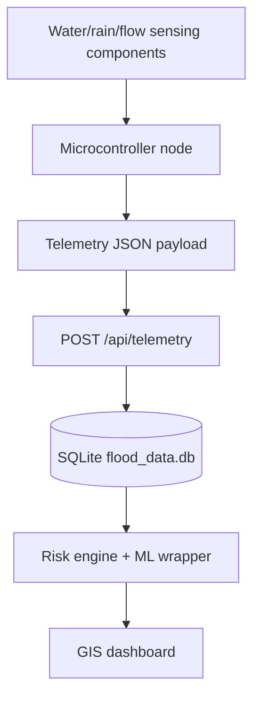

# Hardware Integration Guide

This guide explains how a physical sensor node can connect to the current FloodWatch backend without changing the approved core system.

The important idea is simple: the simulator and hardware use the same telemetry shape. The dashboard can switch between `simulated`, `hardware`, and `hybrid` source modes because each reading carries a `data_source` value.

2026-09-08 operational update: operators can also upload evidence through `POST /api/telemetry/upload-csv` or the Flood Data page. A source label is supplied provenance, not hardware authentication. A deployment may set `FLOOD_EWS_INGEST_TOKEN`, in which case direct sensor POSTs must include an `X-Ingest-Token` header. The existing simulator does not yet attach that optional header automatically; leave the key unset for its local demo or update the client before enabling it. Keep public deployments protected. See [operational_platform_guide.md](operational_platform_guide.md) for limits and role setup. Physical sensor accuracy/calibration has not been tested by these software checks.

## 1. Hardware-ready architecture



The backend does not need to know whether a reading came from the simulator or a real device. It only needs a valid JSON payload.

## 2. Suggested component categories

These are categories, not a compulsory shopping list:

- microcontroller with Wi-Fi support, such as an ESP32-class board;
- water-level sensor, such as ultrasonic, pressure, or float-based sensing;
- rainfall input, such as a tipping-bucket rain gauge or simulated rainfall reading during early prototype testing;
- optional flow-rate sensor or estimated flow-rate calculation;
- stable power source, battery backup, and voltage regulation;
- waterproof enclosure;
- optional status indicators for power/network/sensor state.

For the undergraduate prototype, a real node can begin with only a microcontroller and one water-level sensor, while rainfall and flow values are estimated or manually calibrated during testing. The payload must still include all required fields because the API validates the full schema.

## 3. Required API endpoint

Send hardware readings to:

```text
POST http://127.0.0.1:8000/api/telemetry
```

Content type:

```text
application/json
```

## 4. Required JSON payload

```json
{
  "station_id": "HW-01",
  "station_name": "Prototype Hardware Gauge",
  "data_source": "hardware",
  "lat": 9.0579,
  "lon": 7.4951,
  "timestamp": "2026-09-03T12:00:00Z",
  "water_level_m": 1.42,
  "danger_level_m": 2.0,
  "rainfall_mm_hr": 8.5,
  "flow_rate_m3s": 12.1,
  "battery_pct": 91.0,
  "signal": "online"
}
```

The most important field for switching is:

```json
"data_source": "hardware"
```

## 5. Tested PowerShell hardware-style POST

Use this command to simulate a hardware node from PowerShell while the API server is running:

```powershell
$HardwareReading = @{
  station_id = "HW-01"
  station_name = "Prototype Hardware Gauge"
  data_source = "hardware"
  lat = 9.0579
  lon = 7.4951
  timestamp = "2026-09-03T12:00:00Z"
  water_level_m = 1.42
  danger_level_m = 2.0
  rainfall_mm_hr = 8.5
  flow_rate_m3s = 12.1
  battery_pct = 91.0
  signal = "online"
} | ConvertTo-Json

Invoke-RestMethod -Uri "http://127.0.0.1:8000/api/telemetry" -Method Post -ContentType "application/json" -Body $HardwareReading
```

After posting, open:

```text
http://127.0.0.1:8000/dashboard
```

Set the dashboard source selector to `Hardware` or `Hybrid`.

## 6. Hardware validation rules

The API rejects invalid hardware readings before they enter the database.

Important validation rules:

- `station_id` and `station_name` must not be blank.
- `data_source` must be either `simulated` or `hardware`.
- `lat` must be between `-90` and `90`.
- `lon` must be between `-180` and `180`.
- `danger_level_m` must be greater than `0`.
- `water_level_m`, `rainfall_mm_hr`, and `flow_rate_m3s` must not be negative.
- `battery_pct` must be between `0` and `100`.
- `timestamp` must be a valid date/time value.

These checks are verified in `files/api/test_api.py`.

## 7. Simulator, hardware, and hybrid modes

The dashboard calls:

```text
GET /api/risk-status?data_source=simulated
GET /api/risk-status?data_source=hardware
GET /api/risk-status?data_source=hybrid
```

Meaning:

| Mode | Purpose |
|---|---|
| `simulated` | Show only simulator readings |
| `hardware` | Show only physical or hardware-style readings posted with `data_source: "hardware"` |
| `hybrid` | Compare available readings per station and show the most serious latest risk |

This gives the project two demonstration options:

1. run fully from the simulator;
2. plug in hardware later without rebuilding the backend/dashboard.

## 8. Safe defense wording

Use this wording when explaining hardware readiness:

> The system is hardware-ready because a physical node can send the same JSON telemetry shape as the simulator. The tested backend accepts `data_source: "hardware"`, stores the reading, and displays it on the same accessible GIS dashboard.

Avoid saying:

> The physical hardware has been field-tested.

unless it has actually been connected and tested.
