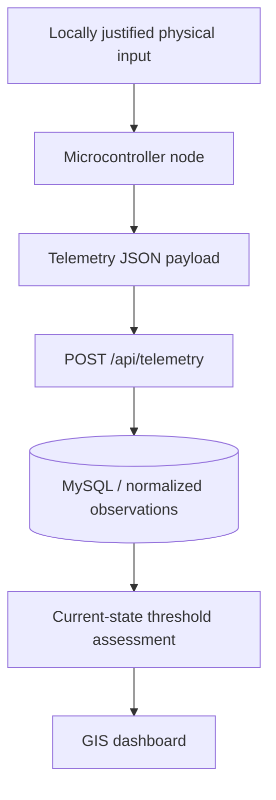

# Hardware Integration Guide

This guide explains how a physical sensor node can connect to the current FloodWatch backend without changing the approved core system.

The simulator and hardware still share a migration-compatible telemetry envelope, but their evidence is not scientifically interchangeable. Each reading carries `data_source`, and unavailable physical measurements are represented as `null`, not fabricated numeric zeroes.

2026-09-24 closure update: operators can also upload evidence through `POST /api/telemetry/upload-csv` or the Flood Data page. A source label is supplied provenance, not hardware authentication. Direct telemetry POSTs are protected by `FLOOD_EWS_INGEST_TOKEN` when configured and use the `X-Ingest-Token` header. The Pico bridge now reads this token from the environment and attaches the header automatically. Keep public deployments protected. See [operational_platform_guide.md](operational_platform_guide.md) for limits and role setup. Physical sensor accuracy/calibration has not been tested by these software checks.

## 1. Hardware-ready architecture



The backend must preserve whether a reading is simulated or physical. The saved synthetic ML model is not applied to hardware observations.

## 2. Suggested component categories

These are categories, not a compulsory shopping list:

- microcontroller with Wi-Fi support, such as an ESP32-class board;
- water-level sensor, such as ultrasonic, pressure, or float-based sensing;
- optional local rainfall sensor only if the physical-validation plan justifies it;\n- no direct flow sensor is required by the current evidence gate;
- stable power source, battery backup, and voltage regulation;
- waterproof enclosure;
- optional status indicators for power/network/sensor state.

For the current controlled prototype, the Pico analogue input represents stage-like change for integration testing. Rainfall, discharge/flow and battery state must be omitted or sent as `null` when they are not physically measured. They must not be estimated merely to satisfy the API.

## 3. Required API endpoint

Send hardware readings to:

```text
POST http://127.0.0.1:8010/api/telemetry
```

Content type:

```text
application/json
```

## 4. Required JSON payload

```json
{
  "station_id": "HW-01",
  "station_name": "[CONTROLLED PROTOTYPE] Hardware Gauge",
  "data_source": "hardware",
  "lat": 9.0579,
  "lon": 7.4951,
  "timestamp": "2026-09-03T12:00:00Z",
  "water_level_m": 1.42,
  "danger_level_m": 2.0,
  "threshold_type": "prototype_demo",
  "rainfall_mm_hr": null,
  "flow_rate_m3s": null,
  "battery_pct": null,
  "signal": "online"
}
```

The most important field for switching is:

```json
"data_source": "hardware"
```

## 5. Tested PowerShell hardware-style POST

Use this command to simulate a hardware node from PowerShell while the API server is running:

```powershell
$HardwareReading = @{
  station_id = "HW-01"
  station_name = "[CONTROLLED PROTOTYPE] Hardware Gauge"
  data_source = "hardware"
  lat = 9.0579
  lon = 7.4951
  timestamp = "2026-09-03T12:00:00Z"
  water_level_m = 1.42
  danger_level_m = 2.0
  threshold_type = "prototype_demo"
  rainfall_mm_hr = $null
  flow_rate_m3s = $null
  battery_pct = $null
  signal = "online"
} | ConvertTo-Json

$Headers = @{}
if ($env:FLOOD_EWS_INGEST_TOKEN) {
  $Headers["X-Ingest-Token"] = $env:FLOOD_EWS_INGEST_TOKEN
}
Invoke-RestMethod -Uri "http://127.0.0.1:8010/api/telemetry" -Method Post -ContentType "application/json" -Headers $Headers -Body $HardwareReading
```

After posting, open:

```text
http://127.0.0.1:8010/dashboard
```

Set the dashboard source selector to `Hardware` or `Hybrid`.

## 6. Hardware validation rules

The API rejects invalid hardware readings before they enter the database.

Important validation rules:

- `station_id` and `station_name` must not be blank.
- `data_source` must be either `simulated` or `hardware`.
- `lat` must be between `-90` and `90`.
- `lon` must be between `-180` and `180`.
- `danger_level_m` must be greater than `0`.
- `water_level_m`, `rainfall_mm_hr`, and `flow_rate_m3s` must not be negative.
- `battery_pct` must be between `0` and `100`.
- `timestamp` must be a valid date/time value.

These checks are verified in `files/api/test_api.py`.

## 7. Simulator, hardware, and hybrid modes

The dashboard calls:

```text
GET /api/risk-status?data_source=simulated
GET /api/risk-status?data_source=hardware
GET /api/risk-status?data_source=hybrid
```

Meaning:

| Mode | Purpose |
|---|---|
| `simulated` | Show only simulator readings |
| `hardware` | Show only physical or hardware-style readings posted with `data_source: "hardware"` |
| `hybrid` | Compare available readings per station and show the most serious latest risk |

This gives the project two demonstration options:

1. run fully from the simulator;
2. plug in hardware later without rebuilding the backend/dashboard.

## 8. Safe defense wording

Use this wording when explaining hardware readiness:

> The physical integration path is working: the Pico can send a controlled stage-like analogue value through the serial bridge to FastAPI, storage, and the dashboard. This demonstrates sensing-to-software integration. It is not a Lokoja field observation, and unmeasured rainfall, discharge, and battery values are kept unavailable rather than fabricated.

Avoid saying:

> The physical hardware has been field-tested.

unless it has actually been connected and tested.


## 9. Physical regression gate after normalized-read promotion

The software migration is now far enough that the original physical path must be re-run before the legacy telemetry table can be retired.

The required defense/development chain is:

```text
Pico analogue input
    -> USB serial / COM4
    -> Python serial bridge
    -> POST /api/telemetry
    -> atomic dual-write
    -> MySQL normalized LOCAL_SENSOR Observation + typed Threshold
    -> /api/risk-status?data_source=hardware
    -> dashboard Hardware/Hybrid view
```

This is a **physical integration regression**, not a hydrological calibration experiment. It proves that the already-demonstrated Pico-to-software path still works after the database/read-path migration. It does not prove that the analogue input is an accurate Lokoja river-stage sensor.

### Procedure

1. Start MySQL Server and the FloodWatch API with `FLOOD_EWS_DATABASE_URL` pointing to the intended MySQL database.
2. Confirm `GET /health` reports a healthy application/database state.
3. Connect the Raspberry Pi Pico and confirm Windows assigns the expected serial port (previously COM4; use the actual current port if Windows assigns another).
4. Configure the bridge for the actual local port/API and start it. Defaults are COM4, 115200 baud and port 8010:

```powershell
$env:FLOOD_EWS_SERIAL_PORT = "COM4"   # change if Windows assigned another port
$env:FLOOD_EWS_API_URL = "http://127.0.0.1:8010/api/telemetry"
# Use the same token configured for the API, if one is enabled:
$env:FLOOD_EWS_INGEST_TOKEN = "<your-local-ingestion-token>"
python files\hardware\bridge\pico_serial_bridge.py
```

Move the controlled analogue input through at least two visibly different levels.
5. Confirm the bridge receives HTTP 200 responses from `POST /api/telemetry`.
6. Open `/api/risk-status?data_source=hardware` and confirm the station, latest water level, threshold type, source and rate-of-rise update.
7. Open the dashboard, select Hardware, then Hybrid, and confirm the same fresh hardware-originated state is visible.
8. Run the read-only database verifier from the repository root or with the API modules on `PYTHONPATH`:

```powershell
cd files\api
$env:PYTHONPATH = "."
python ..\hardware\verify_physical_hardware_regression.py HW-01
```

Use the actual station ID if the bridge uses a different one.

The verifier checks normalized `LOCAL_SENSOR` stage persistence, active threshold configuration, dual-write parity and the rule that unmeasured hardware rainfall, flow and battery remain null. It does **not** access COM4 itself, so a PASS is valid only when it is run immediately after observing the live Pico/bridge POSTs described above.

### Pass evidence to record

Record the date/time, serial port, station ID, two or more raw/converted bridge readings, HTTP 200 responses, verifier output, `/api/risk-status` result and one dashboard screenshot. If any stage fails, DB-5 remains blocked and the failure should be logged rather than bypassed.
