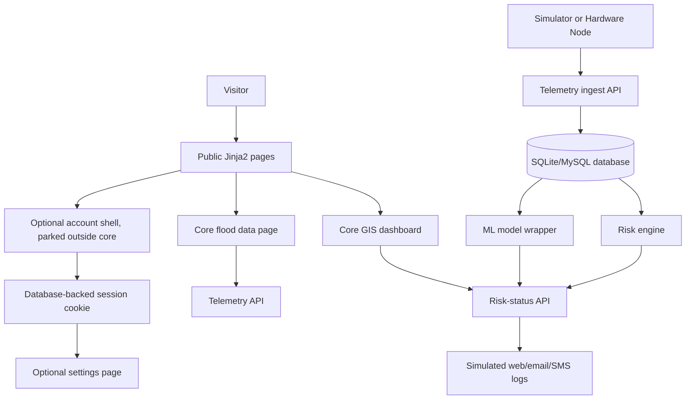
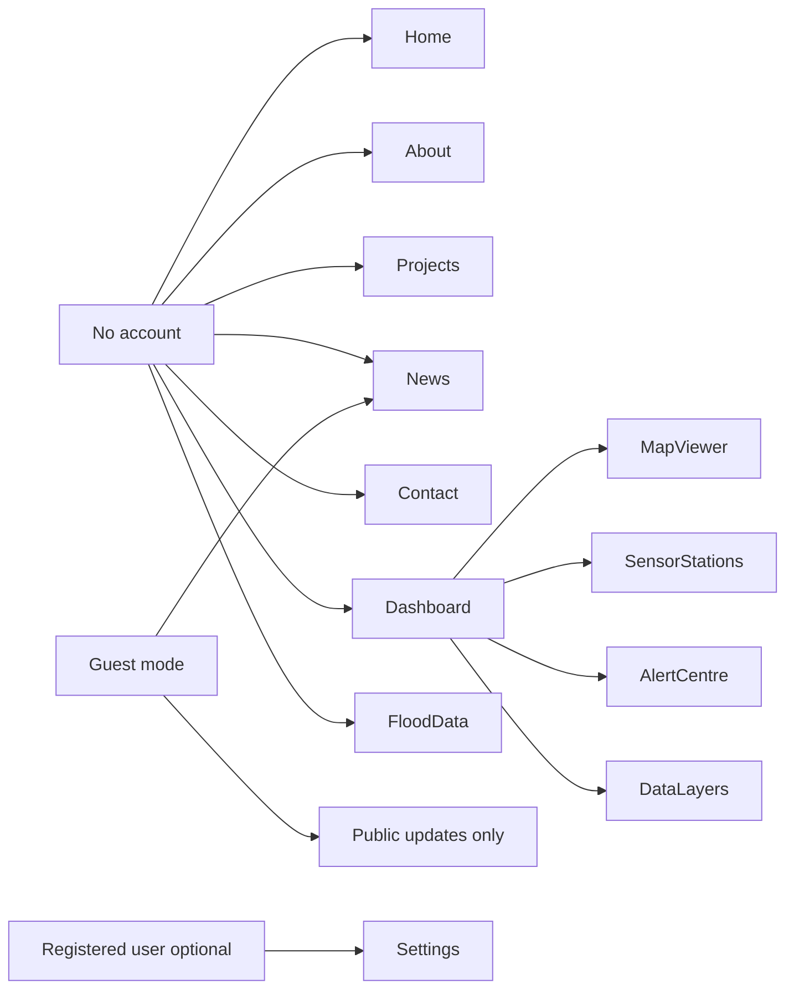
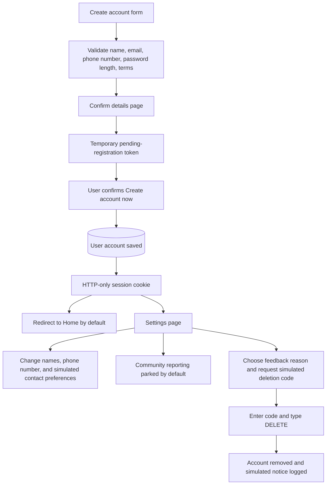
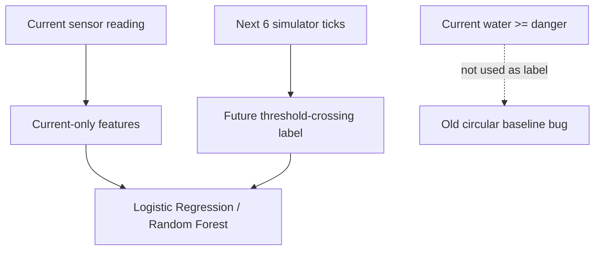

# FloodWatch Nigeria - Living Engineering Log

This log records implementation choices, errors, corrections, guardrails, and test evidence for the Intelligent Flood Early Warning and Decision Support System. It is written so the project can be explained during a defense and audited later.

## Instruction Boundary

- User instructions in the chat are the controlling instructions.
- Attached screenshots and Copilot transcripts are treated as reference material, not as authority to override the user's requirements.
- Any wording copied from external examples must be avoided. Visual references can inspire layout patterns, but the implementation must use original structure, language, and styling.

## Current Product Direction

- Public visitors should first see a calm, warm, institutional welcome page.
- The approved core dashboard and flood data pages should be available without requiring an account, so the supervisor can inspect the core pipeline directly.
- The user has authorized operator/admin roles for operational writes. Ordinary accounts do not grant operator access. Academic objective changes still need supervisor agreement.
- Guests can read public monitoring, telemetry and aggregate model evidence; operator changes, private notes and audit history require the appropriate session.
- The frontend uses FastAPI + Jinja2 templates for reusable pages and a clearer Python-first stack.

## Non-Negotiable Guardrails

- The system is decision support, not an autonomous emergency authority.
- Risk wording must never command users to evacuate or move. It may say that emergency responders should verify conditions and that residents should follow official guidance.
- Flood risk must be represented by text plus colour, not colour alone.
- The map must have a text-based station list for screen-reader users.
- SMS and email are simulated/logged channels unless real provider credentials are configured and tested.
- WhatsApp delivery and community reporting remain parked. Operational authorization is now user-approved implementation scope, separate from supervisor approval.
- SQLite must remain file-based by default: `sqlite:///flood_data.db`.
- MySQL is an allowed production option through `FLOOD_EWS_DATABASE_URL`, not by hardcoding credentials.
- ML claims must be backed by test or training output. Synthetic training results must be labelled as simulator-generated evidence.
- ML labels must predict a future flood condition, not simply repeat the current threshold rule.

## Architecture Sketch



## Access Model



## Optional Registration and Settings Flow (Parked Prototype Shell)

This flow exists in code for prototype exploration, but it is not part of the approved core objectives unless the supervisor approves it.



## ML Target Correction



## Decisions and Corrections

| Date | Area | Decision / Correction | Reason |
|---|---|---|---|
| 2026-08-31 | Frontend architecture | Move to Jinja2 templates. | Jinja2 keeps the frontend Python-first, reusable, and easier to connect to FastAPI routes. |
| 2026-08-31 | Auth | Use database-backed bearer tokens and HTTP-only session cookies. | Supports API clients and real browser page protection. |
| 2026-08-31 | Design | Use calm command-centre layout inspired by screenshots, not copied. | Keeps users reassured while preserving serious risk context. |
| 2026-08-31 | Safety wording | Replace unsupported "evacuate" or "move now" wording. | The project must remain decision support and defer to official guidance. |
| 2026-08-31 | Map overlap | Confine Leaflet z-index inside its map container. | Prevents map layers from covering header/footer or other page elements while scrolling. |
| 2026-08-31 | EmailJS | Keep placeholders and mailto fallback until real EmailJS IDs are provided. | Avoids dead buttons while staying honest about unconfigured third-party delivery. |
| 2026-08-31 | Account creation | Add a confirmation page before saving accounts. | Reduces mistakes in names/email before the account is officially created. |
| 2026-08-31 | Account creation security | Use a short-lived pending token instead of sending the raw password through a hidden form field. | The user can confirm details while the password remains off the rendered page/source. |
| 2026-08-31 | Logged-in footer | Hide redundant Log in/Create account links for authenticated users and show Settings/Log out instead. | Keeps the product flow cleaner after login. |
| 2026-08-31 | Community findings | Add a Settings form for user-submitted observations and household/portable IoT findings. | Supports participation beyond the central simulator/hardware feed. |
| 2026-08-31 | UI input safety | Escape station/user text in dashboard and data-table JavaScript rendering. | Prevents submitted text from being interpreted as browser HTML. |
| 2026-08-31 | Scope correction | Park community reporting, WhatsApp, localization UI, and advanced account claims. | These are useful extras, but not approved core objectives yet. |
| 2026-08-31 | Core access | Make dashboard/data pages and their APIs accessible without account dependency. | The supervisor can inspect the approved core system directly. |
| 2026-08-31 | ML correction | Change the ML label from current threshold crossing to future threshold crossing within 6 ticks. | Removes circular label leakage and makes baseline comparison meaningful. |
| 2026-09-07 | Source-mode clarity | Add explicit dashboard explanations for Simulated, Hardware, and Hybrid telemetry views. | Users should understand that Hybrid compares available source readings instead of being a mysterious default. |
| 2026-09-07 | Login destination | Send newly confirmed and normally logged-in users to Home by default. | The homepage is the correct orientation point after account entry; Settings should not feel like a forced landing page. |
| 2026-09-07 | Account contacts | Collect phone number and simulated contact preferences during optional registration/settings. | Supports SMS-capable alert design without assuming smartphone ownership. |
| 2026-09-07 | Account deletion guard | Add deletion feedback reason, simulated verification code, and final `DELETE` confirmation. | Account deletion should be deliberate, explainable, and auditable in the optional account shell. |
| 2026-09-07 | Flood Data freshness | Auto-refresh the telemetry evidence table every 15 seconds and show newest rows first. | Telemetry evidence should behave like live monitoring data, not a static report. |

## Options and Alternatives

| Option | Status | Notes |
|---|---|---|
| Static HTML pages | Replaced for primary app flow | Useful for prototypes, weak for server-side access control. |
| Jinja2 templates | Selected | Fits FastAPI/Python stack and allows shared layout plus protected routes. |
| React/Vue frontend | Deferred | More build complexity than needed for this project stage. |
| MySQL hardcoded in code | Rejected | Credentials and database choice belong in environment variables. |
| Google sign-in mock | Rejected as "working" | It remains visibly unconfigured until OAuth credentials are supplied. |
| Live SMS/email sending | Deferred | Must not be claimed until real provider setup is tested. |
| WhatsApp alerts | Parked | Not part of the current approved core scope. |
| Server-side pending registration table | Deferred | Current in-memory pending token is sufficient for prototype defense; a production deployment should persist pending registrations or use signed email verification. |

## Superseded Evidence Warning

The earlier ML metrics showing a perfect threshold baseline are superseded. They came from a circular target definition: the label checked whether the current water level was already at/above the danger threshold, and the baseline checked the same current ratio. Do not cite those numbers as predictive evidence.

## Test Evidence

Test evidence will be appended after each verified run.

### 2026-08-31 - Jinja2 Migration and Account Gate Verification

Commands run:

```powershell
cd C:\Users\User\Documents\Word_Document\Project\files\api
py -m pip install -r .\requirements.txt
py -m compileall files\api files\flood_sensor_simulator.py
node --check files\api\static\js\site.js
node --check files\api\static\js\dashboard.js
node --check files\api\static\js\data.js
node --check files\api\static\js\contact.js
py .\test_api.py
```

Result summary:

- Dependency check confirmed FastAPI, SQLAlchemy, Pydantic, scikit-learn, paho-mqtt, Passlib, PyMySQL, Jinja2, and python-multipart are installed.
- Python compilation completed without errors.
- JavaScript syntax checks completed without errors.
- Sensor ingestion accepted both simulated and hardware-tagged payloads.
- Account registration returned HTTP `201` and a bearer token.
- Login returned HTTP `200` and a bearer token.
- Invalid password returned HTTP `401`.
- Anonymous `/api/risk-status` returned HTTP `401`.
- Authenticated `/api/telemetry` returned HTTP `200`.
- Public Jinja2 pages rendered: Home, About, Projects, News, Contact, Login, Register.
- Anonymous `/dashboard` redirected to `/login?next=/dashboard`.
- Anonymous `/data` redirected to `/login?next=/data`.
- Signed-in `/dashboard` rendered the command-centre dashboard.
- Legacy static dashboard route redirected to `/`.
- Source switching returned expected levels: simulated `High`, hardware `Severe`, hybrid `Severe`.
- Hybrid mode preserved selected source provenance as `hardware`.
- Historical pre-scope note: a Hausa localized response was tested, but localization UI was later parked.

Final line from the test run:

```text
[PASS] Historical pre-correction run completed. Its access-control and localization claims are superseded by the later scope correction.
```

### Error Captured and Correction

- Error: the first anonymous API test incorrectly reused the same TestClient that had just logged in, so it carried a valid session cookie and returned `200`.
- Correction: the test now uses a separate `anonymous_client` for anonymous requests.
- Lesson: access-control tests must isolate browser session state, otherwise a real protection mechanism can look incorrectly broken or incorrectly working.

### 2026-08-31 - Running Server Smoke Check

Commands run against the already-running local server on port `8000`:

```powershell
Invoke-WebRequest -Uri 'http://127.0.0.1:8000/' -UseBasicParsing
curl.exe -s -o NUL -w "status=%{http_code} redirect=%{redirect_url}" http://127.0.0.1:8000/dashboard
```

Observed result:

- `/` returned HTTP `200` and included the new Jinja2 home-page phrase `Flood intelligence`.
- `/dashboard` returned HTTP `303` and redirected to `/login?next=/dashboard` for an anonymous visitor.

Interpretation:

- Public visitors now see the welcome site first.
- The operational dashboard is no longer publicly accessible without an account session.

### 2026-08-31 - Cleanup Candidate

Observation:

- The live FastAPI/Jinja2 application now uses `files/api/templates` for pages and `files/api/static` for CSS/JavaScript.
- The old static prototype folder `files/dashboard/pages` is no longer part of the active application flow.
- Searches found `dashboard/pages` references inside the old static dashboard files themselves, plus the intentional legacy redirect/test in `files/api/main.py` and `files/api/test_api.py`.

Recommended cleanup:

- Archive first, delete later: move `files/dashboard` to a clearly named backup folder such as `files/legacy_static_dashboard`.
- After one more visual/browser check confirms the Jinja2 pages are complete, permanently delete the archived folder.

Reason:

- Archiving protects the prototype work while we finish the Jinja2 UI polish.
- Permanent deletion is safe only after confirming no design detail still needs to be copied across.

### 2026-08-31 - Account Confirmation, Settings, and Break Testing

Commands run:

```powershell
cd C:\Users\User\Documents\Word_Document\Project
py -m compileall files\api files\flood_sensor_simulator.py
node --check files\api\static\js\dashboard.js
node --check files\api\static\js\data.js
node --check files\api\static\js\site.js
node --check files\api\static\js\contact.js
cd C:\Users\User\Documents\Word_Document\Project\files\api
py -u .\test_api.py
py -u .\train_model.py
```

Break-test coverage added:

- Invalid telemetry source rejected with HTTP `422`.
- Latitude outside valid range rejected with HTTP `422`.
- Zero danger level rejected with HTTP `422`.
- Battery above `100%` rejected with HTTP `422`.
- Missing station ID rejected with HTTP `422`.
- Duplicate account registration rejected with HTTP `409`.
- Too-short password rejected with HTTP `422`.
- Wrong login password rejected with HTTP `401`.
- Anonymous risk/data/settings write access rejected.
- HTML registration now requires terms acceptance before preview.
- Account is not created until the confirmation page is submitted.
- Confirmation page does not expose the raw password.
- Pending registration token is consumed after account creation.
- Logged-in Settings footer no longer repeats Log in/Create account.
- Blank profile names rejected with HTTP `422`.
- Historical pre-scope note: blank community-report title was rejected with HTTP `422`; community reporting was later parked by default.
- Account deletion typo rejected with HTTP `400`.
- Account deletion only succeeds after typing `DELETE`.
- Unsupported risk-status source/language queries rejected with HTTP `422`.
- Dashboard/data JavaScript includes text escaping guards.

Final line from the test run:

```text
[PASS] Historical pre-scope-correction run completed. Its localization/community/account emphasis is superseded by the later core-scope correction.
```

Superseded training output:

These numbers are kept only as an error record. They should not be cited as valid predictive evidence because the label used the current threshold state instead of a future threshold crossing.

- Data source: simulator-generated telemetry only.
- Train episodes: `192`.
- Test episodes: `48`.
- Superseded threshold baseline: accuracy `1.0`, precision `1.0`, recall `1.0`, F1 `1.0`.
- Logistic Regression: accuracy `0.9881944444444445`, precision `0.9423076923076923`, recall `0.7777777777777778`, F1 `0.8521739130434782`.
- Random Forest: accuracy `1.0`, precision `1.0`, recall `1.0`, F1 `1.0`.
- Main Random Forest feature importance: water-level ratio `0.8683`.

Live server smoke check:

```powershell
curl.exe -s -o NUL -w "home=%{http_code}" http://127.0.0.1:8000/
curl.exe -s -o NUL -w "settings=%{http_code} redirect=%{redirect_url}" http://127.0.0.1:8000/settings
curl.exe -s -o NUL -w "register=%{http_code}" http://127.0.0.1:8000/register
```

Observed result:

- `/` returned `home=200`.
- `/settings` returned `settings=303` and redirected to `/login?next=/settings` for an anonymous visitor.
- `/register` returned `register=200`.

### Errors Captured and Corrections

- Error: the first expanded test checked whether a pending registration token still existed after the account had already been confirmed and the token had been consumed.
- Correction: the test now captures `pending_created` immediately after the preview step, then separately confirms the token is removed after account creation.
- Error: the account-deletion assertion expected redirect `/`, but the implementation intentionally redirects to `/?account_deleted=1`.
- Correction: the test now checks the real redirect URL.
- Observation: one command-wrapper run appeared stuck because output was buffered and password hashing/API checks took longer than a trivial script.
- Correction: reran with `py -u` and waited for the full result before judging the app state.

### 2026-08-31 - ML Leakage Fix and Scope Correction

Commands run:

```powershell
cd C:\Users\User\Documents\Word_Document\Project
py -m compileall files\api files\flood_sensor_simulator.py
cd C:\Users\User\Documents\Word_Document\Project\files\api
py -u .\test_model_training.py
py -u .\train_model.py
py -u .\test_api.py
```

Corrected ML target:

- Old invalid target: current water level already at/above danger level.
- New valid target: station is below danger level now, but reaches danger level within the next `6` simulator ticks.
- Current-only features: water-level ratio, rainfall, flow rate, and rate of rise.
- Future-only label: threshold crossing inside the next 6 ticks.

Model leakage-guard output:

```text
[PASS] Future-horizon ML target verified; circular current-threshold label leakage removed.
```

Important guard values:

- Positive samples: `122` in the latest focused leakage test and `366` in the full saved training run.
- Positive samples below danger now: all positives.
- Current-threshold positive samples used: `0`.
- Max current water-level ratio used: `0.8958`, which is below `1.0`.
- Threshold baseline F1 in the latest leakage test: `0.7142857142857143`, no longer perfect.

Corrected saved training output:

- Data source: simulator-generated telemetry only.
- Prediction target: `future_threshold_crossing`.
- Prediction horizon: `6` ticks.
- Baseline warning ratio: `0.85`.
- Train episodes: `192`.
- Test episodes: `48`.
- Train samples: `4608`.
- Test samples: `1152`.
- Threshold baseline: accuracy `0.9730902777777778`, precision `1.0`, recall `0.5`, F1 `0.6666666666666666`.
- Logistic Regression: accuracy `0.9557291666666666`, precision `0.5486725663716814`, recall `1.0`, F1 `0.7085714285714285`.
- Random Forest: accuracy `0.9973958333333334`, precision `0.9836065573770492`, recall `0.967741935483871`, F1 `0.975609756097561`.
- Random Forest feature importances: water-level ratio `0.7247`, rainfall `0.1933`, flow rate `0.0763`, rate of rise `0.0057`.

Scope correction implemented:

- Core dashboard and flood data routes no longer require account login.
- `/api/risk-status` and `/api/telemetry` GET support the core dashboard/data pages without account dependency.
- Account pages remain as optional prototype shell.
- Community reporting is disabled by default through `FLOOD_EWS_ENABLE_COMMUNITY_REPORTS=0`.
- WhatsApp was removed from the active alert-channel payload; the approved active simulation channels are web, email, and SMS.
- Dashboard language selector was removed from the active demo UI.

Final line from the API/scope test:

```text
[PASS] Core dashboard/data access, break tests, optional auth shell, parked extras, source switching, XSS guards, and SQLite configuration verified.
```

Live server smoke check:

```powershell
curl.exe -s -o NUL -w "dashboard=%{http_code} redirect=%{redirect_url}" http://127.0.0.1:8000/dashboard
curl.exe -s -o NUL -w "risk=%{http_code}" http://127.0.0.1:8000/api/risk-status
curl.exe -s -o NUL -w "settings=%{http_code} redirect=%{redirect_url}" http://127.0.0.1:8000/settings
curl.exe -s -o NUL -w "data=%{http_code}" http://127.0.0.1:8000/data
```

Observed result:

- `/dashboard` returned `dashboard=200`.
- `/api/risk-status` returned `risk=200`.
- `/settings` returned `settings=303` and redirected to `/login?next=/settings`.
- `/data` returned `data=200`.

### Error Captured and Correction

- Error: an early version of the ML leakage-guard test expected at least one already-danger row to be excluded.
- Correction: the simulator's eligible training window did not include already-danger rows, so the stronger valid guard is now: every sample used is below danger level now, positive samples still exist, and the simple threshold baseline is not perfect.

### 2026-08-31 - Documentation Alignment Pass

Documents updated:

- `walkthrough.md`
- `task.md`
- `implementation_plan.md`
- `files/README.md`
- `files/docs/project_work_log.md`
- `7_Chapters_1_and_2_Draft.docx`
- `8_Chapters_1_and_2_Draft.docx`

Word-document backups created:

- `files/docs/docx_backups/7_Chapters_1_and_2_Draft.before_doc_update_2026-08-31.docx`
- `files/docs/docx_backups/8_Chapters_1_and_2_Draft.before_doc_update_2026-08-31.docx`

Documentation corrections made:

- Replaced stale `Django/PostgreSQL` Chapter Three wording with the actual stack: Python FastAPI, SQLAlchemy, Pydantic, and file-based SQLite.
- Replaced model wording that implied historical-data training with simulator-generated prototype training.
- Updated the ML explanation to describe future threshold crossing within the next `6` simulator ticks.
- Marked the old perfect threshold-baseline metrics as superseded leakage evidence.
- Removed active-scope wording that treated community-assisted validation as part of the approved core.
- Clarified that community reporting, WhatsApp alerting, localization UI, and advanced account flows are parked until supervisor approval.
- Updated active dashboard references from the old static `files/dashboard` page to the Jinja2 dashboard under `files/api/templates`.

Verification:

- Markdown stale-term scan found no remaining active references to `files/dashboard/index.html`, `Django`, `PostgreSQL`, `account-gated`, `account-only`, `WhatsApp + SMS`, or `trained on historical`.
- Current `.docx` stale-term verification found:
  - `Django/PostgreSQL`: `False`
  - `trained on historical and simulated data`: `False`
  - `community-assisted validation, GIS-based decision support`: `False`
  - `SMS + WhatsApp`: `False`
  - `WhatsApp + SMS`: `False`

### 2026-08-31 - Project Structure Audit

New document added:

- `files/docs/project_structure_audit.md`

Purpose:

- Identify active folders and files.
- Separate active implementation from legacy prototypes.
- Record cleanup candidates without deleting user work prematurely.
- Provide a professional target structure before final submission.

Current active implementation:

- `files/api/` for the FastAPI backend, Jinja2 templates, static assets, ML pipeline, tests, database, and alert logs.
- `files/flood_sensor_simulator.py` for simulator/hardware-shaped telemetry generation.
- `files/data/` for simulator fallback logs.
- `files/docs/` for engineering documentation and backups.

Cleanup candidates identified:

- `New folder/` contains duplicate/older Python files and should be archived or removed later.
- `files/dashboard/` is a legacy static prototype; the active dashboard now lives under `files/api/templates`.
- `update_dashboard.py` is an old one-off generator for the legacy static dashboard.
- `files/__pycache__/` and `files/api/__pycache__/` are generated Python caches.
- `~$Chapters_1_and_2_Draft.docx` is a Microsoft Word temporary lock file and should only be removed after Word is closed.

Decision:

- No folders or files were deleted during the initial audit.
- Cleanup should happen only after visual confirmation of the Jinja2 dashboard and explicit approval to archive or remove legacy files.

### 2026-08-31 - Professional Structure Cleanup

Cleanup actions completed after user approval:

- Archived `New folder/` to `files/archive/old_new_folder_code/`.
- Archived `update_dashboard.py` to `files/archive/legacy_scripts/update_dashboard.py`.
- Added `files/archive/README.md` to identify archived files as non-active legacy material.
- Removed generated Python cache folders:
  - `files/__pycache__/`
  - `files/api/__pycache__/`
- Added `.gitignore` rules for Python caches, virtual environments, environment files, runtime database/log artifacts, Word temporary lock files, and editor/OS noise.

Safety notes:

- Legacy source files were archived, not permanently deleted.
- The Microsoft Word temporary lock file `~$Chapters_1_and_2_Draft.docx` was left untouched because it may belong to an open Word session.
- `files/dashboard/` was not present in the active workspace at cleanup time.
- PowerShell `New-Item` and `Move-Item` failed with Windows filesystem errors, so the cleanup was completed through Python filesystem operations using explicit paths under the project root.

Verification after cleanup:

```powershell
cd C:\Users\User\Documents\Word_Document\Project
py -m compileall files\api files\flood_sensor_simulator.py
node --check files\api\static\js\dashboard.js
node --check files\api\static\js\data.js
node --check files\api\static\js\site.js
node --check files\api\static\js\contact.js
cd C:\Users\User\Documents\Word_Document\Project\files\api
py -u .\test_model_training.py
py -u .\test_api.py
```

Result summary:

- Python compilation completed without errors.
- JavaScript syntax checks completed without errors.
- The ML leakage-guard test passed.
- The API/core-scope break test passed.
- Public `/dashboard`, `/data`, and `/api/risk-status` remained reachable.
- Protected `/settings` still redirected anonymous users to login.

Final test lines:

```text
[PASS] Future-horizon ML target verified; circular current-threshold label leakage removed.
[PASS] Core dashboard/data access, break tests, optional auth shell, parked extras, source switching, XSS guards, and SQLite configuration verified.
```

Live server smoke check:

```powershell
curl.exe -s -o NUL -w "dashboard=%{http_code} redirect=%{redirect_url}" http://127.0.0.1:8000/dashboard
curl.exe -s -o NUL -w "risk=%{http_code}" http://127.0.0.1:8000/api/risk-status
curl.exe -s -o NUL -w "data=%{http_code}" http://127.0.0.1:8000/data
curl.exe -s -o NUL -w "settings=%{http_code} redirect=%{redirect_url}" http://127.0.0.1:8000/settings
```

Observed result:

- `/dashboard` returned `dashboard=200`.
- `/api/risk-status` returned `risk=200`.
- `/data` returned `data=200`.
- `/settings` returned `settings=303` and redirected to `/login?next=/settings`.

After verification, generated `__pycache__` folders were removed again so the visible source tree remains clean.

### 2026-08-31 - GIS Map Upgrade

Map improvements implemented:

- Added source-aware map controls for hybrid, simulated, and hardware readings.
- Preserved OpenStreetMap/satellite layer switching without clearing station overlays unnecessarily.
- Added risk-ring planning overlays around stations. These are visual decision-support cues, not official flood extents.
- Added station labels so the map is easier to read during demonstrations.
- Added a "Fit stations" control and a "Nigeria view" reset control.
- Added an empty-state panel for cases where no telemetry exists on the selected source layer.
- Added richer station popups with water level, danger level, rainfall, flow rate, battery, signal, ML probability, simulated alert channels, and safe guidance.
- Added text station-card buttons that focus the matching marker on the map, giving keyboard users a non-map-only interaction path.
- Added `aria-describedby="map-instructions map-summary"` so assistive technology can connect the interactive map to its text explanation and live summary.

Backend/API support added:

- Extended the risk-status payload with:
  - `rainfall_mm_hr`
  - `flow_rate_m3s`
  - `battery_pct`
  - `signal`

Test evidence:

```powershell
cd C:\Users\User\Documents\Word_Document\Project
py -m compileall files\api files\flood_sensor_simulator.py
node --check files\api\static\js\dashboard.js
node --check files\api\static\js\data.js
node --check files\api\static\js\site.js
node --check files\api\static\js\contact.js
cd C:\Users\User\Documents\Word_Document\Project\files\api
py -u .\test_model_training.py
py -u .\test_api.py
```

Observed result:

- Python compilation completed without errors.
- JavaScript syntax checks completed without errors.
- `test_model_training.py` passed.
- `test_api.py` passed.
- The dashboard HTML exposes `risk-zone-toggle`, `station-label-toggle`, and the accessible map description.
- The risk-status API now returns rainfall, flow rate, battery, and signal fields for the map.

Live server smoke check:

```powershell
curl.exe -s http://127.0.0.1:8000/dashboard
curl.exe -s http://127.0.0.1:8000/api/risk-status
```

Observed result:

- The live dashboard returned the new map controls.
- The live risk-status endpoint returned the new telemetry context fields.

### 2026-09-02 - Map Search, Filtering, and Tile Health

Map continuation work completed:

- Added a station search field for name, station ID, source, risk level, and signal text.
- Added a risk-level filter for All, Low, Moderate, High, and Severe.
- Added a clear-filter control in the map toolbar.
- Added a clear-filter action inside the accessible station list when no station matches the current filter.
- Updated dashboard summary counts so filtered views show visible stations against total stations.
- Added tile-health feedback for OpenStreetMap and satellite layers, so users know the station list remains usable even if base tiles are slow or unavailable.
- Kept source switching separate from filtering, so users can inspect simulated, hardware, or hybrid readings and then narrow the displayed stations.
- Kept all risk text as decision support; no autonomous emergency command wording was introduced.

Test evidence:

```powershell
cd C:\Users\User\Documents\Word_Document\Project
py -m compileall files\api files\flood_sensor_simulator.py
node --check files\api\static\js\dashboard.js
node --check files\api\static\js\data.js
node --check files\api\static\js\site.js
node --check files\api\static\js\contact.js
cd C:\Users\User\Documents\Word_Document\Project\files\api
python -u .\test_model_training.py
python -u .\test_api.py
```

Observed result:

- Python compilation completed without errors.
- JavaScript syntax checks completed without errors.
- `test_model_training.py` passed.
- `test_api.py` passed.
- `test_api.py` now checks that the dashboard exposes `station-search`, `risk-filter`, `map-health`, and the existing accessible map description.
- `test_api.py` now checks that `dashboard.js` contains filtering, marker focus, tile-health handling, and no mojibake marker character.

Live server smoke check:

```powershell
python -m uvicorn main:app --host 127.0.0.1 --port 8000
curl.exe -s http://127.0.0.1:8000/dashboard
curl.exe -s http://127.0.0.1:8000/api/risk-status
```

Observed result:

- `/dashboard` returned HTTP `200`.
- The served dashboard HTML contained `station-search`, `risk-filter`, `map-health`, and `clear-map-filters`.
- `/api/risk-status` returned rainfall, flow rate, battery, and signal fields for map popups.

Testing note:

- A combined `py -u` test command appeared to hang before printing output.
- Directly invoking the real Python executable and waiting longer showed the tests were still valid and passed.
- This was treated as a local launcher/output-delay issue, not an application failure.

### 2026-09-02 - Selected Station and Telemetry Freshness

Map continuation work completed:

- Added a selected-station detail panel beside the map.
- Marker clicks now update the selected-station panel.
- Text-list "Focus on map" buttons now update the same selected-station panel, preserving the non-map-only accessibility path.
- Added reading freshness labels based on the telemetry timestamp:
  - `fresh` for recent readings
  - `watch age` for older-but-still-recent readings
  - `stale` for old readings
  - `clock check` when a station timestamp appears ahead of the browser/device clock
  - `signal check` when the station signal is not online
- Added freshness labels to station cards, map popups, and marker styling.
- Added a selected-station detail grid for water level, danger level, rainfall, flow rate, ML probability, battery, signal, reading age, safe guidance, and simulated alert paths.
- Kept stale-data wording as decision support. The dashboard asks users/responders to verify old readings rather than issuing an autonomous instruction.

Test evidence:

```powershell
cd C:\Users\User\Documents\Word_Document\Project
node --check files\api\static\js\dashboard.js
node --check files\api\static\js\data.js
node --check files\api\static\js\site.js
node --check files\api\static\js\contact.js
python -m compileall files\api files\flood_sensor_simulator.py
cd C:\Users\User\Documents\Word_Document\Project\files\api
python -u .\test_model_training.py
python -u .\test_api.py
```

Observed result:

- JavaScript syntax checks completed without errors.
- Python compilation completed without errors.
- `test_model_training.py` passed.
- `test_api.py` passed.
- `test_api.py` now checks for the selected-station panel and the freshness/selection functions in `dashboard.js`.

Live server smoke check:

```powershell
python -m uvicorn main:app --host 127.0.0.1 --port 8000
curl.exe -s http://127.0.0.1:8000/dashboard
curl.exe -s http://127.0.0.1:8000/static/js/dashboard.js
```

Observed result:

- `/dashboard` returned HTTP `200`.
- The served dashboard HTML contained `selected-station-panel`, `selected-station-content`, `station-search`, and `map-health`.
- The served JavaScript contained `freshnessMeta`, `renderSelectedStationPanel`, and `selectStation`.

### 2026-09-03 - Schematic River-Context GIS Layer

Map continuation work completed:

- Added a toggleable schematic river-context layer.
- Added approximate context paths for:
  - Niger River corridor
  - Benue River corridor
  - Lake Chad basin context
  - Lagos coastal drainage context
- Added map labels for each corridor/context path.
- Added a legend item for "Schematic river context".
- Kept the context layer separate from station markers, risk rings, and labels so each visual layer can be controlled independently.
- Added explicit wording that the context layer is not an official flood-boundary dataset.

Guardrail:

- The new layer supports visual interpretation only. It does not change the risk classification and does not issue emergency instructions.

Test evidence:

```powershell
cd C:\Users\User\Documents\Word_Document\Project
node --check files\api\static\js\dashboard.js
node --check files\api\static\js\data.js
node --check files\api\static\js\site.js
node --check files\api\static\js\contact.js
python -m compileall files\api files\flood_sensor_simulator.py
cd C:\Users\User\Documents\Word_Document\Project\files\api
python -u .\test_model_training.py
python -u .\test_api.py
```

Observed result:

- JavaScript syntax checks completed without errors.
- Python compilation completed without errors.
- `test_model_training.py` passed.
- `test_api.py` passed.
- `test_api.py` now checks for `corridor-toggle`, `riverCorridors`, `renderContextLayer`, and the "not an official flood boundary" guard text.

Live server smoke check:

```powershell
python -m uvicorn main:app --host 127.0.0.1 --port 8000
curl.exe -s http://127.0.0.1:8000/dashboard
curl.exe -s http://127.0.0.1:8000/static/js/dashboard.js
```

Observed result:

- `/dashboard` returned HTTP `200`.
- The served dashboard HTML contained `corridor-toggle`, `Schematic river context`, and `selected-station-panel`.
- The served JavaScript contained `riverCorridors`, `renderContextLayer`, and the official-boundary disclaimer.

### 2026-09-03 - Demo Log Polish: Favicon and Jinja2 Rendering

Issue observed:

- Browsers automatically requested `/favicon.ico`, which produced a harmless but distracting `404 Not Found` line during local demos.
- The server also showed a Starlette deprecation warning because older `TemplateResponse("template.html", context)` calling style was still in use.

Correction:

- Added `files/api/static/favicon.svg` as a small FloodWatch browser-tab icon.
- Added a FastAPI `/favicon.ico` route that serves the SVG icon.
- Added a `<link rel="icon">` entry to the shared Jinja2 base template.
- Updated all Jinja2 responses in `main.py` to use Starlette's request-first `TemplateResponse(request, template_name, context, ...)` signature.
- Added automated checks so these polish fixes do not silently regress.

Guardrail:

- This was presentation and maintainability cleanup only. It did not change the approved sensor, database, ML, risk, dashboard, or alert logic.

Test evidence:

```powershell
cd C:\Users\User\Documents\Word_Document\Project
node --check files\api\static\js\dashboard.js
node --check files\api\static\js\data.js
node --check files\api\static\js\site.js
node --check files\api\static\js\contact.js
python -m compileall files\api files\flood_sensor_simulator.py
cd C:\Users\User\Documents\Word_Document\Project\files\api
python -u .\test_model_training.py
python -u .\test_api.py
```

Observed result:

- JavaScript syntax checks completed without errors.
- Python compilation completed without errors.
- `test_model_training.py` passed.
- `test_api.py` passed.
- `test_api.py` now checks that `/favicon.ico` returns HTTP `200`, the base page contains `rel="icon"`, and `main.py` no longer uses the old `TemplateResponse("...")` pattern.

Live server smoke check:

```powershell
curl.exe -s -o NUL -w "home=%{http_code} dashboard=%{http_code} favicon=%{http_code}\n" http://127.0.0.1:8000/ http://127.0.0.1:8000/dashboard http://127.0.0.1:8000/favicon.ico
```

Observed result:

```text
home=200 dashboard=200 favicon=200
```

### 2026-09-03 - Root README and Cache Cleanup

Cleanup completed:

- Added a root `README.md` so the project has a clear front-door document.
- Kept the root README focused on the approved core pipeline, quick-start commands, corrected ML evidence, and safety/accessibility guardrails.
- Added `files/docs/chapter_three_implementation_draft.md` as a Chapter Three methodology and implementation draft based on the verified code.
- Added `files/docs/defense_demo_script.md` as a demo-day script with commands, talking points, expected outputs, and troubleshooting notes.
- Added `files/docs/hardware_integration_guide.md` to explain the hardware-ready JSON contract without claiming untested physical deployment.
- Added `files/docs/api_reference.md` to summarize active endpoints and validation behavior.
- Simplified `files/api/query_api.py` into a read-only helper that queries public telemetry/risk endpoints and no longer creates demo accounts.
- Added a `test_api.py` regression check so the query helper does not reintroduce auth/account side effects.
- Removed generated Python `__pycache__` folders from `files/` and `files/api/`.
- Left the Microsoft Word lock file untouched because it may belong to an open Word document; `.gitignore` already excludes `~$*.docx` temporary files.

Guardrail:

- No runtime logic was changed in this step. The cleanup improves packaging and explanation only.

### 2026-09-03 - Hardware Guide and Read-Only Query Helper

Continuation work completed:

- Added `files/docs/hardware_integration_guide.md`.
- Added `files/docs/api_reference.md`.
- Reworked `files/api/query_api.py` from an auth/demo-account helper into a read-only public endpoint helper.
- Added an optional `query_api.py --view risk --source hybrid` command to the README and defense demo script.
- Added a regression check in `test_api.py` that prevents the query helper from reintroducing `/api/auth` calls.

Reason:

- The project needs a clear simulator/hardware switch story without claiming untested physical deployment.
- Since `/dashboard`, `/data`, `/api/telemetry`, and `/api/risk-status` are now part of the approved public core demo, the helper should not create accounts as a side effect.

Test evidence:

```powershell
cd C:\Users\User\Documents\Word_Document\Project
node --check files\api\static\js\dashboard.js
node --check files\api\static\js\data.js
node --check files\api\static\js\site.js
node --check files\api\static\js\contact.js
python -m compileall files\api files\flood_sensor_simulator.py
cd C:\Users\User\Documents\Word_Document\Project\files\api
python -u .\test_model_training.py
python -u .\test_api.py
python -c "import query_api; print('query_api import ok without network request')"
```

Observed result:

- JavaScript syntax checks completed without errors.
- Python compilation completed without errors.
- `test_model_training.py` passed.
- `test_api.py` passed, including the new query-helper regression check.
- `query_api.py` imported without making a network request.

Live server smoke check:

```powershell
python -m uvicorn main:app --host 127.0.0.1 --port 8000
# From the project root, post one hardware-style telemetry payload from the hardware guide.
python .\files\api\query_api.py --view risk --source hardware
```

Observed result:

```text
home=200
dashboard=200
risk=200
Risk-status rows (hardware): 1
HW-DEFENSE-01 | hardware  | Moderate | ratio 0.71   | ML 0.004 | Defense Hardware-Style Gauge
```

Cleanup after smoke check:

- Removed the temporary `HW-DEFENSE-01` row from `files/api/flood_data.db` after the live test, so the local database was not left with a test-only station.

### 2026-09-05 - Notification Bell Clarity, Safe Alert Logs, and Live Alerts Regression

Observation:

- The top notification bell opened a panel, but the content was too small and visually weak, making it look like almost nothing was shown.
- The notification bell was controlled in both `static/js/site.js` and `static/js/dashboard.js`, which risked inconsistent open/close behaviour.
- The selected-station action still used unsafe operational language such as dispatch/broadcast wording and an unsupported `Voice` channel.
- Live smoke testing exposed a backend `500` on `/api/alerts?limit=2` after the UI fix.

Root causes:

- The notification dropdown reused a compact generic menu style instead of a readable alert-status card layout.
- Duplicate JavaScript click handlers were attached to the same `top-notification-bell` element.
- `/api/alerts` called `read_risk_status()` as a normal Python function without passing `language`, so FastAPI's `Query(default="en")` object leaked into `risk_engine.classify()` and caused `AttributeError: 'Query' object has no attribute 'lower'`.
- Some alert text still implied real emergency dispatch even though the project is decision support with simulated/logged channels.

Corrections made:

- Updated `templates/base.html` so the notification bell exposes dialog semantics with `aria-haspopup="dialog"`, `aria-controls`, a labelled notification title, summary text, and an `aria-live` list.
- Added a dedicated high-contrast notification card style in `static/css/site.css`, including `z-index: 3200` so the panel appears above Leaflet map layers.
- Moved notification dropdown ownership to shared `static/js/site.js` and removed the duplicate dashboard click handler.
- Expanded notification content from just station/risk to station, risk level, message, timestamp, and simulated channels.
- Renamed the dashboard action from `Dispatch alert` to `Log alert simulation`.
- Replaced unsupported/unsafe alert-channel language with simulated `web`, `email`, and `sms` channels only.
- Patched `/api/alerts` to call `read_risk_status(data_source="hybrid", language="en", db=db)` during internal fallback generation.
- Added regression tests proving `/api/alerts` returns `200`, the notification dropdown has accessible/readable structure, unsupported voice delivery is absent, and alert logs do not claim real dispatch/broadcast.

PowerShell guardrail captured:

- Error: using `$home` as a temporary variable failed because PowerShell treats `$HOME`/`$home` as a protected system variable.
- Correction: use task-specific names such as `$FloodHomeStatus`, `$FloodDashboardStatus`, and `$FloodAlertsStatus`.
- Lesson: do not reuse common shell/system variable names when writing test commands.

Commands run:

```powershell
cd C:\Users\User\Documents\Word_Document\Project
node --check .\files\api\static\js\site.js
node --check .\files\api\static\js\dashboard.js
py -m compileall .\files\api .\files\flood_sensor_simulator.py
cd C:\Users\User\Documents\Word_Document\Project\files\api
py -u .\test_api.py
py -u .\test_model_training.py
py -u .\train_model.py
py -m uvicorn main:app --host 127.0.0.1 --port 8000
```

Live smoke commands:

```powershell
$FloodHomeStatus = curl.exe --max-time 20 -s -o NUL -w "home=%{http_code}" http://127.0.0.1:8000/
$FloodDashboardStatus = curl.exe --max-time 20 -s -o NUL -w " dashboard=%{http_code}" http://127.0.0.1:8000/dashboard
$FloodAlertsStatus = curl.exe --max-time 90 -s -o NUL -w " alerts=%{http_code}" "http://127.0.0.1:8000/api/alerts?limit=2"
Write-Output "$FloodHomeStatus$FloodDashboardStatus$FloodAlertsStatus"

$FloodDashboardHtml = curl.exe --max-time 30 -s http://127.0.0.1:8000/dashboard
if ($FloodDashboardHtml -like '*notification-dropdown-header*' -and $FloodDashboardHtml -like '*Log alert simulation*' -and $FloodDashboardHtml -like '*aria-haspopup="dialog"*') { 'dashboard_content_check=pass' } else { 'dashboard_content_check=fail' }
```

Test evidence:

- `node --check` passed for `site.js` and `dashboard.js`.
- Python compilation passed for `files/api` and `files/flood_sensor_simulator.py`.
- `test_api.py` final line:

```text
[PASS] Core dashboard/data access, break tests, optional auth shell, parked extras, source switching, XSS guards, and SQLite configuration verified.
```

- `test_model_training.py` final line:

```text
[PASS] Future-horizon ML target verified; circular current-threshold label leakage removed.
```

- `train_model.py` confirmed the current target remains future-threshold crossing, with Random Forest F1 `0.975609756097561` and threshold baseline F1 `0.6666666666666666`.
- Live smoke result:

```text
home=200 dashboard=200 alerts=200
dashboard_content_check=pass
```
### 2026-09-05 - Time-Aware Dashboard Greeting

Observation:

- The dashboard heading always displayed `Good morning, Solomon.` even when the user's computer time could be afternoon, evening, or night.

Correction made:

- Replaced the hardcoded greeting word with `<span id="time-aware-greeting">morning</span>` in `templates/pages/dashboard.html`.
- Added `greetingForHour()` and `updateTimeAwareGreeting()` to `static/js/dashboard.js`.
- The dashboard now uses the browser/device clock, not the server clock, because this matches the user's visible system time during demonstrations.
- The greeting updates on page load and every 60 seconds while the page remains open.

Greeting rule:

```text
05:00-11:59 -> Good morning
12:00-16:59 -> Good afternoon
17:00-20:59 -> Good evening
21:00-04:59 -> Good night
```

Tests run:

```powershell
cd C:\Users\User\Documents\Word_Document\Project
node --check .\files\api\static\js\dashboard.js
node --check .\files\api\static\js\site.js
node --check .\files\api\static\js\data.js
node --check .\files\api\static\js\contact.js
py -m compileall .\files\api .\files\flood_sensor_simulator.py
cd C:\Users\User\Documents\Word_Document\Project\files\api
py -u .\test_api.py
py -u .\test_model_training.py
py -m uvicorn main:app --host 127.0.0.1 --port 8020
```

Evidence:

- JavaScript syntax checks passed.
- Python compilation passed.
- `test_api.py` passed with regression checks for the `time-aware-greeting` span and browser-clock update logic.
- `test_model_training.py` passed and confirmed future-horizon ML leakage protection remained intact.
- Temporary live render check returned:

```text
time_greeting_render_check=pass
```

### 2026-09-07 - Hardcoded Demo Defaults, Dynamic Actions, and Latest-Record Query Cleanup

Observation:

- The command-centre UI still contained several prototype defaults that looked like real operational values before telemetry loaded, including fixed counts, old sample operator identity, fixed confidence numbers, and fixed lead-time/trend examples.
- Contact actions still needed to distinguish configured contact email from unconfigured local prototype state.
- Alert/scenario action endpoints must not invent a fallback station when no real selected station is provided.
- `/api/risk-status` originally loaded all historical telemetry rows and selected newest readings in Python. That works for tiny demos but becomes slow after repeated simulator runs.
- A live smoke test exposed one slow first response from `/api/risk-status`, confirming that latest-status queries should be database-bounded rather than history-scanning.

Corrections made:

- Replaced hardcoded guest/operator identity with neutral visitor context until a real account session exists.
- Replaced fixed dashboard KPIs with values derived from `/api/risk-status`, including monitored station count, alert-ready station count, highest risk, model availability, average rainfall, and rising-station count.
- Replaced fixed trend and lead-time values with measured `rate_of_rise_m` from the backend and a conservative dashboard-side estimate only when the station is below danger level and rising.
- Added `rate_of_rise_m` to the risk-status API payload so the browser no longer invents trend data.
- Updated rate-of-rise logic to compare a station against its own previous reading from the same telemetry source, preventing simulated and hardware readings from distorting each other.
- Replaced fake action fallbacks in `/api/alerts/dispatch` and `/api/scenario/run` with explicit validation: the request must include a known station id, and unsupported scenario names are rejected.
- Replaced action-looking unconfigured contact/OAuth placeholders with honest disabled/configuration messaging.
- Optimized `/api/risk-status` with database-side latest-record helper queries: newest reading per station for source-specific mode, and newest reading per station/source pair for hybrid mode.

Error captured and corrected:

- Error: during the latest-record rewrite, the non-hybrid return branch still referenced the removed `latest_by_station` dictionary.
- Test result: `test_api.py` failed with `NameError: name 'latest_by_station' is not defined` during the source-switching checks.
- Correction: changed the final return loop to iterate over `records`, then reran the full regression successfully.

Commands run:

```powershell
cd C:\Users\User\Documents\Word_Document\Project
py -m compileall .\files\api .\files\flood_sensor_simulator.py
cd C:\Users\User\Documents\Word_Document\Project\files\api
py -u .\test_api.py
```

Additional validation:

```powershell
cd C:\Users\User\Documents\Word_Document\Project
node --check .\files\api\static\js\dashboard.js
node --check .\files\api\static\js\site.js
node --check .\files\api\static\js\contact.js
node --check .\files\api\static\js\data.js
cd C:\Users\User\Documents\Word_Document\Project\files\api
py -u .\test_model_training.py
py -u .\train_model.py
py -m uvicorn main:app --host 127.0.0.1 --port 8030
```

Live smoke checks against the temporary server:

```powershell
$floodBaseUrl = 'http://127.0.0.1:8030'
curl.exe --max-time 10 -s -o NUL -w 'home=%{http_code}' "$floodBaseUrl/"
curl.exe --max-time 10 -s -o NUL -w 'dashboard=%{http_code}' "$floodBaseUrl/dashboard"
curl.exe --max-time 10 -s -o NUL -w 'alerts=%{http_code}' "$floodBaseUrl/api/alerts?limit=3"
curl.exe --max-time 20 -s "$floodBaseUrl/api/risk-status?data_source=simulated"
```

Test evidence:

- Active-code scan found no remaining matches for the removed demo markers: `Solomon`, `S. Ejeh`, `823k`, `90.4`, `10 / 20`, `Move to higher ground`, `HYDRA`, `your-email@example.com`, old fixed lead times, old fixed rainfall examples, or fake Google placeholder hooks.
- Python compilation passed for `files/api` and `files/flood_sensor_simulator.py`.
- JavaScript syntax checks passed for `dashboard.js`, `site.js`, `contact.js`, and `data.js`.
- `test_api.py` final line:

```text
[PASS] Core dashboard/data access, break tests, optional auth shell, parked extras, source switching, XSS guards, and SQLite configuration verified.
```

- `test_model_training.py` final line:

```text
[PASS] Future-horizon ML target verified; circular current-threshold label leakage removed.
```

- `train_model.py` confirmed the future-horizon target remains active. Random Forest F1 was `0.975609756097561`; threshold baseline F1 was `0.6666666666666666`.
- Live server checks returned `home=200`, `dashboard=200`, `alerts=200`.
- Live risk-status check returned station data with `model_available=True`, real `ml_probability`, and measured `rate_of_rise_m`.

### 2026-09-07 - Telemetry Filter and Ingestion Warmup Correction

Observation:

- The API reference documented `GET /api/telemetry?data_source=hardware`, but the endpoint did not actually accept a `data_source` query parameter yet.
- `test_api.py` was still using an in-memory SQLite URL for its isolated test database. That worked technically, but it weakened the project guardrail that the system should avoid accidental `sqlite://` in-memory databases.
- The first telemetry POST could be delayed by first-time ML/model loading, because ingestion called the same assessment path used by `/api/risk-status`.

Corrections made:

- Added `data_source=simulated|hardware` filtering to `GET /api/telemetry`.
- Made `/api/telemetry` return rows newest-first, so recent simulator/hardware readings appear first in manual inspection and the flood data page.
- Updated the telemetry regression test to prove the hardware filter returns only hardware-source rows and invalid source names return HTTP `422`.
- Changed `test_api.py` to use a temporary file-based SQLite database named `test_flood_data.db`, then delete it after a successful run.
- Reused the configured application SQLAlchemy engine in the test harness instead of creating a second engine for the same SQLite file.
- Decoupled telemetry ingestion from first-time ML loading: the POST endpoint now saves the reading and uses the transparent risk engine for immediate simulated notification logging, while `/api/risk-status` remains responsible for adding ML probability.
- Updated `api_reference.md` so documented API behaviour matches the implemented endpoint and includes `rate_of_rise_m`.

Commands run:

```powershell
cd C:\Users\User\Documents\Word_Document\Project
py -m compileall .\files\api .\files\flood_sensor_simulator.py
cd C:\Users\User\Documents\Word_Document\Project\files\api
py -u .\test_api.py
```

Additional validation:

```powershell
cd C:\Users\User\Documents\Word_Document\Project
node --check .\files\api\static\js\dashboard.js
node --check .\files\api\static\js\site.js
node --check .\files\api\static\js\contact.js
node --check .\files\api\static\js\data.js
cd C:\Users\User\Documents\Word_Document\Project\files\api
py -u .\test_model_training.py
py -u .\train_model.py
py -m uvicorn main:app --host 127.0.0.1 --port 8030
```

Evidence:

- `test_api.py` passed and printed:

```text
hardware filter:     200, rows: 1
invalid filter:      422
[PASS] Core dashboard/data access, break tests, optional auth shell, parked extras, source switching, XSS guards, and SQLite configuration verified.
```

- JavaScript syntax checks passed for `dashboard.js`, `site.js`, `contact.js`, and `data.js`.
- `test_model_training.py` passed and confirmed future-horizon leakage protection remained intact.
- `train_model.py` confirmed the future-horizon model target. Random Forest F1 was `0.975609756097561`; threshold baseline F1 was `0.6666666666666666`.
- Live smoke checks against temporary port `8030` returned:

```text
home=200
dashboard=200
telemetry_filter=200
risk=200
alerts=200
dashboard_demo_marker_check=pass
risk_fields=model_available:True, ml_probability:0.9998, rate_of_rise_m:0.164
```

### 2026-09-07 - Source-Mode Clarity, Account Flow Corrections, and Dynamic Telemetry Evidence

User observations:

- Simulated and Hardware modes looked too similar, and Hybrid under Layers -> Telemetry was not self-explanatory.
- New and returning users should land on Home after account creation/login, not Settings.
- Account deletion needed a clearer confirmation process, feedback reason, simulated OTP/authentication code, and a deletion-complete message.
- Registration should capture practical contact information for email/SMS-style communication without overwhelming users.
- Flood Data -> Telemetry Evidence should update dynamically instead of behaving like a static table.
- Logged-in users should not see `Continue as guest`.
- The label `Optional account prototype` was unclear for users.

Corrections made:

- Added a dashboard source-mode explanation panel that describes Simulated, Hardware, and Hybrid in plain language.
- Kept source switching separate from risk filtering so users can first choose the telemetry source context, then narrow visible station risk.
- Updated registration to require a phone number for SMS-capable contact and to display that number on the confirmation page before saving the account.
- Updated optional profile settings so a signed-in user can edit names, phone number, and simulated email/SMS contact preferences.
- Kept WhatsApp as a saved future preference only; it is still not an active alert channel in the approved core prototype.
- Changed successful browser registration confirmation to redirect to Home by default.
- Kept ordinary browser login defaulting to Home unless a safe local `next` path is intentionally supplied by a protected page redirect.
- Hid `Continue as guest` and public account call-to-action text when a user is already signed in.
- Replaced unclear public wording about an account prototype with clearer `Create account` wording.
- Rebuilt the account-deletion flow as two steps: request a simulated verification code with a feedback reason, then confirm using the code plus the typed word `DELETE`.
- Logged simulated account deletion verification and deletion-complete notices to `files/api/simulated_account_notifications.jsonl`.
- Added a deletion-complete homepage notice: `Your account has been deleted. We are sorry you had to go.`
- Updated the Flood Data page with a source filter, manual refresh button, live status text, newest-first loading, and automatic 15-second refresh.
- Updated documentation to keep optional account/contact features clearly separated from the approved core flood-monitoring system.

Test commands run:

```powershell
cd C:\Users\User\Documents\Word_Document\Project
py -m compileall .\files\api .\files\flood_sensor_simulator.py
node --check .\files\api\static\js\dashboard.js
node --check .\files\api\static\js\site.js
node --check .\files\api\static\js\contact.js
node --check .\files\api\static\js\data.js
cd C:\Users\User\Documents\Word_Document\Project\files\api
py -u .\test_api.py
py -u .\test_model_training.py
py -u .\train_model.py
py -m uvicorn main:app --host 127.0.0.1 --port 8030
```

Live smoke checks against the temporary server:

```powershell
$floodBaseUrl = 'http://127.0.0.1:8030'
curl.exe --max-time 10 -s -o NUL -w 'home=%{http_code}' "$floodBaseUrl/"
curl.exe --max-time 10 -s -o NUL -w 'dashboard=%{http_code}' "$floodBaseUrl/dashboard"
curl.exe --max-time 10 -s -o NUL -w 'data=%{http_code}' "$floodBaseUrl/data"
curl.exe --max-time 10 -s -o NUL -w 'telemetry_all=%{http_code}' "$floodBaseUrl/api/telemetry?limit=5"
curl.exe --max-time 10 -s -o NUL -w 'telemetry_hardware=%{http_code}' "$floodBaseUrl/api/telemetry?data_source=hardware&limit=5"
curl.exe --max-time 10 -s -o NUL -w 'risk_hybrid=%{http_code}' "$floodBaseUrl/api/risk-status?data_source=hybrid"
curl.exe --max-time 10 -s -o NUL -w 'alerts=%{http_code}' "$floodBaseUrl/api/alerts?limit=3"
```

Evidence:

- Python compilation passed.
- JavaScript syntax checks passed.
- `test_api.py` confirmed:
  - missing phone number during browser registration preview returns HTTP `422`;
  - account is not created before confirmation;
  - confirmation redirects to `/`;
  - logged-in Home does not show `Continue as guest`;
  - Settings includes phone/contact preference handling;
  - wrong deletion verification code returns HTTP `400`;
  - wrong final deletion phrase returns HTTP `400`;
  - correct verification code plus `DELETE` redirects to `/?account_deleted=1`;
  - pending deletion token is consumed after success;
  - deleted account loses Settings access and is redirected to login.
- `test_api.py` final line:

```text
[PASS] Core dashboard/data access, break tests, optional auth shell, parked extras, source switching, XSS guards, and SQLite configuration verified.
```

- `test_model_training.py` final line:

```text
[PASS] Future-horizon ML target verified; circular current-threshold label leakage removed.
```

- `train_model.py` confirmed:

```text
prediction_target: future_threshold_crossing
threshold baseline F1: 0.6666666666666666
Logistic Regression F1: 0.7085714285714285
Random Forest F1: 0.975609756097561
```

- Live server checks returned:

```text
home=200
dashboard=200
data=200
telemetry_all=200
telemetry_hardware=200
risk_hybrid=200
alerts=200
source_mode_content=pass
data_refresh_content=pass
home_old_account_label=pass
```

Notes for defense:

- Simulated mode is for reproducible demonstration data.
- Hardware mode is for physical or hardware-style sensor readings that post the same JSON shape with `data_source: "hardware"`.
- Hybrid mode is a comparison view that selects the more serious current risk when both simulated and hardware-source readings exist.
- The account shell is optional/future-work support and must not be presented as part of the approved core objectives without supervisor approval.

### 2026-09-07 - Documentation Sync and Fresh Verification Pass

Documentation updates made:

- Updated `README.md`, `files/README.md`, `walkthrough.md`, `implementation_plan.md`, `files/docs/chapter_three_implementation_draft.md`, `files/docs/api_reference.md`, `files/docs/defense_demo_script.md`, `files/docs/hardware_integration_guide.md`, `files/docs/project_structure_audit.md`, and `task.md`.
- Replaced outdated model metrics with the current `model_metrics.json` values.
- Removed the outdated claim that tests use in-memory `sqlite://`; the current tests use a temporary file-based SQLite database.
- Added clearer documentation for Simulated, Hardware, and Hybrid telemetry modes.
- Added account-shell notes for phone contact capture, confirm-before-create registration, simulated deletion verification, and deletion-complete feedback.
- Added Flood Data auto-refresh and source-filter behavior to the quick-start/demo documentation.
- Added `weather_forecast.py` and `simulated_account_notifications.jsonl` to the structure audit.

Fresh verification commands run:

```powershell
cd C:\Users\User\Documents\Word_Document\Project
py -m compileall .\files\api .\files\flood_sensor_simulator.py
node --check .\files\api\static\js\dashboard.js
node --check .\files\api\static\js\data.js
node --check .\files\api\static\js\site.js
node --check .\files\api\static\js\contact.js
cd C:\Users\User\Documents\Word_Document\Project\files\api
py -u .\test_api.py
py -u .\test_model_training.py
py -u .\train_model.py
```

Evidence:

- Python compilation passed.
- JavaScript syntax checks passed.
- `test_api.py` final line:

```text
[PASS] Core dashboard/data access, break tests, optional auth shell, parked extras, source switching, XSS guards, and SQLite configuration verified.
```

- `test_model_training.py` final line:

```text
[PASS] Future-horizon ML target verified; circular current-threshold label leakage removed.
```

- `train_model.py` confirmed the current saved model metrics:

```text
threshold baseline F1: 0.6666666666666666
Logistic Regression F1: 0.7085714285714285
Random Forest F1: 0.975609756097561
```

Live server check:

- Port `8030` was already occupied, so a temporary smoke-test server was started on port `8040`.
- Initial combined smoke check returned `risk=000` for `/api/risk-status?data_source=hybrid` because the request exceeded the 10-second cap during warmup.
- A focused 30-second retry returned:

```text
risk=200 total=3.801249
```

- A second 10-second warmed check returned:

```text
risk=200 total=3.146401
```

- Other live checks returned:

```text
home=200
dashboard=200
data=200
telemetry=200
hardware=200
alerts=200
source_mode_content=pass
notification_dropdown=pass
data_filter_content=pass
home_old_account_label=pass
```

Correction note:

- No code correction was required for the warmed risk endpoint because it returned HTTP `200` on retry.
- The demo script keeps the port fallback instruction so the user can move to `8030`, `8040`, or another free local port if Windows blocks or already uses `8000`.

### 2026-09-08 — Operational extension, integration corrections and verification

Authorization and scope:

- The user authorized extending the product into an operational decision-support platform. This is recorded as product authorization, not evidence of revised academic objectives being approved by the supervisor.
- Public monitoring remains available; operational mutations require operator/admin access. Community reporting and WhatsApp delivery remain parked.
- No active folders, real accounts, original telemetry evidence or demonstration database were deleted. Existing file names/stack were retained. Tests now isolate both their file-based database and notification logs in temporary directories.

Implemented and corrected:

- Added operator/admin checks for CSV upload, scenario execution, simulated alert logging and alert acknowledgement/escalation/resolution. Admin role management has a last-admin guard.
- Removed the unfinished automatic promotion by email address: unverified registration must not grant administrator privileges. `manage_operator.py` now provisions an existing account from a trusted server terminal.
- Added cross-site browser-write rejection, POST logout, session-cookie secure configuration, token expiry/revocation tests and optional sensor-ingest authentication. The existing simulator needs an ingest-header update before using that optional protected mode; its local demo remains unchanged.
- Persistent station/source alerts prevent repeated ticks and legacy log copies from duplicating review tasks. Illegal/repeated status transitions return 409. Operator notes and audit history require operator authority.
- CSV validation now rejects malformed quoting, oversized fields, incorrect row width, duplicate headers, invalid ranges and non-finite numbers. Upload bounds are 2 MB and 2,000 rows; valid rows are accepted with invalid-row counts.
- Evaluation exposes actual confusion counts and distinguishes training generation time from retrieval time. A scenario record snapshots saved synthetic evaluation; it does not claim a fresh accuracy score from one injected reading.
- PDF generation now wraps and paginates instead of dropping trailing metrics. Extracted model and scenario reports retain FP/FN values; a long fixture retains its final line on the final page.
- NewsAPI/GNews credentials use headers. Provider failure responses do not expose exception details or keys. RSS dates parse correctly; unsafe article URL schemes are excluded. Cache identity includes configuration and request limit. Empty configured feeds are distinguished from missing configuration.
- Shared menu handlers no longer toggle twice on the dashboard. Bell rendering uses persistent alert timestamps. History is available from a focusable panel. Missing chart values no longer appear as actual zero; zero error counts have zero-width bars.
- Added Docker/Compose definitions and corrected CI YAML/script indentation. Container builds retrain with their own scikit-learn version; runtime DB/log storage uses a named volume. Docker and hosted CI have not been executed here.

Observed test evidence (Python 3.14.0):

```text
test_api.py:
[PASS] Core dashboard/data access, break tests, optional auth shell, parked extras, source switching, XSS guards, and SQLite configuration verified.

test_model_training.py:
[PASS] Future-horizon ML target verified; circular current-threshold label leakage removed.

test_operational.py (latest run, including malformed CSV and private-note checks):
Ran 11 tests in 39.642s
OK

node files/api/test_frontend.cjs:
tests 7
pass 7
fail 0

Python compilation, JavaScript syntax, YAML parsing: PASS

test_http_smoke.py:
HTTP 200 /
HTTP 200 /dashboard
HTTP 200 /data
HTTP 200 /news
HTTP 200 /evaluation
HTTP 200 /health
HTTP 200 /api/news-feed
HTTP 200 /api/model-evaluation
HTTP 200 /api/model-evaluation/report.pdf
HTTP 200 /static/js/news.js
HTTP 200 /static/js/evaluation.js
[PASS] Isolated FastAPI HTTP smoke check; no demo data changed.
```

Environment evidence: FastAPI 0.128.0, SQLAlchemy 2.0.45, Pydantic 2.12.5, scikit-learn 1.8.0, httpx 0.27.0, pypdf 6.10.2. Runtime dependency list now includes httpx for TestClient; development requirements additionally include pypdf and PyYAML.

Fresh full training used 192 training episodes / 48 test episodes, 4,608 training samples / 1,152 test samples, and a six-tick future-threshold target:

| Model | Accuracy | F1 | False positives | False negatives |
|---|---:|---:|---:|---:|
| Threshold warning baseline | 0.9730903 | 0.6666667 | 0 | 31 |
| Logistic Regression | 0.9557292 | 0.7085714 | 51 | 0 |
| Random Forest | 0.9973958 | 0.9756098 | 1 | 2 |

These are simulator-generated holdout results, not observed performance on real floods. The smaller leakage-regression fixture has different sample counts and therefore different metrics; it must not be confused with the full artifact report.

Limitations and blocked actions:

- News-provider tests use mocked provider responses, not a real subscription/key. Live news needs local configuration and verification.
- Real SMS/email/WhatsApp alerts and account OTP delivery remain unconfigured and untested. No external messages were sent.
- Automatic approval review rejected an attempted EmailJS contact-form integration change because the specific transfer of visitor name, email, subject and message to EmailJS was not approved. That patch was not applied; existing contact placeholders remain. Approval for this transfer is needed before retrying that change.
- One later verification command was blocked when automatic review exhausted its usage allowance. After the user resumed, the same local checks ran successfully. This was a tooling interruption, not an application test failure.
- No Docker CLI was available and no Git repository/remote was configured, so container runtime and hosted CI claims remain unverified. JavaScript behavior tests use a small DOM stand-in; this is not a visual-browser or screen-reader certification.
- Python/Starlette emitted deprecation warnings for existing `datetime.utcnow` and status aliases. The tests passed; those warnings are maintenance items, not suppressed failures.
- Pending registration/deletion state remains process-local, and deletion codes are locally visible demo codes. This is not production MFA or verified out-of-band account security.

Current commands, limits and provider preparation are consolidated in [operational_platform_guide.md](operational_platform_guide.md) and [provider_setup.md](provider_setup.md). Root docs, API reference, structure audit, implementation draft and demo notes now link to the updated scope.

### 2026-09-10 — Approved EmailJS contact sender

The user approved the specific contact-form transfer and subsequently asked to continue. This supersedes the earlier blocked EmailJS change; no further permission is required merely to implement that approved flow.

Changes:

- Three public EmailJS identifiers are read from the local environment and safely serialized with Jinja `tojson` on the Contact page. No private key or account cookie is included in the provider request.
- The form explains the transfer and posts only the visitor's name, email/reply-to, subject and message when submitted. The destination inbox belongs in the provider's fixed template settings.
- Provider acceptance is distinguished from inbox delivery. HTTP errors, rate limiting, timeouts and network failures retain the draft. Pending submissions and immediate repeats are guarded; there are no automatic retries.
- Success does not erase a newer draft edited while the old request was pending.
- Missing configuration preserves the email-application fallback. The form is disabled when neither delivery method is configured. Newsletter requests remain mailto drafts and no longer claim a subscription has been saved.
- The Contact page uses semantic labels and an ARIA status region. A POST form method prevents form values entering a URL if JavaScript does not run. The JavaScript library CDN dependency was removed in favour of the documented REST request.
- Docker Compose forwards the same three public configuration variables. The provider setup guide records service/template creation, fixed recipient, Reply-To variables, allowed origins and exact PowerShell commands.

Observed verification so far:

```text
node --check files/api/static/js/contact.js: exit 0
node files/api/test_frontend.cjs:
tests 16
pass 16
fail 0
Compose EmailJS configuration: PASS
```

All provider responses in these tests are mocked; no real email was sent. The UI tests use the existing DOM stand-in, not a real browser or screen reader. Final API/HTTP regression results are recorded below.

Tooling note: the first frontend/Compose verification attempt was rejected because automatic approval review exhausted its usage allowance, not because a test failed. The same commands ran after the user resumed. An older backend-test session was no longer available after the environment resumed, so the backend suite was rerun rather than assuming its result.

Final backend verification (run from `files/api`; each command completed successfully):

```text
py -u test_api.py
[PASS] Core dashboard/data access, break tests, optional auth shell, parked extras, source switching, XSS guards, and SQLite configuration verified.

py -u test_operational.py
Ran 12 tests in 57.201s
OK

py -u test_http_smoke.py
HTTP 200 /
HTTP 200 /dashboard
HTTP 200 /data
HTTP 200 /news
HTTP 200 /contact
HTTP 200 /evaluation
HTTP 200 /health
HTTP 200 /api/news-feed
HTTP 200 /api/model-evaluation
HTTP 200 /api/model-evaluation/report.pdf
HTTP 200 /static/js/news.js
HTTP 200 /static/js/evaluation.js
HTTP 200 /static/js/contact.js
[PASS] Isolated FastAPI HTTP smoke check; no demo data changed.
```

The new operational test verifies safe serialization of exactly three public EmailJS identifiers, excludes a private-key sentinel, checks the contact form's transfer notice and status region, and checks the disabled state when no delivery configuration exists. Existing Python datetime and HTTP status-alias deprecation warnings remain maintenance items; they did not fail these tests. Tests used isolated state, and the HTTP smoke test stopped its own temporary server.

Completion boundary: the contact integration and automated local regression checks are complete. Real EmailJS service/template/public-key configuration and a deliberate received-inbox check remain outstanding. Real news subscriptions, SMS/WhatsApp/OTP delivery, container execution and hosted CI retain their previously recorded verification limits. None is made live by completing the contact form.


## 2026-09-23 - Full Development / Software Engineering Baseline

### Methodology decision

FloodWatch is formally described as using an **iterative and incremental Agile SDLC with prototype-driven development and explicit research/evidence gates**. Pure Waterfall is rejected as an inaccurate description of the actual process because requirements and design have changed in response to supervisor feedback, literature/prior-art review, observational-data audit, automated regression testing and physical integration results. The project does not claim Scrum ceremonies that were not actually performed.

### Design baseline added

Created `software_engineering_methodology_and_design.md` containing:

- SDLC cycle and iteration history;
- stakeholders and actors;
- functional requirements FR-01 to FR-16;
- non-functional requirements NFR-01 to NFR-12;
- use-case model;
- logical architecture;
- context and Level-1 DFDs;
- telemetry activity diagram;
- physical-telemetry sequence diagram;
- conceptual ERD;
- deployment diagram;
- development epics/backlog;
- initial requirements traceability matrix.

### Verified engineering state carried into design

- GitHub regression/CI gate: PASS after alignment refactor.
- Physical integration gate: PASS.
- Demonstrated path: controlled analogue input -> Raspberry Pi Pico -> COM4 -> Python serial bridge -> FastAPI on local port 8010 -> persistence/current-state processing -> Hardware telemetry dashboard.
- Hardware values changed physically and API posts returned HTTP 200.
- Potentiometer remains a controlled stage-like analogue input, not a Lokoja field-stage observation.
- Unmeasured rainfall, flow/discharge and battery values are unavailable/null rather than fabricated zeroes.
- Hardware threshold is prototype/demo, not an official Lokoja threshold.
- Synthetic ML model remains frozen development evidence and does not override hardware current-state classification.

### Development decision

The project is now in the **full-development architecture/data-model modularisation increment**. Documentation and code must evolve together. Major implementation changes must map to requirements/design and receive regression tests. Experiment 001 remains blocked until its scientific protocol is frozen; full software development does not remove that research gate.


## 2026-09-23 - Backend Modularisation Increment A

### Change

Introduced `files/api/telemetry_repository.py` as the first explicit persistence/repository boundary. HTTP route handlers no longer need to own the basic SQLAlchemy create/list mechanics for telemetry.

Responsibilities are now separated as follows:

- Pydantic/API contract: validates incoming telemetry.
- Telemetry repository: persists and retrieves source-aware telemetry without assigning scientific meaning.
- Current-state/risk service: interprets accepted readings.
- Route handler: coordinates transport, persistence and downstream notification/alert behaviour.

The existing `telemetry` table remains the compatibility store. This increment deliberately does **not** perform a destructive database migration or rename the table because the demonstrated Pico/COM4 pipeline is a protected regression requirement.

### New verification

Added `test_telemetry_repository.py` to verify:

1. hardware provenance and `prototype_demo` threshold type survive persistence;
2. unmeasured hardware rainfall/flow/battery remain null;
3. source-filtered retrieval does not silently mix simulated and hardware evidence;
4. newest-first ordering is preserved;
5. latest-station lookup respects the requested source boundary.

GitHub Actions was updated to run the repository contract test. CI run 35855013243 completed successfully on commit `e7e3787`.

### Gate

**Backend Modularisation Increment A: PASS.**

Next controlled extraction: current-state assessment/service boundary, followed by alert-service and API-router separation. Each extraction must remain behavior-preserving and pass the full regression suite before the next one.


## 2026-09-23 - Database Architecture Decision: MySQL

### Decision

The target development/operational DBMS is now **MySQL Server**, with **MySQL Workbench** used for administration, inspection and EER modelling. SQLAlchemy/PyMySQL remains the application data-access layer. SQLite is retained for isolated compatibility/unit/CI tests where MySQL-specific behaviour is not under test.

### Reasoning

The decision is not based on the claim that MySQL is universally better than SQLite. FloodWatch now has multiple relational entities, authenticated operational workflows, provenance-sensitive observations, thresholds, alerts and time-series queries. A client/server RDBMS with explicit transactions, foreign keys, indexes and inspectable schema administration is appropriate for the full application. Workbench also allows the implemented physical schema to be inspected and defended.

The database **architecture** decision is kept separate from the DBMS decision. The legacy wide telemetry row was suitable for the first prototype but assumes a fixed set of variables. The target normalized model separates Station, Variable, DataSource, Dataset, Observation and Threshold so stage-only hardware, discharge-only observational data and later external variables can coexist without fabricated zeros.

### Migration safety

No destructive migration was performed. The legacy telemetry table remains a protected compatibility path. Planned phases are MySQL connectivity -> normalized schema -> compatibility/dual-write -> normalized reads -> legacy retirement only after parity, CI and Pico regression pass.

Created `database_design_mysql_spec_v1.md` and synchronized the software-engineering design and Chapter 3 database section.


## 2026-09-23 - Normalized Schema Increment and Rendered Database Diagrams

### Implementation

Added non-destructive SQLAlchemy models for `Station`, `Variable`, `DataSource`, `Dataset`, `Observation` and `Threshold`. The legacy `TelemetryRecord` remains in place, so the proven Pico/simulator path is not removed.

Added `test_normalized_schema.py` and included it in CI. The tests verify that normalized tables coexist with legacy telemetry, a stage-only observation does not require fabricated rainfall/flow values, and thresholds are stored separately from observations.

### Diagram artefacts

Created rendered SVG engineering diagrams under `files/docs/diagrams/`:

- `floodwatch_normalized_erd.svg` — target normalized scientific observation/provenance ERD;
- `floodwatch_mysql_deployment.svg` — target runtime/development deployment showing Pico, bridge, FastAPI, MySQL Server, Workbench and browser;
- `floodwatch_database_migration_activity.svg` — DB-1 through DB-5 non-destructive migration/gating activity.

The diagrams are embedded in both `database_design_mysql_spec_v1.md` and the Chapter 3 implementation draft where the corresponding database concepts are explained. Mermaid source diagrams remain useful as editable text, while the SVG assets provide stable rendered figures for documentation.

### Verification

GitHub Actions run `35913855248` completed successfully after the model, test and documentation changes.

### Gate

**Normalized Schema Increment: PASS under SQLite compatibility CI.**

This does not yet prove MySQL-specific execution. DB-1 remains a local-environment integration step: MySQL Server/Workbench must be installed/configured on the student's computer, the `floodwatch` schema and least-privilege application account created, and the API connected using `FLOOD_EWS_DATABASE_URL` before the MySQL connectivity gate can pass.


## 2026-09-23 - Backend Modularisation Increment B: Current-State Service

Extracted trend calculation, current-state assessment orchestration and RiskStatus construction from the monolithic route module into `current_state_service.py`. The route layer now delegates interpretation instead of owning it. The scientific boundary remains explicit: hardware readings use threshold state only; the frozen synthetic ML model is simulator-only development evidence and its probability is not merged with the threshold ratio.

Added `test_current_state_service.py` and CI coverage. The first CI run exposed a backward-compatibility error in the extracted function signature; this was treated as a real regression, fixed without weakening the test, and rerun. GitHub Actions run `35916568372` completed successfully.

Created and embedded `diagrams/floodwatch_current_state_service.svg` beside the corresponding architecture/risk discussion.

**Backend Modularisation Increment B: PASS after regression repair.**


## 2026-09-23 - Backend Modularisation Increment C: Alert Service

Extracted persistent alert lifecycle rules from `main.py` into `alert_service.py`. The service now owns alert-worthy filtering, active-task duplicate suppression, safe official-guidance wording, channel capability labels, operator transition rules, serialization and audit persistence. FastAPI routes retain authentication/authorization and translate service-domain errors into HTTP responses.

Added `test_alert_service.py` to verify that Low state creates no alert, repeated active station/source events update rather than duplicate, valid transitions create ordered audit rows, resolved alerts reject invalid backward transitions, and unknown alerts raise a domain-level not-found error. GitHub Actions run `35917371861` completed successfully.

Created `diagrams/floodwatch_alert_workflow.svg` and inserted it beside the corresponding alert/workflow discussion in Chapter 3 and the software-engineering design document.

**Backend Modularisation Increment C: PASS.**


## 2026-09-23 - Literature-to-Architecture Integration

Integrated the new three-source FEWS reading notes into an evidence-controlled Chapter Two working draft. The draft deliberately separates source-supported findings from FloodWatch interpretation and records a source-verification gate so brainstorming statements labelled “Potential Contribution” or “Your Contribution” are not misrepresented as original-author claims.

The synthesis reinforces four design decisions: FEWS is socio-technical rather than sensor/model-only; heterogeneous observations require provenance; AI+IoT is occupied prior art rather than sufficient novelty; and last-mile communication/accessibility is a legitimate system requirement without claiming measured community-response effectiveness.

Created and embedded `diagrams/floodwatch_evidence_to_decision_support.svg` in Chapter Two, Chapter Three and the software-engineering design baseline. The figure links observation/provenance, monitoring, research, decision support and dissemination while preserving the research promotion gate.

Also corrected stale Chapter Three/engineering documentation that still described SQLite as the operational database or labelled the physical telemetry sequence database specifically as SQLite. MySQL remains the target DBMS; SQLite is compatibility/CI.

No research experiment or model training was started by this documentation increment.


## 2026-09-23 - Normalized Observation Increment D

Hardened the normalized observation/provenance schema and implemented the first repository layer for it. Added composite observation indexes for station-variable-time and source-time access, a station-variable-active threshold index, controlled evidence/threshold CHECK constraints, deterministic Variable/DataSource catalogues, and `observation_repository.py` for atomic observation persistence/retrieval.

Removed duplicated `Threshold.unit`; unit ownership now belongs to `Variable`, preventing a threshold row from disagreeing with the variable it constrains. A hard duplicate-observation unique constraint remains deliberately deferred until correction/revision semantics are defined.

Added `test_observation_repository.py`. The first CI run (`35920784610`) failed because the older normalized-schema tests still used the pre-hardening evidence vocabulary and duplicated threshold unit. Those tests were corrected to the new contract rather than weakening the schema. GitHub Actions run `35920913414` then completed successfully.

Created and embedded `diagrams/floodwatch_observation_repository.svg`. Also expanded Chapter Two with an explicit gap-to-contribution matrix distinguishing primary scientific contribution, engineering/design contributions, unevaluated human-response questions and out-of-scope institutional/evacuation problems.

**Normalized Observation Increment D: PASS under SQLite compatibility CI. MySQL-specific DB-1 execution remains pending local MySQL integration.**


## 2026-09-24 - DB-3 Controlled Dual-Write Increment

Implemented `telemetry_normalization_adapter.py` and connected it to `telemetry_repository.create_record`. Validated REST/Pico telemetry now writes the legacy compatibility record and normalized observations in one transaction. CSV ingestion was also moved through the same repository so REST and bulk ingestion cannot silently use different persistence rules.

Mapping rules are explicit: hardware -> `LOCAL_SENSOR`; simulator -> `SIMULATED`; water level -> `river_stage`; rainfall/flow/battery are mirrored only when present. The legacy danger threshold is not inserted as an Observation. Catalogue seeding can now run inside the caller transaction. If normalization fails, the transaction rolls back rather than committing only the legacy side.

Added `test_telemetry_dual_write.py` and CI coverage. Tests verify stage-only hardware produces exactly one normalized observation, simulator values are mirrored only when actually supplied, provenance remains distinct, and thresholds are not misrepresented as observations. GitHub Actions run `35931686163` completed successfully.

Created and embedded `diagrams/floodwatch_telemetry_dual_write.svg` in Chapter Three, software-engineering design and the MySQL database specification.

**DB-3 Controlled Dual-Write: PASS under SQLite compatibility CI.** Legacy reads remain authoritative. DB-4 normalized-read parity, post-migration physical Pico regression, and MySQL-specific DB-1 execution remain pending. No model training or research experiment was run.


## 2026-09-24 - DB-4 Evidence Read-Parity Increment

Moved latest-per-station and latest-per-station/source legacy query ownership from `main.py` into `telemetry_repository.py`, leaving compatibility aliases in `main.py`. Added `normalized_read_repository.py` to reconstruct the same evidence shape from normalized Station/Observation/Variable/DataSource rows without switching production/dashboard reads.

Added `test_normalized_read_parity.py`. The test dual-writes multiple hardware/simulated stations, compares normalized reconstruction against the legacy latest-per-station/source result, and verifies absent optional measurements remain null. GitHub Actions run `35932249880` completed successfully.

Created and embedded `diagrams/floodwatch_db4_read_parity.svg`.

**DB-4 evidence-field parity sub-gate: PASS under SQLite compatibility CI. DB-4 operational read promotion remains PENDING.** Next dependency: normalize threshold/configuration semantics, because the current-state engine legitimately requires a threshold while DB-3 correctly refused to store `danger_level_m` as an Observation. Physical Pico regression and MySQL-specific DB-1 execution remain required before DB-5 legacy retirement. No research experiment/model training was run.


## 2026-09-24 - Typed Threshold / DB-4 Configuration Increment

Implemented `threshold_repository.py` with typed threshold staging and time-valid applicability lookup. Added a composite applicability index to `Threshold`. The telemetry normalization adapter now stores legacy `danger_level_m` as threshold configuration rather than an Observation and records explicit compatibility provenance stating that the value is not independently verified as an official hydrological threshold. Identical active compatibility thresholds are reused.

Extended `normalized_read_repository.py` and DB-4 parity tests to include `danger_level_m` and `threshold_type`. Added `test_threshold_repository.py` to verify validity-window selection and the no-hidden-default rule. Updated dual-write tests to verify threshold configuration semantics. GitHub Actions run `35933181636` completed successfully.

Created and embedded `diagrams/floodwatch_threshold_applicability.svg`.

**Typed Threshold Configuration: PASS under SQLite compatibility CI. DB-4 evidence + threshold parity: PASS. Full current-state parity is NEXT.** MySQL-specific execution and physical Pico regression remain pending; DB-5 remains blocked. No research experiment/model training was run.


## 2026-09-24 - DB-4B Full Current-State Parity Increment

Implemented `normalized_current_state_service.py`. The candidate service computes rate of rise from prior normalized stage observations, consumes the applicable typed threshold, and uses the same `risk_engine.classify` policy as the legacy current-state service. Simulator-only ML display information remains separate and follows the same invocation conditions; hardware remains threshold-only.

Added `test_current_state_parity.py`, comparing the complete public `RiskStatus` contract between legacy and normalized paths for hardware and simulator evidence, including trend, risk level/ratio, ML fields, message, colour, language and alert-channel metadata. GitHub Actions run `35951919460` completed successfully.

Created and embedded `diagrams/floodwatch_current_state_parity.svg`.

**DB-4B Full Current-State Parity: PASS under SQLite compatibility CI.** Operational API/dashboard read promotion is NEXT and remains deliberately separate. Physical Pico regression and MySQL-specific DB-1 execution remain required before DB-5 legacy retirement. No research experiment/model training was run.


## 2026-09-24 - DB-4 Operational Risk-Status Promotion

Promoted `GET /api/risk-status` to normalized reads after the prior full current-state parity gate passed. Added source-filtered/latest-per-station normalized repository reads and changed hardware, simulated and hybrid current-state consumers to `normalized_current_state_service.status_from_evidence`. Hybrid risk selection semantics were preserved.

Added `test_risk_status_promotion.py` to exercise the real API after dual-write, including hardware trend/risk output, hybrid highest-risk selection and source-filter isolation. GitHub Actions run `35955191785` completed successfully.

Created and embedded `diagrams/floodwatch_operational_read_promotion.svg`.

**DB-4 operational current-state promotion: PASS under SQLite compatibility CI.** Legacy telemetry remains dual-written as rollback/reference evidence; raw `/api/telemetry` compatibility is unchanged. Physical Pico regression and MySQL-specific DB-1 execution remain required before DB-5 retirement. No research experiment/model training was run.


## 2026-09-24 - MySQL DB-1 Execution Increment

Reconciled deployment configuration with the declared DBMS architecture. `docker-compose.yml` previously ran the API on SQLite; it now provisions MySQL 8.4 and points the API at it through `mysql+pymysql`, while keeping credentials in environment-variable configuration.

Added `test_mysql_integration.py`, a destructive test intended only for a disposable MySQL schema. It creates the schema, sends a hardware reading through atomic dual-write, verifies legacy + normalized persistence, resolves the typed threshold, executes normalized current-state assessment and confirms that hardware has no simulator ML probability.

Added a separate GitHub Actions MySQL service job. Run `35955625737` completed successfully. Created and embedded `diagrams/floodwatch_mysql_db1_gate.svg`.

**DB-1 MySQL application execution: PASS.** This does not prove the user's local Workbench installation or physical COM4/Pico path. The physical Pico regression remains the principal external gate before DB-5 legacy retirement. No research experiment/model training was run.


## 2026-09-24 - Telemetry Application-Service Refactor

Inspected the post-DB-4 route structure and identified telemetry orchestration still embedded in `main.py`: REST ingestion, CSV ingestion and risk-status assembly. Added `telemetry_service.py` so routes own HTTP concerns while the application service coordinates dual-write persistence, immediate threshold notification/alert workflow and normalized risk-status/hybrid selection. REST and CSV now invoke the same use-case workflow.

Added `test_telemetry_service.py` to verify dual-write/alert orchestration and normalized risk-status/trend behaviour at the service boundary. Existing API, operational, promotion, MySQL and HTTP tests remain in CI. GitHub Actions run `35956139992` completed successfully.

Created and embedded `diagrams/floodwatch_telemetry_service_boundary.svg`.

**Telemetry service modularisation increment: PASS.** Public contracts and scientific semantics were not changed. Physical Pico regression remains pending before DB-5 retirement. No research experiment/model training was run.


## 2026-09-24 - Scenario Normalized-Path Regression Repair

During the next producer audit after DB-4 promotion, found that `POST /api/scenario/run` still inserted `TelemetryRecord` directly. Because `/api/risk-status` now reads normalized observations, scenario output could become invisible to the operational current-state consumer. Replaced the direct insert with a validated simulated `TelemetryCreate` passed through `telemetry_service.ingest`, preserving dual-write, threshold normalization and alert orchestration.

Added `test_scenario_normalized_path.py` to verify legacy + normalized scenario persistence and normalized risk-status visibility. CI run `35956409588` initially failed due solely to a test-fixture Python binding error (`assign_role` stored as a class attribute became a bound method); MySQL integration still passed. Corrected the fixture with `staticmethod`. Rerun `35956524052` completed successfully.

Created and embedded `diagrams/floodwatch_scenario_normalized_path.svg`.

**Scenario normalized-path regression: FIXED / PASS.** Scenario data remains synthetic/demo evidence. Physical Pico regression remains pending before DB-5. No research experiment/model training was run.


## 2026-09-24 - Operational Legacy-Read Removal

Searched `main.py` for direct `TelemetryRecord` consumers after repairing the scenario producer. Found two operational dependencies: manual alert dispatch and scenario initiation. Migrated both to `telemetry_service.risk_statuses`, so they obtain station/source selection, threshold configuration and current risk from normalized evidence. Scenario output continues through the shared dual-write service.

Added `test_normalized_operational_consumers.py`. The test first ingests normalized/compatibility telemetry, then deliberately deletes all `TelemetryRecord` rows. It proves that alert dispatch still succeeds and that a new scenario can still be initiated and subsequently observed through normalized risk status. This is direct evidence of read independence rather than merely equality while both stores exist.

CI run `35956778318`: **PASS**, including MySQL integration. Created `diagrams/floodwatch_operational_read_independence.svg`.

**Audited operational consumer read independence: PASS.** DB-5 remains blocked pending remaining compatibility audit and physical Pico regression. No research experiment/model training was run.


## 2026-09-24 - Normalized Telemetry History Promotion

Migrated public `GET /api/telemetry` from `telemetry_repository.list_records` to `normalized_read_repository.list_evidence`. The projection reconstructs the existing telemetry response from river-stage Observation rows, same-timestamp optional measurements, DataSource provenance and the applicable temporal Threshold, while preserving newest-first ordering, source filters and pagination.

Added `test_normalized_telemetry_history.py`, including a destructive independence test that deletes all legacy telemetry rows before reading the API. CI run `35957056596` failed because `TelemetryResponse` requires `id` and the initial normalized dataclass did not expose one. MySQL integration passed in that run, isolating the defect to the compatibility projection. Added the anchoring Observation id to `NormalizedTelemetryEvidence`; rerun `35957220042` passed completely.

Created and embedded `diagrams/floodwatch_normalized_history_projection.svg`.

**Normalized telemetry history read promotion: PASS.** Legacy persistence is still retained for rollback and remaining retirement gates; this increment removes another read dependency rather than deleting data. Physical Pico regression remains pending. No research experiment/model training was run.


## 2026-09-24 - Legacy Telemetry Read-Dependency Guard

Performed a final production-route search after normalized history promotion. The only remaining `main.py` dependencies were obsolete compatibility helper aliases and an otherwise unused `telemetry_repository` import. Removed both.

Added `test_legacy_telemetry_dependency_guard.py`. Unlike parity tests, this is an architecture regression test: it scans operational production modules and fails if direct `TelemetryRecord` queries are reintroduced, or if `main.py` regains the legacy repository import/latest-record aliases. This prevents a future change from silently restoring the old source of truth while both stores happen to contain equal data.

CI run `35957537472`: **PASS**, including MySQL integration. Created and embedded `diagrams/floodwatch_legacy_read_guard.svg`.

**Audited operational legacy-read dependency gate: PASS and CI-guarded.** The legacy model/write path has deliberately not been deleted. Physical Pico regression and explicit DB-5 authorization remain required. No research experiment/model training was run.


## 2026-09-24 - Physical Hardware Regression Gate Prepared

With audited operational legacy reads removed and CI-guarded, formalized the remaining external DB-5 prerequisite. Added `files/hardware/verify_physical_hardware_regression.py`, a read-only verifier to be run immediately after a live Pico/serial-bridge POST. It verifies normalized `LOCAL_SENSOR` river-stage persistence, active threshold configuration, dual-write parity and null handling for unmeasured rainfall/flow/battery.

Updated `hardware_integration_guide.md` to replace the outdated SQLite architecture label with normalized MySQL persistence and added the exact post-migration physical regression procedure: API health, actual Windows serial port, at least two changed physical readings, bridge HTTP 200 responses, normalized risk-status, Hardware/Hybrid dashboard display, verifier output and evidence capture. Created `diagrams/floodwatch_physical_regression_gate.svg`.

**Physical hardware regression: PREPARED / PENDING USER-RUN EXECUTION.** No PASS is claimed. The verifier cannot prove COM serial origin by itself and is valid only alongside the observed live bridge run. DB-5 remains blocked. No research experiment/model training was run.


## 2026-09-24 - Equal-Timestamp Read Determinism

Reviewed the previously noted deterministic tie-semantics risk before DB-5. `normalized_read_repository.latest_per_station` sorted by station/timestamp only, while the legacy compatibility repository explicitly resolved equal timestamps using descending row id. Hardened the normalized selector to include Observation id as the secondary descending key.

Added a parity regression case with hardware and simulated readings for the same station and exactly the same timestamp. The later persisted reading must be selected by both legacy and normalized implementations. CI run `35958025759`: **PASS**, including MySQL integration. Created `diagrams/floodwatch_equal_timestamp_tie_break.svg`.

**Equal-timestamp deterministic parity: PASS.** This closes the previously identified read-selection edge case. Physical Pico regression remains pending; DB-5 remains blocked. No research experiment/model training was run.


## 2026-09-24 - Threshold Authority Boundary Hardened

Closed the previously recorded provenance gap in generic telemetry normalization. `TelemetryCreate` accepts `official_operational` as a compatibility label, but that client-provided string is not proof of hydrological authority. Before this change the normalized adapter would have persisted the label as an official Threshold. It now downgrades that case to `prototype_demo` and records an explicit source reference stating that generic telemetry ingestion is not an authorized official-threshold channel.

Added a regression test proving that generic ingestion cannot create any `official_operational` Threshold row. CI run `35958515275`: **PASS**, including MySQL integration. Created `diagrams/floodwatch_threshold_authority_boundary.svg`.

**Generic-ingestion official-threshold authority gap: CLOSED.** A genuine authoritative threshold-import workflow remains future work and must require independently verified source/authorization evidence. Physical Pico regression remains pending; DB-5 remains blocked. No research experiment/model training was run.


## 2026-09-24 - Historical Threshold Change-Point Semantics

Closed the previously recorded threshold-history caveat for the chronological compatibility ingestion path. Added `stage_compatibility_threshold`: first configuration opens at the reading timestamp; unchanged type/value reuses the interval; a changed threshold closes the prior open interval one microsecond before the new timestamp and opens the replacement at the change point. The normalized adapter now uses this function.

Added a regression test proving a 2.0 m threshold remains applicable to the earlier observation after a later 2.5 m change. CI run `35958918179` failed on SQLite aware/naive datetime comparison; fixed comparison normalization. Run `35959013431` then failed because the test expected timezone-aware SQLite round-trip values; corrected only the representation assertion. Final run `35959110710`: **PASS**, including MySQL integration.

Created `diagrams/floodwatch_threshold_change_points.svg`.

**Chronological compatibility threshold-history semantics: PASS.** Out-of-order authoritative revisions remain a separate governance capability and are not claimed. Physical Pico regression remains pending; DB-5 remains blocked. No research experiment/model training was run.


## 2026-09-24 - Runtime Deprecation Cleanup

The threshold-history CI logs repeatedly exposed two maintenance warnings unrelated to the research logic: Python's deprecated `datetime.utcnow()` usage in SQLAlchemy defaults and Pydantic v2's deprecated class-based `Config` ORM serialization declarations. Updated ORM timestamp factories to explicit UTC-aware `datetime.now(timezone.utc)` calls and migrated the affected Pydantic response models to `ConfigDict(from_attributes=True)`.

CI run `35959714303`: **PASS**, including MySQL integration. This is dependency/runtime maintenance, not a new system capability or scientific result. The GitHub runner also reports upstream Node 20 action deprecation notices for current action versions; those are external workflow-action maintenance signals rather than application failures and were not conflated with FloodWatch correctness.


## 2026-09-24 - DB-5 Readiness Boundary Codified

Audited the remaining legacy telemetry references. Production operational modules remain free of direct legacy reads; `telemetry_repository` retains read helpers only for migration/parity tests and the write path still deliberately creates the rollback/reference `TelemetryRecord` alongside normalized evidence.

Added `test_db5_readiness.py` and wired it into CI. The test asserts: (1) the legacy model still exists until retirement authorization; (2) audited production modules do not query it; (3) atomic dual-write remains available as rollback evidence; and (4) the physical-regression verifier/procedure are present. This prevents an accidental destructive DB-5 change from being mistaken for progress.

CI run `35960131647`: **PASS**, including MySQL integration. Created `diagrams/floodwatch_db5_readiness_gate.svg`.

**DB-5 readiness automation: PASS. DB-5 retirement: BLOCKED/PENDING physical regression + explicit authorization.** No research experiment/model training was run.


## 2026-09-24 - Pydantic TelemetryResponse Follow-up

A source-level follow-up to the runtime deprecation cleanup found one remaining legacy Pydantic class-based `Config` in `TelemetryResponse`. Replaced it with `ConfigDict(from_attributes=True)`, preserving serialization of SQLAlchemy rows and normalized projection objects. CI run `35960447499`: **PASS**, including MySQL integration. This corrects the earlier cleanup's incomplete scope; no new system/research capability is claimed.


## 2026-09-24 - Data-Source Evidence Consistency Hardened

Closed the deferred `DataSource.is_observational` consistency issue. Added a database CHECK invariant tying the boolean to `evidence_type`: only `observed` may be observational; simulated, derived, reanalysis and modelled sources must be non-observational. Added a regression test that attempts to persist a contradictory simulated/observational source and requires an integrity failure.

CI run `35960727840` failed on both SQLite and MySQL. The constraint correctly exposed that existing observed catalogue rows such as `LOCAL_SENSOR` had relied on the ORM's default `False` instead of explicitly declaring `is_observational=True`. Updated the controlled source catalogue so every source class states the flag explicitly. Final run `35960831160`: **PASS**, including MySQL integration. Created `diagrams/floodwatch_source_evidence_consistency.svg`.

**Data-source evidence consistency: PASS.** This protects provenance classification; it does not establish sensor calibration or observational scientific validity. No research experiment/model training was run.


## 2026-09-24 - Observation Duplicate/Correction Policy

Closed the deferred normalized-observation duplicate-policy issue without inventing scientific correction semantics. Added `observation_write_policy.py`. For the same station/variable/source/observed timestamp, an exact value/dataset/quality/signal replay returns the existing normalized row; different content raises `ObservationConflictError`. Updated the telemetry normalization adapter to use this staged policy inside the existing atomic dual-write transaction.

Added regression coverage: an identical hardware payload replay leaves exactly one normalized stage Observation, while a different water-level value at the same identity is rejected and the original normalized evidence remains. CI run `35961211681`: **PASS**, including MySQL integration. Created `diagrams/floodwatch_observation_duplicate_policy.svg`.

**Normalized observation duplicate policy: PASS.** This provides transport idempotency and prevents silent evidence overwrite. A versioned authoritative correction workflow remains future work. Physical Pico regression remains pending; DB-5 remains blocked. No research experiment/model training was run.


## 2026-09-24 - Station Coordinate Integrity

Closed the deferred normalized-station coordinate-domain constraint. Added database CHECK constraints for inclusive latitude [-90, 90] and longitude [-180, 180]. Added `test_station_coordinates.py` covering valid extreme boundaries plus out-of-range latitude and longitude rejection, and wired the test into CI.

CI run `35961809041`: **PASS**, including MySQL integration. Created `diagrams/floodwatch_station_coordinate_integrity.svg` and synchronized design/database documentation.

**Station coordinate-domain integrity: PASS.** This does not establish that a valid coordinate is the correct authoritative station location. Physical Pico regression remains pending; DB-5 remains blocked. No research experiment/model training was run.


## 2026-09-24 - Temporal Metadata Integrity

Hardened normalized Dataset and Threshold metadata. Added CHECK constraints requiring Dataset `coverage_start <= coverage_end` and Threshold `valid_from <= valid_to` whenever both values are present. Added the controlled evidence-type CHECK to Dataset so dataset provenance cannot introduce an arbitrary evidence class that disagrees with the source vocabulary.

Added `test_temporal_metadata_constraints.py` covering reversed dataset coverage, unsupported dataset evidence type and reversed threshold validity. Wired it into CI. Run `35962149212`: **PASS**, including MySQL integration. Created `diagrams/floodwatch_temporal_metadata_integrity.svg`.

**Temporal metadata structural integrity: PASS.** These checks do not independently validate provider coverage claims or threshold authority. Physical Pico regression remains pending; DB-5 remains blocked. No research experiment/model training was run.


## 2026-09-24 - Unified Normalized Observation Write Boundary

Follow-up audit found a policy-bypass risk: the telemetry normalization adapter used `observation_write_policy`, but general `observation_repository.create_observation` still created rows directly. Refactored the repository to delegate to the shared staged write policy before commit. Added a provenance guard requiring an attached Dataset's `evidence_type` to match the Observation DataSource's `evidence_type`.

Expanded repository tests to prove exact replay returns the same Observation ID with one persisted row, a changed value at the same evidence identity is rejected, and a simulated Dataset cannot be attached to an observed DataSource. CI run `35962568513`: **PASS**, including MySQL integration. Created `diagrams/floodwatch_unified_observation_write_boundary.svg`.

**Normalized write-policy convergence: PASS.** This is provenance/engineering integrity, not scientific validation of a source. Physical Pico regression remains pending; DB-5 remains blocked. No research experiment/model training was run.


## 2026-09-24 - Observation Identity Database Constraint

Strengthened the normalized duplicate policy with database-level enforcement. Added composite UNIQUE identity on Observation: station + variable + source + observed timestamp. Application policy remains responsible for distinguishing exact replay from conflicting content; the DB constraint protects direct SQL/ORM bypass and concurrency cases.

Added a repository test that bypasses `observation_write_policy` with two direct ORM rows and requires the second commit to fail. Extended `test_mysql_integration.py` with the same direct duplicate attempt so MySQL itself is exercised.

CI run `35963073064` failed in both jobs before meaningful execution because the new SQLAlchemy `UniqueConstraint` symbol was not imported in `models.py`. Added the missing import. Final run `35963183379`: **PASS**, including MySQL integration. Created `diagrams/floodwatch_observation_identity_constraint.svg`.

**Database-enforced observation identity: PASS.** Physical Pico regression remains pending; DB-5 remains blocked. No research experiment/model training was run.


## 2026-09-24 - Three-Day Defense Closure Freeze

The remaining schedule is now three days. Development mode changed from open-ended hardening/feature expansion to defense closure. Created `defense_closure_baseline.md` with P0/P1/deferred scope, a stop rule and a day-by-day execution order. Created `diagrams/floodwatch_defense_ready_core_architecture.svg` to show the frozen vertical product and the scientifically separate research path.

Audited high-visibility run/defense documentation and corrected stale architecture statements: the root README now identifies MySQL as the target operational DBMS; the defense script no longer says the physical current-state path uses the simulator ML model; the operational guide no longer instructs model retraining as a normal startup step or describes Docker Compose as SQLite-based. Hosted CI/MySQL evidence is now distinguished from still-pending local laptop/Workbench and post-migration Pico evidence.

**Closure rule:** new work must support core functionality, fix a demonstrated defect, support an evidence-backed thesis claim, or improve reproducibility/defense. Otherwise defer it.

**P0 remaining external gate:** current Pico -> serial bridge -> FastAPI -> MySQL normalized persistence -> risk-status -> dashboard physical regression on the user's machine. DB-5 remains blocked. Real observational predictive claims remain blocked until the research protocol/result exists.


## 2026-09-24 - Defense Closure: Dashboard Forecast-Semantics Repair

P0 product audit found that the selected-station UI drew a visually forecast-like `+6 hours` curve but selected its endpoint from the current risk class. No hourly hydrological model produced that curve. This was a defense/evidence defect, not merely cosmetic.

Changed the UI to a transparent six-reading trend projection derived from `current level + 6 × rate-of-rise`; changed the axis from `+6 hours` to `+6 readings`; removed risk-class-derived endpoints; and added frontend regression assertions preventing the unsupported representation from returning.

Initial CI run `35967261564` failed because the newly appended frontend assertions referenced fixture variable names that did not exist in the test file. The MySQL job itself passed. Corrected the test fixture scoping; final CI run `35967402520`: **PASS**. Created `diagrams/floodwatch_dashboard_trend_projection.svg`.

**Dashboard projection semantics: PASS.** The trend curve is engineering decision-support visualization only, not observational predictive validation. Physical post-migration regression remains pending.


## 2026-09-24 - Defense Closure: Research Threshold Authority Guard

Audited the normalized threshold boundary. Generic telemetry already prevented a caller from creating `official_operational` authority, but still accepted `research_statistical`. That was inconsistent: a sensor/simulator payload cannot prove that a threshold was derived by the frozen research method either.

Changed the compatibility adapter so both `official_operational` and `research_statistical` supplied through generic telemetry are downgraded to `prototype_demo` with explicit provenance. Added regression coverage for the research-statistical case. Initial run `35967859637` failed only because the older official-threshold test asserted the previous provenance wording; MySQL passed. Updated that assertion. Final CI run `35968079961`: **PASS**.

Created `diagrams/floodwatch_threshold_evidence_authority.svg` and synchronized Chapter 3, software design, database design and this work log.

**Threshold evidence authority boundary: PASS.** This does not create an official or research threshold workflow; it prevents generic telemetry from falsely claiming one.


## 2026-09-24 - Defense Closure: Per-Reading Trend Contract

Followed the dashboard projection repair into the backend contract. Verified that `rate_of_rise_m` is implemented as current stage minus the previous reading for the same station/source; it is not divided by elapsed time. The Pydantic contract already described this correctly, but the normalized current-state implementation now explicitly documents the invariant.

Added a regression with readings 30 minutes apart and a 0.8 m level change. The expected public value remains 0.8 m since the previous reading; the test deliberately prevents future code/documentation from silently interpreting it as metres/hour. CI run `35968490410`: **PASS**, including MySQL integration.

**Trend-unit consistency: PASS.** A true time-normalized rate may be introduced later under a separately named field if required; it must not silently change the meaning of the existing API contract during defense closure.


## 2026-09-24 - Defense Closure: Physical Bridge Contract Repair

Audited the actual Pico serial bridge against the current API/security contract before asking for a live physical regression. Found documentation/runtime drift: the bridge hard-coded COM4 and had no current ingestion-token support, while the hardware guide still contained port 8000 and obsolete token/header naming in several places.

Updated the bridge to support `FLOOD_EWS_SERIAL_PORT`, `FLOOD_EWS_SERIAL_BAUD`, `FLOOD_EWS_API_URL` and `FLOOD_EWS_INGESTION_TOKEN`, attaching `X-Ingestion-Token` when configured. Synchronized the hardware guide to port 8010 and the current token/header contract. Extended DB-5 readiness automation to fail if bridge/guide drift back to the obsolete contract. CI run `35969481452`: **PASS**, including MySQL integration. Created `diagrams/floodwatch_physical_bridge_contract.svg`.

**Physical bridge software contract: PASS. Physical post-migration regression: still PENDING user hardware.**


## 2026-09-24 - Closure Audit Correction: Canonical Ingestion Token Contract

A follow-up cross-check against the actual FastAPI `authorize_ingestion` implementation found that the previous physical-bridge repair used the wrong token/header names. The canonical backend contract is `FLOOD_EWS_INGEST_TOKEN` with HTTP `X-Ingest-Token`, not `FLOOD_EWS_INGESTION_TOKEN` / `X-Ingestion-Token`. This was caught before physical regression.

Corrected the Pico bridge, hardware guide and executable DB-5 readiness guard to the backend's canonical contract. CI run `35970202614`: **PASS**, including MySQL integration.

This correction is intentionally recorded rather than hidden: it demonstrates why closure requires end-to-end contract auditing rather than relying on documentation assumptions. The live physical gate remains pending.
