# FloodWatch Software Engineering Methodology and System Design v1.0

Status: active design baseline for full development.

## 1. Development methodology

FloodWatch uses an **iterative and incremental Agile SDLC with prototype-driven development and explicit research/evidence gates**.

This is more accurate than claiming a pure Waterfall process. Requirements and design have evolved through literature review, supervisor feedback, data audits, software tests and physical prototype integration. The project develops a usable increment, verifies it, records what was learned, and refines the next increment.

The project does **not** claim textbook Scrum ceremonies that were not performed. Agile here means short controlled iterations, a living backlog, continuous testing, traceability and response to validated evidence.

### 1.1 SDLC cycle

~~~mermaid
flowchart LR
    P[Planning and evidence review] --> R[Requirements]
    R --> A[Analysis]
    A --> D[System and data design]
    D --> I[Incremental implementation]
    I --> T[Verification and testing]
    T --> E[Evaluation and review]
    E -->|accepted increment| X[Document and baseline]
    E -->|change required| R
    X --> N[Next iteration]
    N --> P
~~~

Research experiments have an additional gate: a research method cannot enter the operational decision path merely because it can be coded.

## 2. Current iteration history

| Increment | Main outcome | Verification status |
|---|---|---|
| I1 | FastAPI, SQLite and basic telemetry ingestion | implemented |
| I2 | Simulator and dashboard/GIS monitoring | implemented |
| I3 | Rule-based current-state assessment and alert infrastructure | implemented |
| I4 | Synthetic future-horizon ML development experiment | frozen as development evidence |
| I5 | Authentication, roles and operational workflow | implemented |
| I6 | Raspberry Pi Pico -> COM4 -> serial bridge -> API -> dashboard | physically demonstrated |
| I7 | Scientific provenance, missing-value and threshold-type refactor | implemented and CI-tested |
| I8 | Research/software separation and GRDC Lokoja provenance boundary | in development |
| I9 | Full architecture/data-model modularisation | current development increment |
| I10 | Historical B3/B4 research experiment | blocked until experiment protocol is frozen |

## 3. Stakeholders and actors

Primary actors are **Public/Viewer**, **Operator**, **Administrator**, **Physical Monitoring Node**, **Simulator**, **External Data Provider**, and **Researcher/Project Developer**. Official emergency/hydrological agencies are external authorities, not controlled actors of the prototype. FloodWatch remains decision support and does not replace official warnings.

## 4. System boundary and use cases

~~~mermaid
flowchart LR
    V((Viewer)) --> UC1([View monitoring dashboard])
    V --> UC2([View flood data])
    O((Operator)) --> UC3([Manage alert workflow])
    A((Admin)) --> UC4([Manage user roles])
    H((Physical Node)) --> UC5([Submit hardware telemetry])
    S((Simulator)) --> UC6([Submit synthetic telemetry])
    R((Researcher)) --> UC7([Audit historical dataset])
    R --> UC8([Run approved research experiment])
    V --> UC9([View provenance / threshold status])
~~~

## 5. Functional requirements

| ID | Requirement |
|---|---|
| FR-01 | Accept validated telemetry from explicitly identified simulated or physical sources. |
| FR-02 | Persist telemetry and preserve source identity. |
| FR-03 | Represent unmeasured optional variables as unavailable rather than fabricated zero values. |
| FR-04 | Identify threshold type as official-operational, research-statistical or prototype-demo. |
| FR-05 | Calculate explainable current threshold state independently of experimental forecast probability. |
| FR-06 | Provide public monitoring and flood-data views without requiring an account. |
| FR-07 | Display source, freshness, textual state and GIS context. |
| FR-08 | Provide textual alternatives to map/colour-only information. |
| FR-09 | Record alert events and support authorized operator workflow actions. |
| FR-10 | Authenticate protected users and enforce role-based privileges. |
| FR-11 | Support controlled simulator scenarios without presenting them as observations. |
| FR-12 | Convert Pico serial readings into valid hardware telemetry without inventing unmeasured rainfall, flow or battery values. |
| FR-13 | Require provenance manifests for historical research datasets. |
| FR-14 | Keep research processing separable from the live monitoring application. |
| FR-15 | Prevent experimental models entering the operational decision path before the research-to-application promotion gate. |
| FR-16 | Expose health/status information for automated regression/deployment checks. |

## 6. Non-functional requirements

| ID | Requirement |
|---|---|
| NFR-01 | Explainability: current-state decisions remain traceable to explicit rules/inputs. |
| NFR-02 | Scientific integrity: observed, derived, simulated, reanalysis and modelled evidence are not silently conflated. |
| NFR-03 | Reliability: invalid telemetry is rejected and persistent data survives restart. |
| NFR-04 | Security: protected writes and administration require authorization. |
| NFR-05 | Accessibility: important risk information does not depend on colour/maps alone. |
| NFR-06 | Maintainability: backend responsibilities are modularized rather than indefinitely expanding one module. |
| NFR-07 | Testability: core contracts, APIs, frontend behaviour and integration paths have executable tests. |
| NFR-08 | Portability: deployment configuration uses environment/configuration boundaries. |
| NFR-09 | Provenance: scientific values and thresholds retain sufficient source metadata. |
| NFR-10 | Safety: FloodWatch provides advisory decision support and defers emergency authority to official guidance. |
| NFR-11 | Reproducibility: research transformations are reproducible without silently redistributing restricted raw data. |
| NFR-12 | Backward compatibility: refactors preserve the demonstrated telemetry pipeline until replacements pass regression tests. |

## 7. Logical architecture

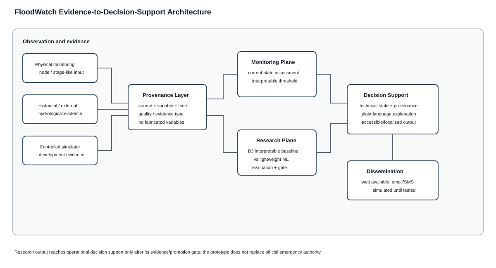

This rendered figure is the cross-chapter architecture baseline: source provenance is preserved before monitoring/research processing, and the research plane cannot silently enter decision support without its promotion gate.

~~~mermaid
flowchart TD
    subgraph Observation[Observation Plane]
      HW[Physical Node / Serial Bridge]
      SIM[Controlled Simulator]
      EXT[Historical / External Data Adapters]
    end
    subgraph Core[Application Plane]
      API[FastAPI Interfaces]
      VAL[Validation + Provenance]
      DB[(Persistence)]
      STATE[Current-State Assessment]
      AUTH[Authentication / RBAC]
      ALERT[Alert Workflow]
    end
    subgraph Research[Research Plane]
      MAN[Dataset Manifest]
      AUDIT[Raw-Data Audit]
      PREP[Preprocessing / Target Construction]
      EXP[Approved Experiments]
      EVAL[Evaluation]
    end
    subgraph Presentation[Presentation Plane]
      DASH[GIS Dashboard]
      DATA[Data View]
      OPS[Operator Views]
    end
    HW --> API
    SIM --> API
    API --> VAL --> DB
    DB --> STATE --> DASH
    DB --> DATA
    AUTH --> OPS
    STATE --> ALERT --> OPS
    EXT --> MAN --> AUDIT --> PREP --> EXP --> EVAL
    EVAL -. promotion gate only .-> STATE
~~~

## 8. Data-flow diagrams

### 8.1 Context DFD

~~~mermaid
flowchart LR
    HW[Physical Node] -->|hardware telemetry| FW((FloodWatch))
    SIM[Simulator] -->|synthetic telemetry| FW
    USER[Viewer] -->|monitoring request| FW
    FW -->|status / flood data| USER
    OP[Operator] -->|authorized actions| FW
    FW -->|alerts / audit state| OP
    EXT[External Data Provider] -->|provenanced dataset| FW
    RES[Researcher] -->|approved experiment request| FW
    FW -->|evaluation artefacts| RES
~~~

### 8.2 Level-1 telemetry DFD

~~~mermaid
flowchart LR
    SRC[Physical / Simulated Source] --> P1[1.0 Validate telemetry]
    P1 -->|invalid| ERR[Reject / error]
    P1 --> P2[2.0 Preserve source and threshold type]
    P2 --> D1[(Telemetry Store)]
    D1 --> P3[3.0 Derive rate-of-rise]
    P3 --> P4[4.0 Assess current threshold state]
    P4 --> D2[(Alert Store)]
    P4 --> P5[5.0 Publish monitoring status]
    P5 --> UI[Dashboard / Data UI]
~~~

## 8.3 Current-state service boundary

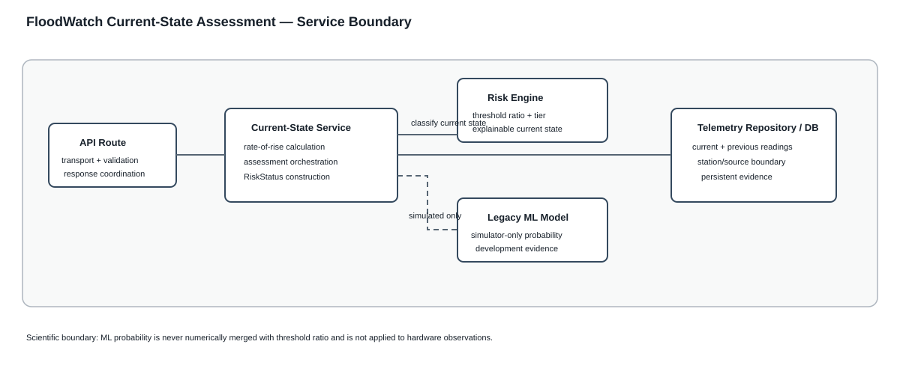

`current_state_service.py` is the application-service boundary between route transport and risk interpretation. It owns trend derivation/orchestration while `risk_engine.py` owns the explainable threshold rule. The frozen simulator ML model remains an informational development path and is not merged into the current-state ratio.

## 8.4 Alert workflow service boundary

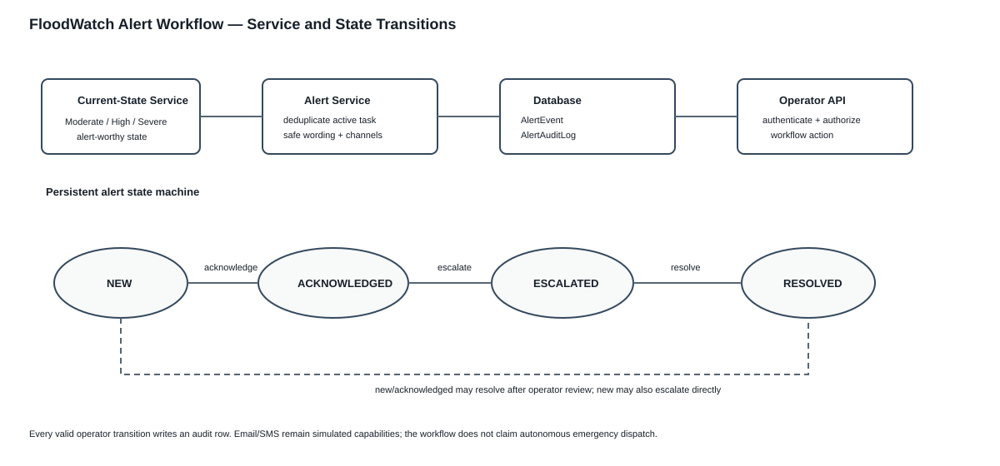

The alert service owns persistent alert lifecycle rules independently of FastAPI transport. Active duplicate suppression is keyed by station/source, valid transitions are explicit, and every operator transition is audited. Delivery capability labels remain honest: web is available while email/SMS are simulated.

## 9. Activity diagram - telemetry processing

~~~mermaid
flowchart TD
    A([Start]) --> B[Receive telemetry]
    B --> C{Schema valid?}
    C -->|No| D[Return validation error]
    D --> Z([End])
    C -->|Yes| E[Preserve source / threshold provenance]
    E --> F[Store telemetry]
    F --> G[Obtain previous compatible reading]
    G --> H[Derive rate of rise]
    H --> I[Assess current threshold state]
    I --> J{Alert-worthy state?}
    J -->|Yes| K[Create/update advisory alert record]
    J -->|No| L[No alert workflow change]
    K --> M[Expose status]
    L --> M
    M --> Z
~~~

## 10. Sequence diagram - physical telemetry

~~~mermaid
sequenceDiagram
    participant Input as Controlled/Physical Input
    participant Pico as Raspberry Pi Pico
    participant Bridge as Serial Bridge
    participant API as FastAPI
    participant DB as Persistence
    participant Risk as Current-State Engine
    participant UI as Dashboard
    Input->>Pico: analogue/environmental measurement
    Pico->>Bridge: HW-01, ADC, stage-like value
    Bridge->>API: POST /api/telemetry (hardware)
    API->>API: validate payload/provenance
    API->>DB: persist telemetry
    API-->>Bridge: HTTP 200
    UI->>API: GET /api/risk-status?data_source=hardware
    API->>DB: retrieve recent hardware evidence
    API->>Risk: assess current threshold state
    Risk-->>API: level, ratio, advisory message
    API-->>UI: source-aware status
~~~

## 10.1 Normalized observation repository boundary

The repository boundary persists one atomic variable/value observation with explicit station and evidence source. Deterministic catalogues constrain the representation vocabulary without claiming every catalogue entry is currently measured. Composite indexes support station/variable/time and source/time access paths. The legacy telemetry path remains available until parity and physical-regression gates pass.

## 11. Database design decision

The target development/operational DBMS is **MySQL Server**, administered and inspected with **MySQL Workbench**, with SQLAlchemy/PyMySQL as the application connection layer. SQLite remains an isolated compatibility/test database where MySQL-specific behaviour is not under test.

The existing wide `telemetry` table is a legacy prototype representation and will not be copied blindly into the final schema. The target normalized data model separates Station, Variable, DataSource, Dataset, Observation and Threshold so heterogeneous evidence can be represented without fabricating unavailable variables. The detailed normalization reasoning, logical ERD, constraints and phased non-destructive migration are maintained in `database_design_mysql_spec_v1.md`.

The current ERD below remains an **as-implemented legacy/operational view** until the normalized models and migrations are actually coded. This distinction prevents design documentation from falsely claiming that a planned schema already exists.

## 11.1 Current conceptual ERD

~~~mermaid
erDiagram
    USER ||--o{ USER_SESSION : owns
    USER ||--o{ ALERT_AUDIT_LOG : performs
    USER ||--o{ SCENARIO_RUN : executes
    USER ||--o{ COMMUNITY_REPORT : submits
    ALERT_EVENT ||--o{ ALERT_AUDIT_LOG : has
    USER {
      int id PK
      string email
      string role
      string preferred_language
    }
    USER_SESSION {
      int id PK
      int user_id FK
      string token_hash
      datetime expires_at
    }
    TELEMETRY_RECORD {
      int id PK
      string station_id
      string data_source
      datetime timestamp
      float water_level_m
      float danger_level_m
      string threshold_type
      float rainfall_mm_hr_nullable
      float flow_rate_m3s_nullable
    }
    ALERT_EVENT {
      int id PK
      string station_id
      string data_source
      string risk_level
      string status
      datetime created_at
    }
    ALERT_AUDIT_LOG {
      int id PK
      int alert_id FK
      int operator_id FK
      string action
      datetime created_at
    }
    SCENARIO_RUN {
      int id PK
      int operator_id FK
      string station_id
      string scenario
      datetime created_at
    }
    COMMUNITY_REPORT {
      int id PK
      int user_id FK
      string location
      string message
    }
~~~

The current schema associates telemetry and alerts through station/source context rather than a physical telemetry-row foreign key. Future normalized observation/station entities must not be drawn as implemented until their migration is actually coded.

## 12. Deployment diagram

~~~mermaid
flowchart LR
    subgraph Device[Physical prototype]
      Input[Controlled analogue / future justified sensor] --> Pico[Raspberry Pi Pico]
    end
    subgraph Laptop[Development / demonstration computer]
      Bridge[Python Serial Bridge]
      API[FastAPI / Uvicorn]
      DB[(MySQL Server)]
      Browser[Web Browser]
      Pico -->|USB serial COM4| Bridge
      Bridge -->|HTTP| API
      API -->|SQLAlchemy / PyMySQL| DB
      Browser -->|HTTP| API
    end
    subgraph External[External services/data]
      Tiles[Map tiles]
      Data[Hydrometeorological datasets]
    end
    Workbench[MySQL Workbench] -->|administration / EER| DB
    Browser --> Tiles
    Data -. research ingestion .-> API
~~~

## 13. Development backlog / epics

1. Observation and data acquisition.
2. Provenance and data quality.
3. Monitoring and current-state assessment.
4. Historical hydrological data.
5. Predictive research pipeline.
6. Decision support and alerts.
7. Dashboard and GIS.
8. Users, authentication and administration.
9. Hardware integration.
10. Testing, security and reliability.
11. Deployment and operations.
12. Documentation and research reproducibility.

## 14. Requirements traceability baseline

| Requirement | Design responsibility | Current implementation | Verification |
|---|---|---|---|
| FR-01/02 | telemetry/observation repositories + persistence | main.py, telemetry_repository.py, observation_repository.py, models.py, database.py | repository/API/operational tests |
| FR-03 | nullable optional evidence | telemetry schema + bridge | contract/API/hardware tests |
| FR-04 | threshold provenance | threshold_type | contract/API/dashboard tests |
| FR-05 | current-state service + engine | current_state_service.py, risk_engine.py | current-state service/risk-separation tests |
| FR-06/07/08 | public accessible monitoring | templates + dashboard.js | frontend/HTTP smoke tests |
| FR-09 | alert workflow service | alert_service.py + alert tables/routes | alert-service/operational tests |
| FR-10 | RBAC | user/session/role routes | API/operational tests |
| FR-11 | simulator boundary | simulator + source labels | frontend/API tests |
| FR-12 | Pico bridge | hardware/bridge/pico_serial_bridge.py | physical COM4 integration |
| FR-13/14 | research boundary | research/ + manifest contract | code review/contract tests |
| FR-15 | promotion gate | implementation alignment specification | architectural gate |
| FR-16 | health checks | API + CI/Docker | GitHub Actions |

## 15. Current development gate

The engineering regression and physical-integration gates have passed. The next development increment is **architecture/data-model modularisation and documentation synchronization**. Experiment 001 remains separate and blocked until its scientific protocol is frozen.

## 10.x DB-3 compatibility adapter

The migration uses a compatibility adapter rather than a big-bang schema replacement. Both REST and CSV ingestion now pass through the same telemetry repository. The repository stages the legacy record plus normalized observation rows in one transaction, preserving backward compatibility while making normalized evidence available for parity testing. This is an Adapter/Repository migration boundary: it changes persistence representation without changing the external telemetry contract.

## 10.x DB-4 read-parity boundary

DB-4 is intentionally split into **parity** and **promotion**. The normalized repository can now reconstruct the dual-written evidence fields and is regression-tested against the legacy repository, but routes continue using the compatibility read path. This strangler-style migration avoids changing persistence representation and operational behaviour simultaneously.

## 10.x Threshold configuration boundary

The current-state contract requires both evidence and a decision threshold, but these are separate domain concepts. `threshold_repository.py` owns typed/time-valid threshold selection. Compatibility telemetry can seed a `prototype_demo` (or otherwise validated typed) threshold without converting it into an observation or claiming official provenance. Missing applicable configuration produces no normalized current-state candidate rather than a hidden default.

## 10.x Full current-state parity

The normalized candidate path now reaches the same `RiskStatus` boundary as the legacy path. It derives trend from normalized stage history, applies typed threshold configuration, and reuses the same explainable classification policy. Full contract parity is tested before route promotion, following the strangler migration principle of separating **prove equivalence** from **switch consumers**.

## 10.x Operational normalized-read promotion

The strangler migration has now promoted one consumer: `/api/risk-status`. The endpoint reads normalized observations and typed thresholds while the legacy table remains dual-written. This separates consumer migration from legacy retirement and keeps rollback evidence available. Raw telemetry APIs are intentionally unchanged.

## 10.x MySQL integration gate

CI now includes a real MySQL 8.4 service job. The same repository/service architecture used in SQLite compatibility tests is executed through SQLAlchemy/PyMySQL against MySQL. Docker Compose was also changed so the development stack provisions MySQL as the application database rather than silently defaulting the containerized system to SQLite.

## 10.x Telemetry application-service boundary

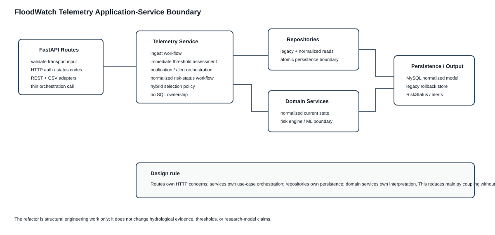

A service layer now separates HTTP transport from telemetry use-case orchestration. `main.py` validates/routes; `telemetry_service.py` coordinates the use case; repositories own database access; current-state/risk services own interpretation. This follows separation of concerns and reduces the reasons `main.py` must change. It is not a claim that every endpoint must be split into a separate file immediately; modularisation is incremental and regression-gated.

## 10.x Scenario path consistency after consumer migration

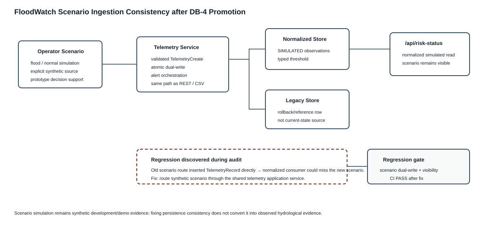

Consumer migration exposed a stale write path: operator scenarios bypassed the new telemetry service and wrote only to the legacy table. This illustrates why migration requires both read-parity tests and an audit of every producer. Scenario generation now enters through the same application-service/dual-write boundary as other telemetry. Its source remains explicitly `simulated`; persistence consistency does not change its evidence class.

## 10.x Operational consumer independence

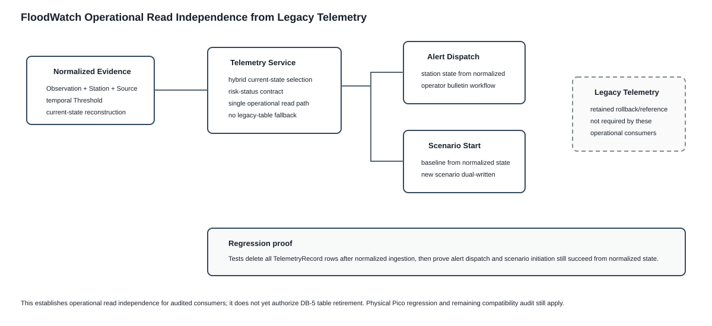

After write-path convergence, remaining consumers were searched for direct `TelemetryRecord` dependencies. Manual alert dispatch and scenario initiation were migrated to normalized current-state reads. The regression proof intentionally removes all compatibility telemetry rows before invoking those routes, which is stronger than a normal parity check: success demonstrates that their operational behaviour is not silently relying on the legacy table. Compatibility aliases and historical list endpoints remain deliberately separate migration concerns.

## 10.x Normalized history compatibility projection

The telemetry history API now demonstrates the compatibility-projection pattern: the external response shape can remain stable while its persistence source changes. This reduces migration impact on the data page and clients. The failed first CI run was valuable contract evidence: persistence equivalence alone was insufficient because the HTTP schema also required an identifier. The normalized stage Observation identifier now satisfies that contract.

## 10.x Architectural regression guard

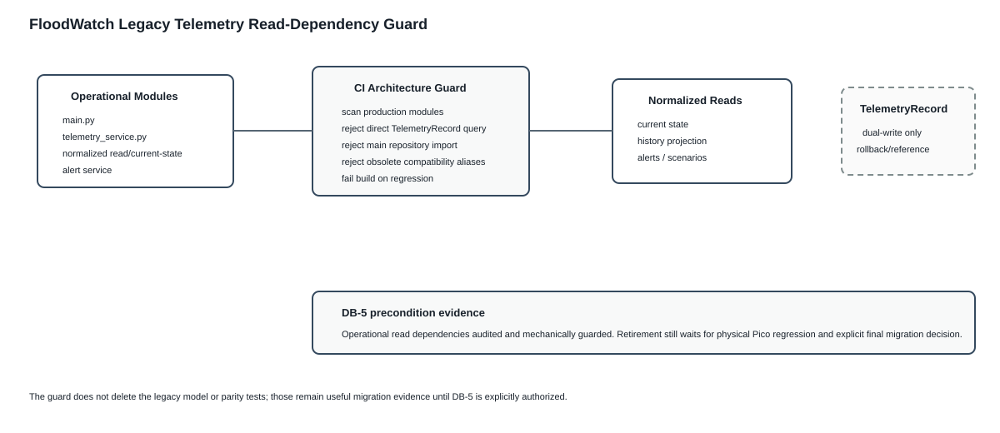

Migration rules are now executable rather than documentation-only. CI scans selected production modules and rejects reintroduction of direct compatibility-table reads. This is an architecture test: ordinary unit tests could still pass if a developer accidentally restored a legacy query while both stores contained equivalent data. The guard protects the intended dependency direction independently of data parity.

## 10.x Physical regression acceptance gate

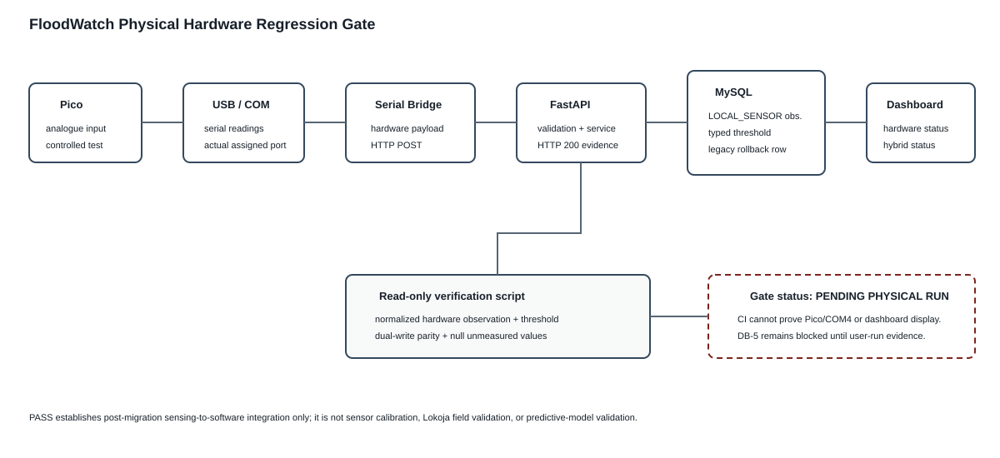

The database strangler migration ends with an external-system acceptance test because serial hardware cannot be represented faithfully by ordinary CI. The gate combines observed live bridge POSTs, a read-only normalized-database verifier, API current-state confirmation and dashboard inspection. This preserves the distinction between automated software verification and physical integration validation.

## 10.x Deterministic tie semantics

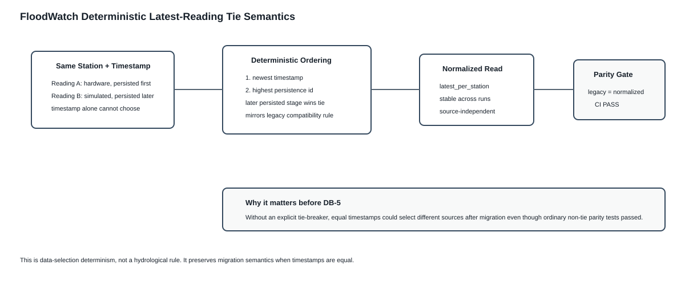

Database migrations must preserve edge-case selection semantics, not only ordinary values. Latest-reading selection therefore uses a total ordering: observation timestamp first and persistence identifier second. This prevents nondeterministic source selection when timestamps are equal and makes the rule executable through parity tests.

## 10.x Authority-aware threshold ingestion

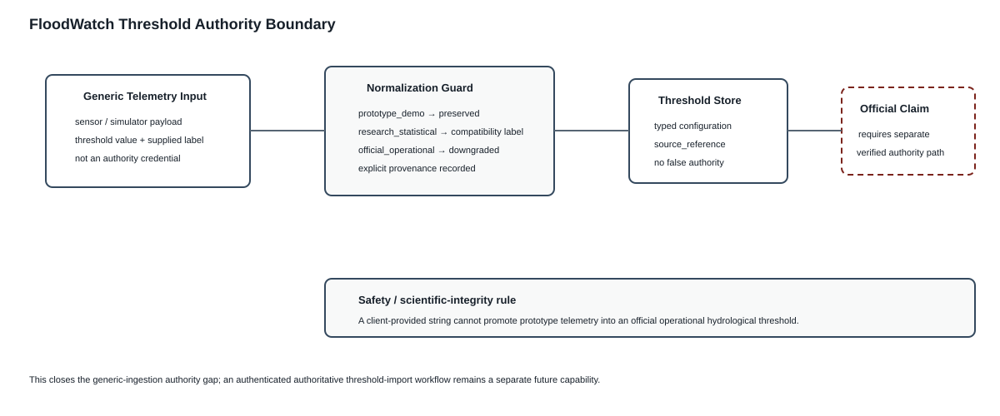

Validation of a field's syntax is not validation of its authority. The generic telemetry contract may accept a threshold-type label for backward compatibility, but the normalization boundary now prevents that untrusted label from becoming an official operational claim. This is a provenance and trust-boundary control, distinct from ordinary input validation.

## 10.x Temporal configuration change points

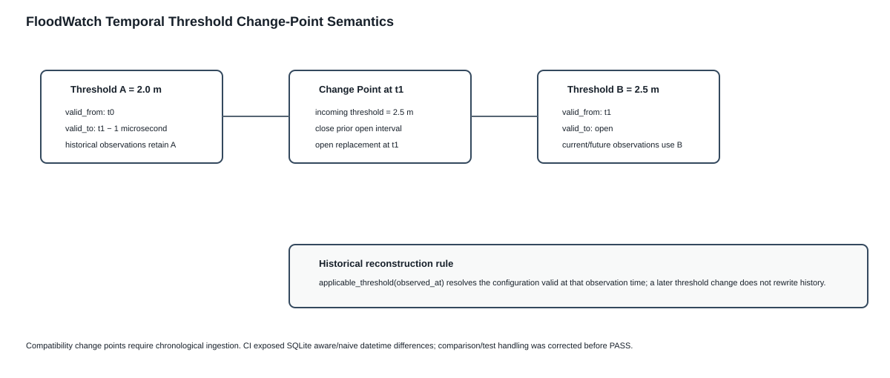

Threshold configuration is now versioned as validity intervals for compatibility ingestion. This prevents configuration drift from rewriting the interpretation of historical observations. The implementation also records an explicit constraint: compatibility change points are chronological; a general bitemporal correction/revision system would be a larger governance feature and is outside this migration increment.

## 10.x Runtime compatibility maintenance

After the migration gates stabilized, CI warnings were treated as maintenance evidence rather than ignored. SQLAlchemy timestamp defaults in the ORM models were migrated away from deprecated `datetime.utcnow` calls to explicit UTC-aware `datetime.now(timezone.utc)` factories. Pydantic response models were migrated from deprecated class-based `Config` declarations to Pydantic v2 `ConfigDict(from_attributes=True)`. These changes do not alter FloodWatch's research claims or architecture; they reduce avoidable dependency-upgrade risk while preserving ORM serialization behavior. Full CI run `35959714303` passed, including MySQL integration.

## 10.x Executable migration-retirement gate

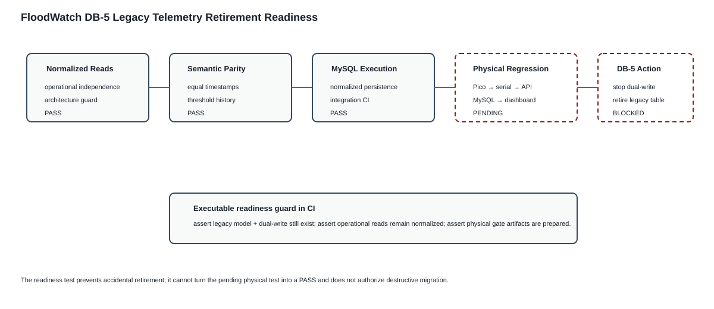

The strangler migration now has a CI-enforced boundary. The readiness test simultaneously prevents regression back to operational legacy reads and prevents premature deletion of the rollback representation. This makes the migration state explicit: normalized operation is established, compatibility persistence remains deliberate, and physical acceptance remains an external prerequisite.

### Runtime cleanup follow-up: telemetry response model

A follow-up source audit found one remaining class-based Pydantic `Config` declaration in `TelemetryResponse`. It was migrated to `ConfigDict(from_attributes=True)`, preserving attribute-based serialization for both SQLAlchemy compatibility rows and normalized projection objects. Full CI run `35960447499` passed, including MySQL integration.

## 10.x Provenance consistency invariant

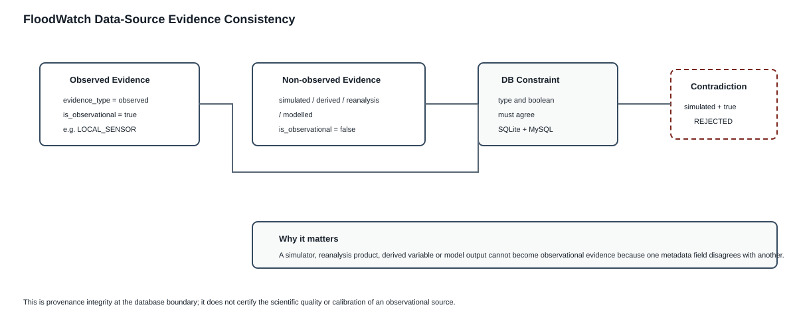

Redundant provenance metadata is dangerous unless its values are constrained to agree. `DataSource.evidence_type` and `is_observational` are now linked by a database invariant and the controlled catalogue supplies the boolean explicitly. This prevents contradictory source classifications from surviving persistence.

## 10.x Idempotency versus evidence correction

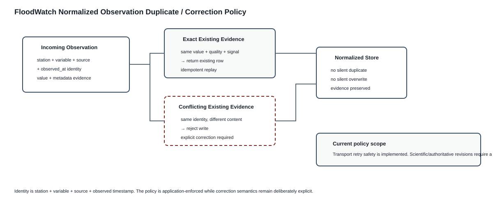

FloodWatch now distinguishes delivery retry semantics from data-correction semantics. Exact normalized observation replays are idempotent, which protects serial/API retries from creating duplicate evidence. A different value or metadata at the same station/variable/source/time is a semantic conflict and is rejected until an explicit correction workflow can record why evidence changed.

## 10.x Coordinate integrity defense-in-depth

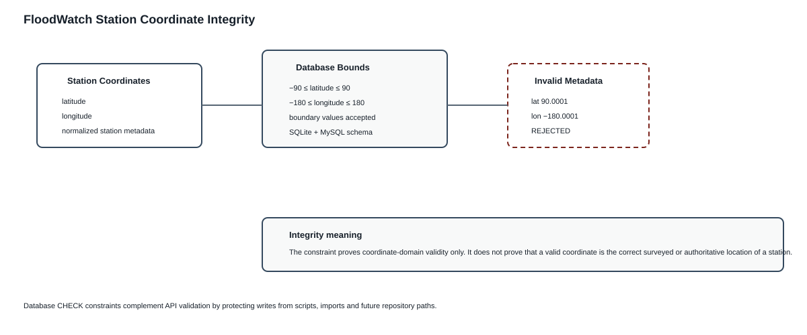

Station coordinate validation is enforced at persistence as well as at application boundaries. Database CHECK constraints protect the normalized model from invalid latitude/longitude values introduced by non-API write paths. This is defense-in-depth: domain validity is enforced independently of whichever client produced the station metadata.

## 10.x Temporal metadata invariants

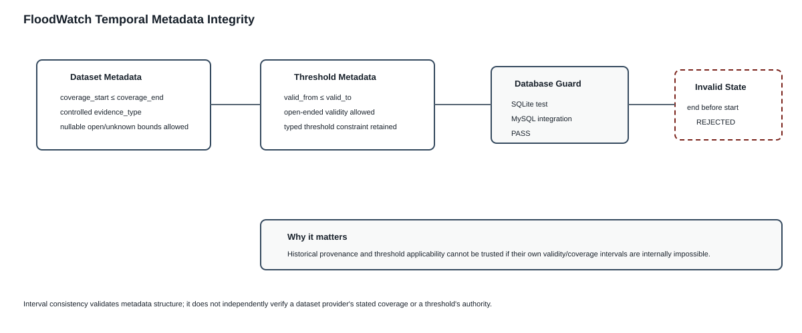

Historical and configuration provenance depend on valid intervals. FloodWatch now enforces ordering invariants for Dataset coverage and Threshold validity at persistence, while retaining nullable/open bounds where the domain permits them. Dataset evidence classification is also restricted to the controlled evidence vocabulary.

## 10.x Single normalized evidence-write policy

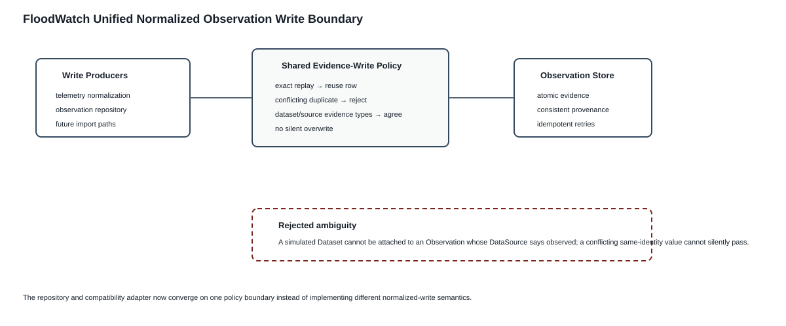

The repository and compatibility adapter now converge on one normalized observation write policy. This removes policy duplication and prevents a future caller from bypassing replay/conflict semantics merely by using the general repository rather than telemetry ingestion. Dataset/source evidence classifications are also checked for agreement at this boundary.

## 10.x Observation identity defense in depth

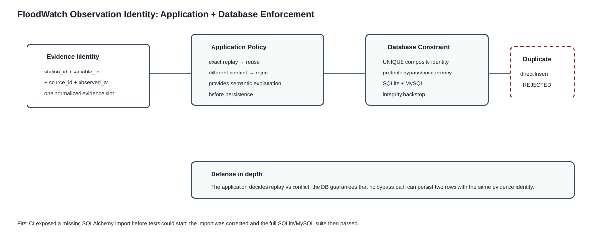

Duplicate semantics are now enforced at two layers. The shared application policy supplies meaningful idempotency/conflict behavior, while a composite database UNIQUE constraint prevents bypass paths or races from persisting duplicate evidence identities. This separates semantic handling from invariant enforcement.

## 10.x Honest visualization boundary

A closure audit removed a misleading forecast-shaped visualization. Because the operational rate-of-rise is a change per reading rather than a calibrated hourly derivative, the selected-station curve now projects six readings using the transparent persistence rule `x + 6Δx`. The visualization is labelled as a trend projection and kept separate from the experimental predictive-research path.

## 10.x Threshold authority separation

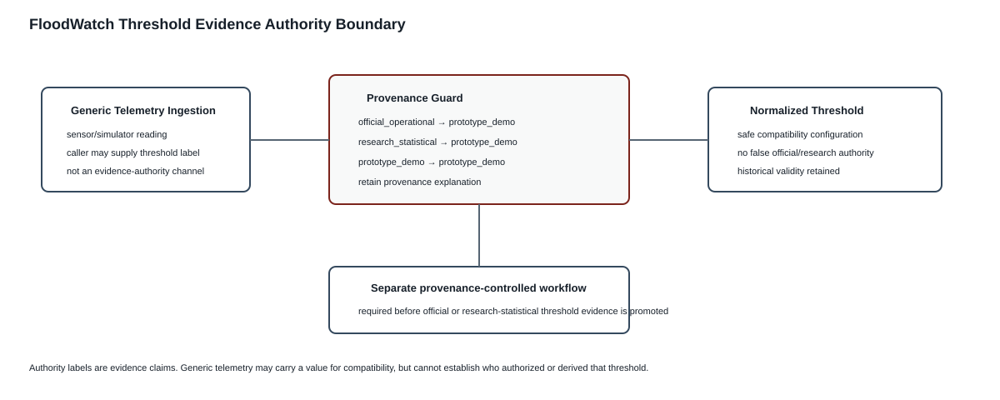

The telemetry adapter applies least-authority semantics to threshold evidence. A sensor/simulator client is authorized to submit telemetry but is not thereby authorized to establish institutional or research provenance. Both `official_operational` and `research_statistical` labels are therefore reduced to `prototype_demo` on the generic compatibility path. This prevents transport authority from becoming evidence authority.
