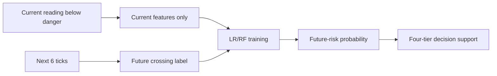

# Flood Early Warning and Decision Support System - Implementation Plan

This document records the original core implementation plan. As of 2026-09-08, the user has also authorized an operational-platform extension. See the [current operational guide](files/docs/operational_platform_guide.md) for roles, CSV, alert review, reports, news and deployment work; the older parked-account descriptions below are historical scope notes. This is not evidence of supervisor approval for changed academic objectives.

## Current verified architecture

The active implementation lives under [files/api](files/api). Old prototype files have been moved into [files/archive](files/archive) so the project root stays clean while the earlier work remains recoverable.

A structure audit is maintained in [files/docs/project_structure_audit.md](files/docs/project_structure_audit.md). It lists active folders, archived legacy files, generated files, and final-submission recommendations.

### Verified components

- [files/api/database.py](files/api/database.py)
  - Uses persistent file-based SQLite: `sqlite:///flood_data.db`
  - Supports a future MySQL/MariaDB switch through `FLOOD_EWS_DATABASE_URL`
  - Avoids the in-memory SQLite bug that caused data loss after restart

- [files/api/models.py](files/api/models.py)
  - Defines telemetry storage with SQLAlchemy
  - Validates incoming data with Pydantic
  - Stores `data_source` so simulated and hardware readings remain auditable

- [files/api/risk_engine.py](files/api/risk_engine.py)
  - Implements Low, Moderate, High, and Severe risk levels
  - Keeps decision-support wording safe
  - Ends English guidance with "follow official guidance."
  - Does not issue autonomous evacuation commands

- [files/api/train_model.py](files/api/train_model.py)
  - Builds simulator-generated training episodes
  - Uses a future-horizon target: danger-level crossing within the next 6 ticks
  - Compares threshold baseline, Logistic Regression, and Random Forest
  - Saves `model.pkl` and `model_metrics.json`

- [files/api/ml_model.py](files/api/ml_model.py)
  - Loads the saved model safely
  - Returns `None` if a model artifact is unavailable
  - Exposes a `predict()` interface used by the risk-status endpoint

- [files/api/notifications.py](files/api/notifications.py)
  - Logs simulated web, email, and SMS alert events
  - Does not send real messages without a configured provider gateway

- [files/api/main.py](files/api/main.py)
  - Hosts the FastAPI app
  - Receives telemetry through `POST /api/telemetry`
  - Returns newest-first stored telemetry through `GET /api/telemetry`, with optional simulated/hardware filtering
  - Returns newest-per-station risk through `GET /api/risk-status`
  - Serves `/favicon.ico` from the project SVG icon to avoid distracting browser 404s in demos
  - Serves Jinja2 pages for the public site, dashboard, data page, and optional account shell

- [files/api/templates/pages/dashboard.html](files/api/templates/pages/dashboard.html)
  - Provides the active Leaflet/OpenStreetMap GIS dashboard
  - Includes simulated/hardware/hybrid source switching
  - Includes map layer switching
  - Includes risk-ring planning overlays and station labels
  - Includes station search and risk-level filtering
  - Includes tile-health feedback when a base map layer is slow or unavailable
  - Includes selected-station details and freshness/staleness indicators
  - Includes a schematic river-context overlay for Nigeria case-study interpretation
  - Provides a text station list for screen-reader users
  - Lets keyboard users focus a map marker from the text station list

- [files/api/test_api.py](files/api/test_api.py)
  - Verifies core API behavior
  - Verifies bad input rejection
  - Verifies source switching
  - Verifies parked extras stay parked by default

- [files/api/test_model_training.py](files/api/test_model_training.py)
  - Verifies that ML training uses future labels
  - Confirms that no used training/evaluation row is already at danger level
  - Confirms that the threshold baseline is no longer a perfect circular rule

## Core project constraints

The implementation stays faithful to the approved project requirements:

- Python
- FastAPI
- SQLAlchemy
- Pydantic
- SQLite file database
- scikit-learn
- Logistic Regression and Random Forest
- threshold baseline comparison
- Leaflet.js and OpenStreetMap
- optional paho-mqtt simulator path
- non-autonomous decision support
- accessible dashboard design
- simulated web/email/SMS alerting

## Corrected ML design

The old ML target was invalid because it labelled a row positive when:

```text
current water level >= current danger level
```

That made a threshold baseline perfect because the baseline checked the same condition.

The corrected target is:

```text
current water level < current danger level
AND
water level reaches danger level within the next 6 simulator ticks
```

This creates a real early-warning prediction task.



## Current corrected metrics

Saved model metrics from [files/api/model_metrics.json](files/api/model_metrics.json):

- Threshold baseline F1: `0.6666666666666666`
- Logistic Regression F1: `0.7085714285714285`
- Random Forest F1: `0.975609756097561`
- Current-threshold positive samples used: `0`
- Positive samples below current danger level: `366`

These are simulator-generated results only and must not be presented as field-validated flood prediction performance.

## Core demonstration flow

1. Start the FastAPI server.
2. Run the simulator in normal or flood mode.
3. The simulator posts telemetry to `/api/telemetry`.
4. FastAPI validates and stores each reading.
5. The risk engine calculates Low/Moderate/High/Severe status.
6. The ML model estimates future danger-level crossing probability.
7. The dashboard polls `/api/risk-status`.
8. The map, schematic river context, risk rings, station labels, filters, popups, selected-station panel, freshness indicators, and accessible station list update together.
9. The Flood Data page polls `/api/telemetry` every 15 seconds so telemetry evidence stays current.
10. Simulated web/email/SMS alerts are logged when alert-worthy conditions occur.

## Milestone plan

### Milestone 1: Stabilize approved core

- Keep simulator, hardware-ready input, database, ML, risk engine, dashboard, and alert log working together.
- Avoid adding new scope until the core is defense-ready.

### Milestone 2: Hardware demonstration

- Connect an ESP32 or equivalent node only if available.
- Match the existing telemetry JSON shape.
- Send `data_source: "hardware"` from physical readings.
- Keep simulator fallback available.

### Milestone 3: Defense documentation

- Update Chapter Three to match the actual stack.
- Include the corrected ML target.
- Include dashboard screenshots.
- Include test outputs.
- State clearly that model evidence is simulator-generated.

### Milestone 4: Optional future work

Only after supervisor approval:

- Community reporting / resident corroboration
- WhatsApp alerts
- Localization UI
- Production account system
- Real provider integrations
- Real hydrological agency feed integration

## Verification principle

Every system claim must be backed by documented test output. The project should avoid claiming production-grade performance unless verified against a real field dataset.

## Final project goal

The final defendable project is a portable, accessible, AI-assisted flood early-warning and decision-support prototype that integrates telemetry ingestion, future-risk prediction, GIS visualization, and simulated multi-channel alerting while staying within approved undergraduate scope.
