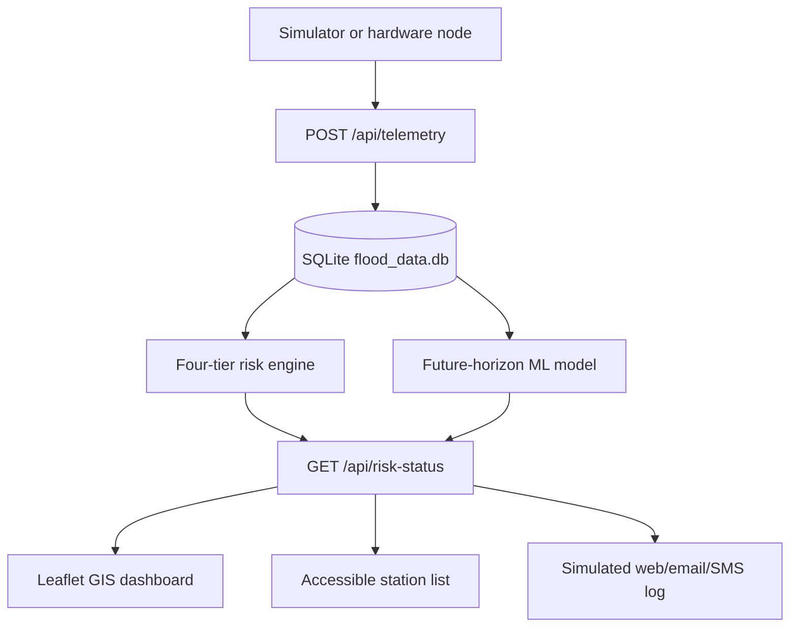

# Flood Early Warning System Walkthrough

This walkthrough explains the current verified state of the Intelligent Flood Early Warning and Decision Support System. The project is a portable flood decision-support prototype using Nigeria as the case-study deployment, not as a Nigeria-exclusive architecture.

2026-09-08 extension: ordinary visitors still see public monitoring. Operators additionally upload CSVs, run simulations and review alerts through acknowledgement/escalation/resolution with audit history. `/evaluation` shows the saved synthetic comparison and PDF reports; `/news` uses configurable external feeds. Follow the [operational guide](files/docs/operational_platform_guide.md) for current steps and limitations rather than older parked-account notes below.

## Project overview

FloodWatch ingests simulated or hardware-ready telemetry, stores the readings in a file-based SQLite database, calculates flood risk using transparent four-tier rules and a corrected future-horizon ML model, and presents the result through an accessible Leaflet/OpenStreetMap dashboard.

The system is deliberately non-autonomous. It supports residents, institutions, and responders with evidence and safe guidance, but it does not issue commands such as "evacuate now."

## Main system components

### 1. Telemetry ingestion

The FastAPI backend is in [files/api/main.py](files/api/main.py).

Important endpoints:

- `POST /api/telemetry` stores new simulated or hardware telemetry.
- `GET /api/telemetry` returns stored telemetry for the flood data page.
- `GET /api/risk-status` returns the newest risk status per station.

The API accepts both `simulated` and `hardware` values in `data_source`, allowing the same backend to support a simulator, physical sensor nodes, or hybrid demonstration mode.

### 2. Database layer

The database configuration is in [files/api/database.py](files/api/database.py).

The default database URL is:

```text
sqlite:///flood_data.db
```

This is intentionally file-based SQLite. The earlier in-memory SQLite bug is avoided because `sqlite://` would lose records whenever the process restarts.

### 3. Data schema and validation

The data model is defined in [files/api/models.py](files/api/models.py).

It includes:

- SQLAlchemy tables for telemetry, optional user sessions, and parked community reports.
- Pydantic validation for incoming telemetry.
- A separate `RiskStatus` response model for dashboard display.
- Validation for latitude, longitude, danger level, battery percentage, and source type.

### 4. Decision-support engine

The risk logic is in [files/api/risk_engine.py](files/api/risk_engine.py).

It uses four levels:

- Low
- Moderate
- High
- Severe

Each English risk message ends with "follow official guidance." The wording is safe by design and does not replace official emergency responders.

### 5. Machine-learning model

The training pipeline is in [files/api/train_model.py](files/api/train_model.py).

The important correction is that the model no longer learns the circular question "is the station already above the danger threshold?" Instead, it predicts:

> While the station is still below danger level now, will it reach danger level within the next 6 simulator ticks?

Current-tick features:

- water-level ratio
- rainfall intensity
- flow rate
- rate of rise

Future label:

- whether the station crosses its danger level within the next 6 simulator ticks

The serving wrapper in [files/api/ml_model.py](files/api/ml_model.py) loads `model.pkl` and exposes `predict()`.

### 6. Notification layer

The notification module is in [files/api/notifications.py](files/api/notifications.py).

Active demonstration channels:

- web dashboard
- simulated email
- simulated SMS

No real messages are sent unless a real provider gateway is configured and tested.

### 7. Dashboard layer

The active dashboard is rendered with Jinja2 from [files/api/templates/pages/dashboard.html](files/api/templates/pages/dashboard.html), styled by [files/api/static/css/site.css](files/api/static/css/site.css), and updated by [files/api/static/js/dashboard.js](files/api/static/js/dashboard.js).

It includes:

- Leaflet.js map with OpenStreetMap tiles
- source selector for simulated, hardware, and hybrid modes
- map layer selector
- screen-reader-friendly station list beside the map
- text plus colour risk communication

The old `files/dashboard` folder is a legacy static prototype and is not the active application flow.

## Complete system flow



## How to run the project

From the project root:

```powershell
cd C:\Users\User\Documents\Word_Document\Project\files\api
py -u .\train_model.py
py -u .\test_model_training.py
py -u .\test_api.py
py -m uvicorn main:app --reload --host 127.0.0.1 --port 8000
```

Then open:

```text
http://127.0.0.1:8000/dashboard
```

If Windows blocks port `8000`, use:

```powershell
py -m uvicorn main:app --reload --host 127.0.0.1 --port 8030
```

and open `http://127.0.0.1:8030/dashboard`.

To populate the dashboard, run the simulator from another terminal:

```powershell
cd C:\Users\User\Documents\Word_Document\Project
py .\files\flood_sensor_simulator.py --mode flood --ticks 30
```

## Corrected model evidence

The current saved model is trained on simulator-generated telemetry only.

Latest corrected metrics:

- threshold baseline F1: `0.6666666666666666`
- Logistic Regression F1: `0.7085714285714285`
- Random Forest F1: `0.975609756097561`

The earlier perfect baseline score is invalid and superseded because it came from a circular current-threshold label.

## Scope note

Active approved core:

- simulator/hardware-ready telemetry ingestion
- persistent database storage
- future-horizon ML model comparison
- four-tier risk engine
- accessible GIS dashboard
- simulated web/email/SMS alert logging

Parked until supervisor approval:

- community reporting
- WhatsApp alerts
- localization UI
- advanced account-dependent product flows

## Why this project is stronger than a basic demo

The system demonstrates:

- portability through station-specific thresholds and source metadata
- hardware readiness through REST/MQTT-shaped telemetry
- AI plus GIS integration
- accessibility through semantic dashboard design and text alternatives
- non-smartphone alert consideration through SMS/email simulation
- evidence-backed ML claims after leakage correction
